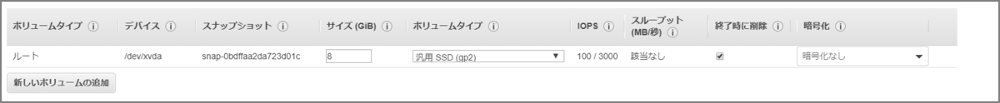
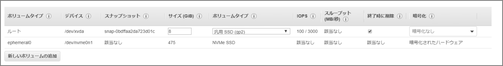

### はじめに

インスタンスストアは頻繁に変更される情報（バッファー、キャッシュ、スクラッチデータ、一時ログ、ダンプデータ、その他の一時コンテンツなど）の一時ストレージに適しています。追加料金は掛かりません。揮発性のディスクということでインスタンスを停止して起動するとデータが消えます。（再起動では消えません。） 

### 勘違いしていたこと

表題の通りです。いつもよく使っていたインスタンスタイプ(t2系)はインスタンスストアが対応していないタイプでした。対応しているタイプは下記マニュアルに記載があります。

> インスタンスで使用できるインスタンスストアボリュームの数とサイズは、インスタンスタイプによって異なります。インスタンスタイプによっては、インスタンスストアボリュームをサポートしていないものがあります。 
>
> EC2 インスタンスにインスタンスストアボリュームを追加する - Amazon Elastic Compute Cloud https://docs.aws.amazon.com/ja_jp/AWSEC2/latest/UserGuide/add-instance-store-volumes.html

> インスタンスタイプにより、使用できるインスタンスストアのサイズ、およびインスタンスストアボリュームで使用されるハードウェアの種類が決まります。 
>
> Amazon EC2 インスタンスストア - Amazon Elastic Compute Cloud https://docs.aws.amazon.com/ja_jp/AWSEC2/latest/UserGuide/InstanceStorage.html

下記のようにストレージ最適化のインスタンスタイプではインスタンス作成時のボリュームタイプに`ephemeral0`が表示されています。これがインスタンスストアになります。

#### t2.large(汎用)



#### i3.large(ストレージ最適化)



### インスタンスストアの設定/確認

インスタンスの起動後に、インスタンスストアボリュームはインスタンスで使用できますが、ボリュームがマウントされるまでアクセスすることはできません。Linux インスタンスの場合は、インスタンスタイプによって、どのインスタンスストアボリュームがマウントされるのか、またご自分でマウントできるインスタンスが何かが決まります。 

#### 初期状態

```sh
[ec2-user@ip-10-0-0-16 ~]$ df -h
Filesystem      Size  Used Avail Use% Mounted on
devtmpfs        7.5G     0  7.5G   0% /dev
tmpfs           7.5G     0  7.5G   0% /dev/shm
tmpfs           7.5G  464K  7.5G   1% /run
tmpfs           7.5G     0  7.5G   0% /sys/fs/cgroup
/dev/xvda1      8.0G  1.3G  6.8G  16% /
tmpfs           1.5G     0  1.5G   0% /run/user/0
tmpfs           1.5G     0  1.5G   0% /run/user/1000
[ec2-user@ip-10-0-0-16 ~]$ 
```

#### ファイルシステム作成、及びマウント

```sh
#コマンド
mkfs.ext4 -E nodiscard /dev/nvme0n1
mkdir /mnt/ssd
mount -o discard /dev/nvme0n1 /mnt/ssd

#実行ログ
[root@ip-10-0-0-16 ec2-user]# mkfs.ext4 -E nodiscard /dev/nvme0n1
mke2fs 1.42.9 (28-Dec-2013)
Filesystem label=
OS type: Linux
Block size=4096 (log=2)
Fragment size=4096 (log=2)
Stride=0 blocks, Stripe width=0 blocks
28999680 inodes, 115966796 blocks
5798339 blocks (5.00%) reserved for the super user
First data block=0
Maximum filesystem blocks=2264924160
3540 block groups
32768 blocks per group, 32768 fragments per group
8192 inodes per group
Superblock backups stored on blocks: 
	32768, 98304, 163840, 229376, 294912, 819200, 884736, 1605632, 2654208, 
	4096000, 7962624, 11239424, 20480000, 23887872, 71663616, 78675968, 
	102400000

Allocating group tables: done                            
Writing inode tables: done                            
Creating journal (32768 blocks): done
Writing superblocks and filesystem accounting information: done     

[root@ip-10-0-0-16 ec2-user]# echo $?
0
[root@ip-10-0-0-16 ec2-user]# 
[root@ip-10-0-0-16 ec2-user]# 
[root@ip-10-0-0-16 ec2-user]# 
[root@ip-10-0-0-16 ec2-user]# mkdir /mnt/ssd
[root@ip-10-0-0-16 ec2-user]# 
[root@ip-10-0-0-16 ec2-user]# 
[root@ip-10-0-0-16 ec2-user]# mount -o discard /dev/nvme0n1 /mnt/ssd
[root@ip-10-0-0-16 ec2-user]# 
```

#### fstabに追記（再起動後にマウントされるように）

```sh
vi /etc/fstab
 /dev/nvme0n1                                    /mnt/ssd       ext4   defaults,nofail   0   2
```

#### 確認

```sh
[root@ip-10-0-0-16 ec2-user]# df -h
Filesystem      Size  Used Avail Use% Mounted on
devtmpfs        7.5G     0  7.5G   0% /dev
tmpfs           7.5G     0  7.5G   0% /dev/shm
tmpfs           7.5G  464K  7.5G   1% /run
tmpfs           7.5G     0  7.5G   0% /sys/fs/cgroup
/dev/xvda1      8.0G  1.3G  6.8G  16% /
tmpfs           1.5G     0  1.5G   0% /run/user/0
tmpfs           1.5G     0  1.5G   0% /run/user/1000
/dev/nvme0n1    436G   73M  414G   1% /mnt/ssd   ★←インスタンスストア
[root@ip-10-0-0-16 ec2-user]# 
```

#### 性能を比較してみる

```sh
#インスタンスストア
dd if=/dev/zero of=/mnt/ssd/write.tmp count=5 bs=1024M

→ 5368709120 bytes (5.4 GB) copied, 14.8873 s, 361 MB/s

#EBS
dd if=/dev/zero of=/home/ec2-user/write.tmp count=5 bs=1024M

→ 5368709120 bytes (5.4 GB) copied, 53.8642 s, 99.7 MB/s

```

- 使用するインスタンスタイプによって性能値が大きく異なる模様。

  　> インスタンスタイプによって SSD の性能が変わるのか調べてみた https://blog.manabusakai.com/2015/06/instance-store-benchmark/

### その他注意事項

- インスタンスを起動する場合にのみ、インスタンスのインスタンスストアボリュームを指定できます。また、起動後のインスタンスにインスタンスストアボリュームをアタッチすることはできません。

- インスタンスタイプを変更すると、インスタンスストアは新しいインスタンスタイプにアタッチされません。 

  