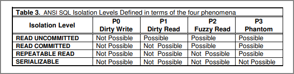
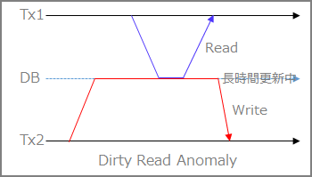
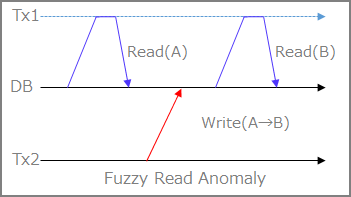
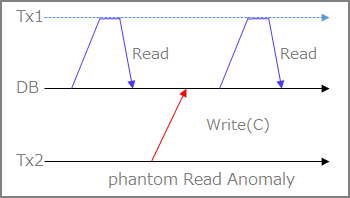
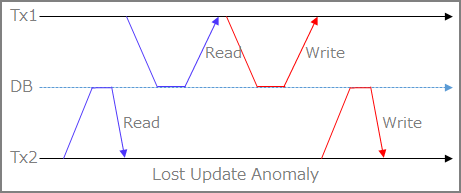
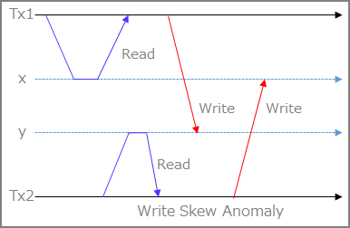

RDBMS製品のACID特性のI（Isolation）に関わるメモ




#### トランザクション分離レベルとは？

***

まずはトランザクション分離レベルの基本的な考え方について整理。  

<br/>

#### SERIALIZABLE ( 直列化可能 )

複数の並行に動作するトランザクションそれぞれの結果が、いかなる場合でも、それらのトランザクションを時間的重なりなく逐次実行した場合と同じ結果となる。このような性質を直列化可能性（Serializability）と呼ぶ。SERIALIZABLEは最も強い分離レベルであり、最も安全にデータを操作できるが、相対的に性能は低い。ただし同じ結果とされる逐次実行の順はトランザクション処理のレベルでは保証されない。  

<br/>

#### REPEATABLE READ ( 読み取り対象のデータを常に読み取る )

ひとつのトランザクションが実行中の間、読み取り対象のデータが途中で他のトランザクションによって変更される心配はない。同じトランザクション中では同じデータは何度読み取りしても毎回同じ値を読むことができる。
ただし ファントム・リード(Phantom Read) と呼ばれる現象が発生する可能性がある。ファントム・リードでは、並行して動作する他のトランザクションが追加したり削除したデータが途中で見えてしまうため、処理の結果が変わってしまう。  

<br/>

#### READ COMMITTED ( 確定した最新データを常に読み取る )

他のトランザクションによる更新については、常にコミット済みのデータのみを読み取る。 MVCC はREAD COMMITTEDを実現する実装の一つである。
ファントム・リード に加え、非再現リード(Non-Repeatable Read)と呼ばれる、同じトランザクション中でも同じデータを読み込むたびに値が変わってしまう現象が発生する可能性がある。

<br/>

#### READ UNCOMMITTED ( 確定していないデータまで読み取る)

他の処理によって行われている、書きかけのデータまで読み取る。
PHANTOM 、 NON-REPEATABLE READ 、さらに ダーティ・リード(Dirty Read) と呼ばれる現象（不完全なデータや、計算途中のデータを読み取ってしまう動作）が発生する。トランザクションの並行動作によってデータを破壊する可能性は高いが、その分性能は高い。

> トランザクション分離レベル - Wikipedia [https://ja.wikipedia.org/wiki/トランザクション分離レベル](https://ja.wikipedia.org/wiki/%E3%83%88%E3%83%A9%E3%83%B3%E3%82%B6%E3%82%AF%E3%82%B7%E3%83%A7%E3%83%B3%E5%88%86%E9%9B%A2%E3%83%AC%E3%83%99%E3%83%AB)

上記のトランザクション分離レベルによって起こりうる Transaction Annomaly が異なる。

<br/>

#### Dirty Read

***

トランザクションT1がデータを変更し、COMMITかROLLBACKをする前に、トランザクションT2がそのデータを読む。その後T1がROLLBACKした場合、T2はCOMMITされていない＝実在しないデータを読んだことになる。 



<br/>

#### Fuzzy Read(Non-Repeatable Read)

***

トランザクションT1がデータを読んだ後、トランザクションT2がそのデータを変更もしくは削除してCOMMITする。その後T1がデータを再度読もうとすると、データが変更されている、もしくは削除されていることが検知される。 



<br/>

#### Phantom Read

***

トランザクションT1が、ある検索条件に基づいてデータ集合を読む。その後、トランザクションT2がその検索条件を満たすデータを作成しCOMMITする。T1が再度同じ検索条件で読み取りを行うと、最初に得られたデータ集合と異なるデータ集合が得られる。



<br/>

#### Lost Update

***

トランザクションT1はデータ項目を読み取り、T2はデータ項目を以前の読み取り値に基づいて更新し、T1はデータ項目を更新して以前の読み取り値に基づいてコミットする。トランザクションT2の更新がトランザクションT1に上書きされてしまうのでT2のUpdateがLostするということでLost Updateと言う。




更新したはずのデータが失われてしまう現象のことで、後勝ち処理とも言うと聞いたことがある。なので、他のAnnomaly と比べて異常という感じはしない。しっかりトランザクション管理しましょうね、という話だと思っている。 

具体例を記載しておく。本の在庫管理のトランザクションを想定。

①現在、在庫が90冊あるとして、100冊を下回った場合、不足分を補充するように追加注文する処理があったとする。

②【Tx2】Tx2で現在の90冊を取得した。

③【Tx1】次にTx1で同じく現在90冊ということを取得。

④【Tx1】10冊を購入処理して、在庫が100冊と更新する。

<br/>

#### Write Skew

***

T1がxとyを読み取り、次にT2がxとyを読み取りxを書き込みコミットする。 次にT1はyを書き込む。 xとyの間に制約がある場合、違反となる。 つまり、2つの並行トランザクションがそれぞれ、他方が書き込んでいるものと重複するデータセットの読み取りに基づいて書き込み内容が決まる場合(y=x+1とか)、一方が他方より先に実行された場合には発生し得ない状態を取得できる



<br/>

具体的なケースはこちら「Black and White」や「Intersecting Data」あたりのケースを見てトランザクションの動きを見るべき。

> ssi - postgresql wiki  https://wiki.postgresql.org/wiki/SSI 

<br/>

#### 分離レベルと起こりうるTransaction Annomaly

***

ISOの定義上のトランザクション分離レベルで上記のこの3つのTransaction Annomalyの発生有無は下記の通りである。しかし、DBエンジンの実装上、READ   COMMITTEDだが、Fuzzy Readは発生しないとかなっているケースがあるので注意が必要。


> A Critique of ANSI SQL Isolation Levels [https://arxiv.org/ftp/cs/papers/0701/0701157.pdf](https://arxiv.org/ftp/cs/papers/0701/0701157.pdf)

<br/>

#### 各DBエンジンとトランザクション分離レベルの対応表

***

DBエンジンで選択可能な分離レベルが異なります。DBエンジンを変更する場合はトランザクション分離レベルの理解が必要です。トランザクションで発行するSQLのタイミングによって取得されるデータが異なってきます。

<br/>

| isolation level  | Oracle         | PostgreSQL     | MySQL          |
| ---------------- | -------------- | -------------- | -------------- |
| SERIALIZABLE     | ○              | ○              | ○              |
| REPEATABLE READ  | ×              | ○              | ○(※デフォルト) |
| READ COMMITTED   | ○(※デフォルト) | ○(※デフォルト) | ○              |
| READ UNCOMMITTED | ×              | ○              | ○              |

<br/>

> MySQL :: MySQL 5.6 リファレンスマニュアル :: 13.3.6 SET TRANSACTION 構文 [https://dev.mysql.com/doc/refman/5.6/ja/set-transaction.html](https://dev.mysql.com/doc/refman/5.6/ja/set-transaction.html)

> POSTGRESQL: DOCUMENTATION: 11: 13.2. TRANSACTION ISOLATION HTTPS[://WWW.POSTGRESQL.ORG/DOCS/11/TRANSACTION-ISO.HTML#MVCC-ISOLEVEL-TABLE](https://www.postgresql.org/docs/11/transaction-iso.html#MVCC-ISOLEVEL-TABLE)

<br/>

#### Oracle Databaseの場合

***

Oracle Databaseでは、**SERIALIZABLE** と **READ COMMITTED** の分離レベルが用意されている。

READ COMMITEDには前提として、UNDOを使用した読取り一貫性の理解が必要。MVCC(MultiVersion Concurrency Control)という技術でありOracle Databaseは、UNDOデータを使用して一貫性を実現しています。

ユーザーがデータを変更すると、常にOracle DatabaseによってUNDOエントリが作成されて、UNDOセグメントに書き込まれる。UNDOセグメントには、未コミットのトランザクションや、最近コミットされたトランザクションによって変更されたデータの古い値が含まれている。このため、同じデータの異なる時点の複数のバージョンがデータベース内に存在することになる。

<br/>

#### PostgreSQL/MySQLの場合

***

すべての分離レベルの利用が可能。

実装自体は各DBエンジン自体で異なり、PostgreSQLもMySQLの`REPEATABLE READ`を選択した場合においても、`Phantom Read` は発生しない実装になっている模様。

> 13.2. トランザクションの分離 [http://pgsql-jp.github.io/current/html/transaction-iso.html](http://pgsql-jp.github.io/current/html/transaction-iso.html)

<br/>

#### Write SkewをSERIALIZABLE分離レベルで試してみる

***

> 複数の並行に動作するトランザクションそれぞれの結果が、いかなる場合でも、それらのトランザクションを時間的重なりなく逐次実行した場合と同じ結果となる。

上記のSerializableに関して書かれたこの文章だけ何回読んでもよくわからないので、Serializableだけ実機で確認してみた。

#### 変更方法

```sql
・SET文を使用した指定方法(セッション単位)
SET default_transaction_isolation TO '分離レベル';

・SET文を使用した指定方法(トランザクション単位)
SET TRANSACTION ISOLATION LEVEL 分離レベル;

・トランザクションの制御コマンドを使用した指定方法(トランザクション単位)
トランザクションの開始時に指定
BEGIN ISOLATION LEVEL 分離レベル;
START TRANSACTION ISOLATION LEVEL 分離レベル;
```

#### 事前にテーブル/データ作成

```sql
drop table mytab;
CREATE TABLE mytab
(
  class int NOT NULL,
  value int NOT NULL
);
INSERT INTO mytab VALUES
(1, 10), (1, 20), (2, 100), (2, 200);
```

<br/>

| Session1                                        | Session2                                        |
| ----------------------------------------------- | ----------------------------------------------- |
| BEGIN TRANSACTION ISOLATION LEVEL SERIALIZABLE; |                                                 |
| SELECT SUM(value) FROM mytab WHERE class = 1;   |                                                 |
| INSERT INTO mytab VALUES(2,30);                 |                                                 |
|                                                 | BEGIN TRANSACTION ISOLATION LEVEL SERIALIZABLE; |
|                                                 | SELECT SUM(value) FROM mytab WHERE class = 2;   |
|                                                 | INSERT INTO mytab VALUES (1, 300);              |
|                                                 | commit;                                         |
| commit;                                         |                                                 |
| BEGIN TRANSACTION ISOLATION LEVEL SERIALIZABLE; |                                                 |
| SELECT SUM(value) FROM mytab WHERE class = 1;   |                                                 |
| INSERT INTO mytab VALUES (2, 330);              |                                                 |
| COMMIT;                                         |                                                 |
| SELECT * FROM mytab;                            |                                                 |

<br/>

#### Session1

```sql
aurorapostdb=> select * from mytab;
 class | value 
-------+-------
     1 |    10
     1 |    20
     2 |   100
     2 |   200
(4 rows)

aurorapostdb=> 
aurorapostdb=> BEGIN TRANSACTION ISOLATION LEVEL SERIALIZABLE;
BEGIN
aurorapostdb=> SELECT SUM(value) FROM mytab WHERE class = 1;
 sum 
-----
  30
(1 row)

aurorapostdb=> INSERT INTO mytab VALUES(2,30);
INSERT 0 1
aurorapostdb=> 

```

<br/>

#### Session2

```sql
aurorapostdb=> BEGIN TRANSACTION ISOLATION LEVEL SERIALIZABLE;
BEGIN
aurorapostdb=> SELECT SUM(value) FROM mytab WHERE class = 2;
 sum 
-----
 300
(1 row)

aurorapostdb=> INSERT INTO mytab VALUES (1, 300);
INSERT 0 1
aurorapostdb=> commit;
COMMIT
aurorapostdb=> 

```

<br/>

#### **Session1**

```sql
#セッション2で実行
aurorapostdb=> commit;
ERROR:  could not serialize access due to read/write dependencies among transactions
DETAIL:  Reason code: Canceled on identification as a pivot, during commit attempt.
HINT:  The transaction might succeed if retried.
aurorapostdb=> BEGIN TRANSACTION ISOLATION LEVEL SERIALIZABLE;
BEGIN
aurorapostdb=> SELECT SUM(value) FROM mytab WHERE class = 1;
 sum 
-----
 330
(1 row)

aurorapostdb=> INSERT INTO mytab VALUES (2, 330);
INSERT 0 1
aurorapostdb=> COMMIT;
COMMIT
aurorapostdb=> SELECT * FROM mytab;
 class | value 
-------+-------
     1 |    10
     1 |    20
     2 |   100
     2 |   200
     1 |   300
     2 |   330
(6 rows)

aurorapostdb=> 
```

<br/>

**OracleとPostgreSQLのトランザクションの差異について**

***

OracleとPostgreSQLは同じRead Committedだが、トランザクションによっては違う結果になることを整理してみた

> OracleとPostgreSQLのトランザクション差異について整理する | my opinion is my own https://zatoima.github.io/oracle-postgresql-transaction-different.html

### **参照先、参考資料**

***

> データの同時実行性と整合性 [https://docs.oracle.com/cd/E57425_01/121/CNCPT/consist.htm](https://docs.oracle.com/cd/E57425_01/121/CNCPT/consist.htm)

> 第18回 ロックについて [https://www.oracle.com/technetwork/jp/database/articles/tsushima/tsm18-1610822-ja.html](https://www.oracle.com/technetwork/jp/database/articles/tsushima/tsm18-1610822-ja.html)

> SSI - PostgreSQL wiki https://wiki.postgresql.org/wiki/SSI
>
> postgresql isolation について - qiita https://qiita.com/kimullaa/items/ed12fa8f6cb993eee5cd
>
> ファントムリードは起こらないのにseirializableでない、それがポスグレのrepeatable read - qiita https://qiita.com/yuba/items/89496dda291edb2e558c
