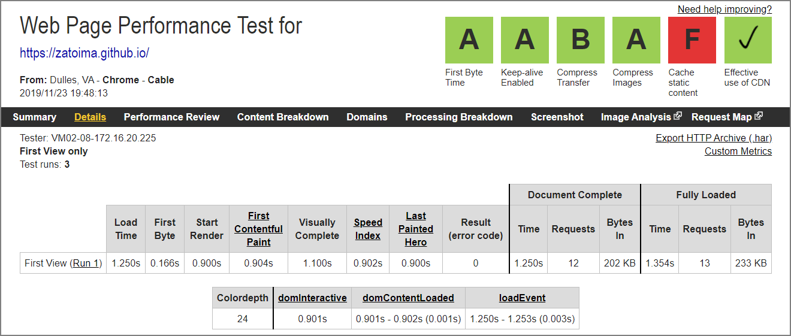
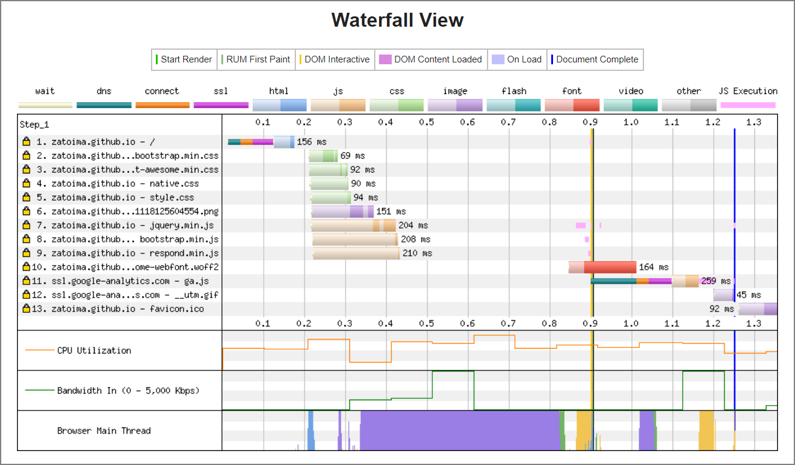

#### **静的サイトとは？**

***

Github PagesやS3上で静的ファイルを置いて外部に公開できる仕組み。静的サイトを構築するジェネレーターはたくさんあるが、今回はPelicanで作っている。理由はPythonで作られているフレームワークという点でPelicanを選択してみた。構築自体も簡単だった。（基本的にCUIや設定ファイルを書き換えることで変更を行うので慣れるまで多少時間が掛かる気がする）

日本語サイトでネットでよく見る静的サイトジェネレーターは、Hugo、Hexoあたりかな、と。色々な種類あるのでこのリンクも見てどうぞ。

<br/>

[StaticGen | Top Open Source Static Site Generators](https://www.staticgen.com/ )

<br/> 

#### **前提事項**

***

- gitインストール済

- Pythonインストール済

- Windows10

  <br/>

#### **Pelicanインストール**

***

環境を汚さないようにvirtualenvでpythonの仮想環境を作る

```bash
cd C:\
virtualenv pelican
cd pelican
Scripts\activate
```

pelican、markdownをpipでインストール

```python
pip install pelican
pip install Markdown
```

Pelican4.2がインストールされる

```
(pelican) C:\pelican>pelican --version
4.2.0
```

<br/>

#### ブログの雛形を作成**

***

pelican-quickstartコマンドを実行すると対話形式で色々聞かれる。

```sh
pelican-quickstart

> Where do you want to create your new web site? [.]
> What will be the title of this web site? zatolog
> Who will be the author of this web site? zato
> What will be the default language of this web site? [en] ja
> Do you want to specify a URL prefix? e.g., http://example.com   (Y/n) Y
> What is your URL prefix? (see above example; no trailing slash) http://zatoima.github.io
> Do you want to enable article pagination? (Y/n) Y
> How many articles per page do you want? [10] 5
> What is your time zone? [Europe/Paris] Asia/Tokyo
> Do you want to generate a Fabfile/Makefile to automate generation and publishing? (Y/n) Y
> Do you want an auto-reload & simpleHTTP script to assist with theme and site development? (Y/n) Y
> Do you want to upload your website using FTP? (y/N) N
> Do you want to upload your website using SSH? (y/N) N
> Do you want to upload your website using Dropbox? (y/N) N
> Do you want to upload your website using S3? (y/N) N
> Do you want to upload your website using Rackspace Cloud Files? (y/N) N
> Do you want to upload your website using GitHub Pages? (y/N) y
> Is this your personal page (username.github.io)? (y/N) y
Done. 
```

#### markdown形式で記事を作る

***

適当にファイルを作成して` content `フォルダ配下に保存する

```markdown
Title: My First Review
Date: 2010-12-03 10:20
Category: Review
Slug: pelican-my-first-review

Following is a review of my favorite mechanical keyboard.
```

「Title」、「Date」、「Category」、「Slug」が記事のメタデータとなる。SlugはページのURL名(HTML名）となる。


#### Windowsの追加手順

***

本来なら`make`コマンドで簡単に静的ページを生成できるが、Windowsでは出来ないのでバッチファイルを使う。下記からダウンロードしたbatファイルをPelicanをインストールしたフォルダ直下に配置。（`C:\pelican`） 

>  [https://gist.github.com/traeblain/4252511](https://gist.github.com/traeblain/4252511 ) 

一部修正する必要あり。


##### 修正前

```
set _PELICAN=$pelican
set _PELICANOPTS=$pelicanopts
.
.
cd %_OUTPUTDIR% && python -m SimpleHTTPServer
```


##### 修正後

```
set _PELICAN=pelican
set _PELICANOPTS=
.
.
cd %_OUTPUTDIR% && python -m http.server
```

※デフォルトでは"http.server"は8000ポートを使う。もし他サービス8000ポート使っていればエラーになるため、必要に応じて他のポートを使うように書き換える


```
cd %_OUTPUTDIR% && python -m http.server 8080
```


#### htmlファイルの作成


pmake htmlコマンドでmarkdownからhtmlファイルを作成し、pmake serveコマンドでlocalhostにサーバが起動されローカルで作成記事の確認が出来る。

```
pmake html
pmake serve
```


##### アクセス先

>  [http://localhost:8000](http://localhost:8000) 


#### Githubに公開する手順

***

Pelicanフォルダ配下の全てのファイルをGithub Pagesにアップロードしても良いが、不要なファイルが多く存在する。ghp-importを使うことで 指定したディレクトリをgh-pagesブランチにしてくれる。 下記では「output」フォルダがgh-pagesブランチになって、「output」フォルダの中のみがpushされる。

<br/>

```sh
cd C:\pelican
Scripts\Activate
pip install ghp-import

pmake html
pmake publish
ghp-import output
git commit -m "Update Post"
git push https://github.com/zatoima/zatoima.github.io.git gh-pages:master
```

<br/>

git push後に数分待って自分のgithub pagesにアクセスする。※下記ページは既にtheme変更後のページ。


#### Pelican themeの変更方法

***

themeの変更はすごく簡単。ただ、themeによって設定できる項目が違っているのでカスタマイズを進めると他のthemeには変えづらくなる。（どこのブログサービスも同じか）

pelicanのオフィシャルのthemesを全てcloneする

```bash
git clone --recursive https://github.com/getpelican/pelican-themes ~/pelican-themes
```

`pelicanconf.py`のTHEME変数を修正する。

```sh
THEME = 'pelican-themes\\pelican-bootstrap3'
```


#### Pluginの導入方法

***

pelicanのオフィシャルのpluginを全てcloneする

```bash
git clone --recursive https://github.com/getpelican/pelican-plugins.git pelican-plugins
```

`pelicanconf.py`のPLUGIN_PATHS変数、PLUGINS変数を修正する。PLUGIN_PATHSには上記でcloneしたディレクトリを指定

```sh
PLUGIN_PATHS = ['pelican-plugins']

PLUGINS = ['i18n_subsites','tag_cloud','sitemap','series']
```

#### Appendix

***

WebPageTestでWebページ表示までのパフォーマンスを確認してみた。阿部寛のサイトにも勝てそう。

> WebPageTest - Website Performance and 	Optimization Test [https://www.webpagetest.org/](https://www.webpagetest.org/)





