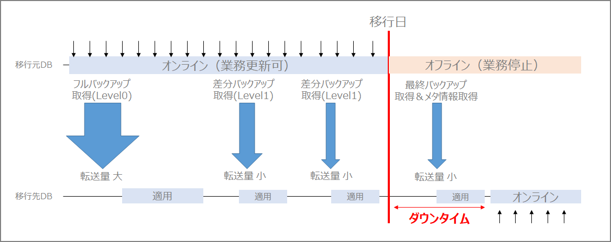

この記事は [JPOUG Advent Calendar 2019](https://adventar.org/calendars/4154) 11日目の記事です！10日目は Naotaka Shinogi さんの  [データベースをNutanixの上で動かすことを考える](https://ameblo.jp/shinogi-gogo/entry-12555315409.html)  でした。Nutanix Eraに興味を惹かれてNutanix社にカジュアル面談に行ったことを思い出しました。

#### **1.移行について**

Oracle to Oracleのアップグレード、クラウド化プロジェクトを想定します。システム移行と聞くとそのプロジェクトに関係していなくてもドキドキしますが、特にデータベースのアップグレードイベントは一際注目度が高くなると思います。一大イベントです。データベースに格納されているデータは業務の根幹ですし、データベースに問題があるとシステム全体に影響があるので重要度が上がるのだと思っています。如何に「リスクを少なく」、「短時間」で「何事もなく」行えるかがDBAの腕の見せどころだと思います。ユーザ影響やその他の影響度の大小はもちろんあると思いますが、データベースのアップグレード時に数日単位で止められる方が難しいのではないかと思います。可能であればゼロダウンタイム、止めても数時間、1日という要件が多いように感じます。移行後も新旧並行稼動して新システム側の更新を旧システム側に反映…という要件も。AWSのRDSを始めとしたクラウドサービスやOSSのPostgreSQLやMySQLがある中でOracle Databaseを使い続けるという選択をする場合なので、利用者の多い重要なシステムであるということは違わないと思います。

Data Pump(昔からのシステムからの移行であればimp/exp)を使うデータ移行の方法が従来からよく使われていたと思います。一番最初に関わったプロジェクトがそうでした。このプロジェクトでは移行時間を多く確保していました。データ移行後に本当にデータの整合性が確保されているか件数確認や実際のデータを確認したり。システム基盤更改だけではなく業務要件対応も一緒に実施していたので、移行ツールの開発などが大変でした。データベース移行は「simple is best」をやはり心掛けるべきだな、と感じました。と言っても現行データベースの分析を行っていくと、他システムと連携をdblinkを使っており、移行の順番を考えないといけない。筐体に乗っているシステムごとに移行しないといけない、等のデータベース単体では収まらない事情が多く発生してくると思います。

前置きが長くなりましたが、移行時のダウンタイムを減らす、移行の確実性を高めるためといった目的のためににどのような手段が取られるかと言うと差分同期を行う移行デザインパターンが一番頭に浮かびます。例えば次のようなケースです。

- 移行日の数週間前　　　　　　　　：一定の断面を確保し、移行先へデータを持っていく

- 移行日の数週間前～移行日当日まで：差分同期を逐次実施

- 当日　　　　　　　　　　　　　　：差分同期の追いつきを確認後、切替を行う

このユースケースの最たる例がOracle GoldenGate、AWS Database Migration Serviceあたりが有名な差分同期の製品やサービスではないかと思います。当日のリスクを移行日以前に持ってくるケースです。

#### **2.Oracle Databaseのデータ移行手段**

ご存知の通り、Oracle Databaseは多くのデータの移行手段を用意しています。

- export/import（※旧バージョンからの移行のみ）
- Data Pump
- トランスポータブル表領域
- クロスプラットフォーム・トランスポータブル表領域
- 増分バックアップを利用したトランスポータブル表領域
- 増分クロスプラットフォーム・トランスポータブル表領域
- フル・トランスポータブルexport/import
- Oracle GoldenGate 
- バックアップからの複製
- Data Guard スタンバイからのプライマリ昇格
- Oracle Zero Downtime Migration（※Oracle Cloud上への移行に限る）

参考：

> Oracle Databaseのアップグレード・移行ベストプラクティスのご紹介 [https://www.oracle.com/technetwork/jp/content/upgrade-patch-seminar-2654134-ja.pdf](https://www.oracle.com/technetwork/jp/content/upgrade-patch-seminar-2654134-ja.pdf)

今回は、この中から「増分トランスポータブル表領域」と「Oracle Zero Downtime Migration」について書いてみます。選定理由としては「増分バックアップを利用したトランスポータブル表領域」はダウンタイムを極力減らすことが出来るソリューションにも関わらずあまり使われていないと思ったのと、Web上にあまり「やってみた」系記事がなかったことから選びました。「Oracle Zero Downtime Migration」は最近リリースされたOracle Cloudへデータを移行するための方法ですが、「Zero Downtime」のアーキテクチャが気になったため選びました。「Oracle Zero Downtime Migration」も実機で試してみたのですが、途中でエラーになってハマってしまった~~時間が足りなかった~~ので机上で調査した内容をまとめてみます。

#### **3.増分バックアップを利用したトランスポータブル表領域**

増分バックアップを利用したトランスポータブル表領域のメリットや有効性については、[JPOUG Advent Calendar 2016](https://jpoug.doorkeeper.jp/events/53797) の コーソル 渡部さんの記事にも記載されています。合わせてご参照ください。

> RMANの差分増分バックアップ機能とフル・トランスポータブル・エクスポート/インポート機能を活用してダウンタイムを極力短くしたデータベース移行方法の図を書いてみた (コーソル DatabaseエンジニアのBlog) [http : //cosol.jp/techdb/2016/12/illustrate-full-transportable-export-import-with-rman-incremental-backup.html](http : //cosol.jp/techdb/2016/12/illustrate-full-transportable-export-import-with-rman-incremental-backup.html)

ちなみに、MOSにはCross Platform Transportable Tablespace with Incremental Backupを主題に置いた下記のhow to のナレッジがありますが、私が確認する限りマニュアルには手順は用意されていないと思っています。

> V4 Reduce Transportable Tablespace Downtime using Cross Platform Incremental Backup (ドキュメントID 2471245.1)

また、2471245.1 のドキュメントですが、Perlスクリプトを使ってデータ移行を行うため、内部的にどのような処理やコマンドが使われるのかがわかりません。なので、手動で増分バックアップを利用したトランスポータブル表領域を実施してみます。Doc 2471245.1 を参考にしているのでおそらく合っていると思いますが、実際にこの手法を使って移行する場合は上記ドキュメントのPerlスクリプトを使って移行した方が良いと思います。色々と多機能です。SCNの管理も自動で行ってくれます。

#### **増分バックアップを利用したトランスポータブル表領域の手順の流れ**

1.準備フェーズ（ソースデータはオンラインのまま）

​    ー 表領域のフルバックアップ（Level0)
​    ー バックアップセットをターゲットDB側に転送する

2.フルバックアップ（Level0)のリストア

​    ー ソースDBで取得したバックアップセットをターゲットDBにロールフォワードする

3.ソースシステムで増分バックアップを取得してターゲットシステムに適用

​    ー 増分バックアップセットをターゲットDB側に転送する。移行先のデータファイルに適用

4.メタデータの取得、移行

​    ー 移行元データベースをREAD ONLYに変更してロールフォワードフェーズを最後に行う
​    ー Data Pumpを使用して、表領域内のオブジェクトのメタデータを移行先データベースにインポート
​    ー 移行先データベースの表領域をREAD WRITEに変更

#### **イメージ図**

移行日より前に特定時点のフルバックアップとフルバック以降に発生した差分データを事前に移行することによってダウンタイムが縮小化できます。




#### **実行環境**

移行元：12.1.0.2

移行先：19.3

#### **手順**

##### **1.ブロック・チェンジ・トラッキングの有効化**

今回は増分バックアップを使用するのでブロック・チェンジ・トラッキング・ファイル（変更追跡ファイル）を有効化します。これによりバックアップ取得を高速化出来ます。増分バックアップの際には、このファイルを元にデータ変更が行われたブロックだけをダイレクトに読み込むことが出来るため、バックアップ所要時間を短縮できます。

```sql
ALTER DATABASE ENABLE BLOCK CHANGE TRACKING;
```

##### **2.level0のバックアップの取得**

ソース側のSCNを確認する。

```sql
SQL> select current_scn from v$database;

CURRENT_SCN
-----------
    3450645
```

level 0 のバックアップを取得します。今回はTTSという表領域を移行対象とします。[必要に応じてトランスポートする表領域セットが自己完結型であることを確認](https  :  //docs.oracle.com/cd/E57425_01/121/ARPLS/d_tts.htm)する必要があります。

```sh
rman target /
backup for transport allow inconsistent incremental level 0 format '/home/oracle/rman/tts_level0.bkp' tablespace tts;

backupが開始されました(開始時間 :  19-12-11)
チャネルORA_DISK_1の使用
チャネルORA_DISK_1 :  増分レベル0のデータファイル・バックアップ・セットを開始しています
チャネルORA_DISK_1 :  バックアップ・セットにデータファイルを指定しています
入力データファイル・ファイル番号=00014 名前=/u01/app/oracle/oradata/DB121S/datafile/o1_mf_tts_gystzx22_.dbf
チャネルORA_DISK_1 :  ピース1(19-12-11)を起動します

チャネルORA_DISK_1 :  ピース1(19-12-11)が完了しました
ピース・ハンドル=/home/oracle/rman/tts_level0.bkp タグ=TAG20191211T135511 コメント=NONE
チャネルORA_DISK_1 :  バックアップ・セットが完了しました。経過時間 :  00 : 00 : 01
backupが完了しました(完了時間 :  19-12-11)
```

##### **3.ターゲット側でLevel0のバックアップからリストアする**

ターゲット側でrestoreする

```sh
restore all foreign datafiles to new from backupset '/home/oracle/rman/tts_level0.bkp';

[oracle@dbsrvec2 ~]$ rman target /

Recovery Manager :  Release 19.0.0.0.0 - Production on 水 12月 11 13 : 46 : 43 2019
Version 19.3.0.0.0

Copyright (c) 1982, 2019, Oracle and/or its affiliates.  All rights reserved.

ターゲット・データベース :  DB19C (DBID=2154771102)に接続されました

RMAN> restore all foreign datafiles to new from backupset '/home/oracle/rman/tts_level0.bkp';

restoreを19-12-11で開始しています
チャネルORA_DISK_1の使用

チャネルORA_DISK_1 :  データファイル・バックアップ・セットのリストアを開始しています
チャネルORA_DISK_1 :  バックアップ・セットからリストアするデータファイルを指定しています
チャネルORA_DISK_1 :  バックアップ・ピースのすべての外部ファイルをリストアしています
チャネルORA_DISK_1 :  バックアップ・ピース/home/oracle/rman/tts_level0.bkpから読取り中です
チャネルORA_DISK_1 :  外部ファイル14を/u01/app/oracle/oradata/DB19C/datafile/o1_mf_tts_gz1xbopy_.dbfにリストアしています
チャネルORA_DISK_1 :  外部ピース・ハンドル/home/oracle/rman/tts_level0.bkp
チャネルORA_DISK_1 :  バックアップ・ピース1がリストアされました
チャネルORA_DISK_1 :  リストアが完了しました。経過時間 :  00 : 00 : 02
restoreを19-12-11で終了しました
```

DB_CREATE_FILE_DESTが設定されていないとエラーになります。「RMAN-05088 :  DB_CREATE_FILE_DESTが設定されていません」

```sql
ALTER SYSTEM SET DB_CREATE_FILE_DEST = '/u01/app/oracle/oradata/db19c' SCOPE = both;
```

##### **4.増分バックアップの取得**

再度ソース側のSCNを確認する。

```sql
SQL> select current_scn from v$database;

CURRENT_SCN
-----------
    3450702
```

次はlevel 1 の増分バックアップを取得します。ここで指定するSCNは一番最初に取得したSCNを指定します。

```sh
backup for transport allow inconsistent incremental from scn 3450645 format '/home/oracle/rman/tts_level1.bkp' tablespace tts;

RMAN> backup for transport allow inconsistent incremental from scn 3450645 format '/home/oracle/rman/tts_level1.bkp' tablespace tts;

backupが開始されました(開始時間 :  19-12-11)
チャネルORA_DISK_1の使用
チャネルORA_DISK_1 :  フル・データファイル・バックアップ・セットを開始しています
チャネルORA_DISK_1 :  バックアップ・セットにデータファイルを指定しています
入力データファイル・ファイル番号=00014 名前=/u01/app/oracle/oradata/DB121S/datafile/o1_mf_tts_gystzx22_.dbf
チャネルORA_DISK_1 :  ピース1(19-12-11)を起動します
チャネルORA_DISK_1 :  ピース1(19-12-11)が完了しました
ピース・ハンドル=/home/oracle/rman/tts_level1.bkp タグ=TAG20191211T135615 コメント=NONE
チャネルORA_DISK_1 :  バックアップ・セットが完了しました。経過時間 :  00 : 00 : 01
backupが完了しました(完了時間 :  19-12-11)
```

ちなみに移行元側で更新がない場合はエラー（skip）になります。

```sh
RMAN-06755 :  警告 :  データファイル14 :  増分起動SCNが新しすぎます。かわりにチェックポイントSCN 3304366を使用しています
チャネルORA_DISK_1 :  フル・データファイル・バックアップ・セットを開始しています
チャネルORA_DISK_1 :  バックアップ・セットにデータファイルを指定しています
入力データファイル・ファイル番号=00014 名前=/u01/app/oracle/oradata/DB121S/datafile/o1_mf_tts_gystzx22_.dbf
データファイル00014は、変更がないためスキップします
チャネルORA_DISK_1 :  全ファイルがスキップされたため、バックアップは取り消されました
backupが完了しました(完了時間 :  19-12-11)
```

##### **5.増分バックアップの適用**

増分バックアップをデータファイルに適用します。ここで指定するデータファイルは上記のrestoreコマンドを実行した時に出力されるデータファイルです。

```sh
recover foreign datafilecopy '/u01/app/oracle/oradata/DB19C/datafile/o1_mf_tts_gz1xbopy_.dbf' from backupset '/home/oracle/rman/tts_level1.bkp';

RMAN> recover foreign datafilecopy '/u01/app/oracle/oradata/DB19C/datafile/o1_mf_tts_gz1xbopy_.dbf' from backupset '/home/oracle/rman/tts_level1.bkp';

restoreを19-12-11で開始しています
チャネルORA_DISK_1の使用

チャネルORA_DISK_1 :  データファイル・バックアップ・セットのリストアを開始しています
チャネルORA_DISK_1 :  バックアップ・セットからリストアするデータファイルを指定しています
チャネルORA_DISK_1 :  外部ファイル/u01/app/oracle/oradata/DB19C/datafile/o1_mf_tts_gz1xbopy_.dbfをリストアしています
チャネルORA_DISK_1 :  バックアップ・ピース/home/oracle/rman/tts_level1.bkpから読取り中です
チャネルORA_DISK_1 :  外部ピース・ハンドル/home/oracle/rman/tts_level1.bkp
チャネルORA_DISK_1 :  バックアップ・ピース1がリストアされました
チャネルORA_DISK_1 :  リストアが完了しました。経過時間 :  00 : 00 : 01
restoreを19-12-11で終了しました
```

移行日が来るまで任意のタイミングで"増分バックアップを作成"と"増分バックアップの適用"フェーズを繰り返します。

##### **6.最終分の増分バックアップの適用、及びメタデータの取得**

移行日当日の作業となります。このタイミングから移行元データベースはダウンタイムが発生します。移行対象のTTSを読み取り専用にします。

```sql
alter tablespace tts read only;
```

表領域が現在読み取り専用になっている最後の増分バックアップを作成する。データファイルを移行先データベースでトランスポータブルするためにメタデータを取得します。

```sh
backup for transport incremental from scn 3450702 format '/home/oracle/rman/tts_last.bkp' tablespace tts DATAPUMP FORMAT '/home/oracle/rman/dp_tts_ts.dmp';

RMAN> backup for transport incremental from scn 3450702 format '/home/oracle/rman/tts_last.bkp' tablespace tts DATAPUMP FORMAT '/home/oracle/rman/dp_tts_ts.dmp';

backupが開始されました(開始時間 :  19-12-11)
チャネルORA_DISK_1の使用
指定された表領域でTRANSPORT_SET_CHECKを実行しています
TRANSPORT_SET_CHECKは正常に終了しました

指定された表領域のメタデータをエクスポートしています...
   EXPDP> "SYS"."TRANSPORT_EXP_DB121S_bCex"を起動しています :  
   EXPDP> オブジェクト型TRANSPORTABLE_EXPORT/PLUGTS_BLKの処理中です
   EXPDP> オブジェクト型TRANSPORTABLE_EXPORT/TABLEの処理中です
   EXPDP> オブジェクト型TRANSPORTABLE_EXPORT/CONSTRAINT/CONSTRAINTの処理中です
   EXPDP> オブジェクト型TRANSPORTABLE_EXPORT/INDEX_STATISTICSの処理中です
   EXPDP> オブジェクト型TRANSPORTABLE_EXPORT/TABLE_STATISTICSの処理中です
   EXPDP> オブジェクト型TRANSPORTABLE_EXPORT/STATISTICS/MARKERの処理中です
   EXPDP> オブジェクト型TRANSPORTABLE_EXPORT/POST_INSTANCE/PLUGTS_BLKの処理中です
   EXPDP> マスター表"SYS"."TRANSPORT_EXP_DB121S_bCex"は正常にロード/アンロードされました
   EXPDP> ******************************************************************************
   EXPDP> SYS.TRANSPORT_EXP_DB121S_bCexに設定されたダンプ・ファイルは次のとおりです : 
   EXPDP>   /u01/app/oracle/product/12.1.0.2/dbhome_1/dbs/backup_tts_DB121S_17308.dmp
   EXPDP> ******************************************************************************
   EXPDP> トランスポータブル表領域TTSにはデータファイルが必要です : 
   EXPDP>   /u01/app/oracle/oradata/DB121S/datafile/o1_mf_tts_gystzx22_.dbf
   EXPDP> ジョブ"SYS"."TRANSPORT_EXP_DB121S_bCex"が水 12月 11 14 : 02 : 24 2019 elapsed 0 00 : 00 : 47で正常に完了しました
エクスポートが完了しました

チャネルORA_DISK_1 :  フル・データファイル・バックアップ・セットを開始しています
チャネルORA_DISK_1 :  バックアップ・セットにデータファイルを指定しています
入力データファイル・ファイル番号=00014 名前=/u01/app/oracle/oradata/DB121S/datafile/o1_mf_tts_gystzx22_.dbf
チャネルORA_DISK_1 :  ピース1(19-12-11)を起動します
チャネルORA_DISK_1 :  ピース1(19-12-11)が完了しました
ピース・ハンドル=/home/oracle/rman/tts_last.bkp タグ=TAG20191211T140131 コメント=NONE
チャネルORA_DISK_1 :  バックアップ・セットが完了しました。経過時間 :  00 : 00 : 01
チャネルORA_DISK_1 :  フル・データファイル・バックアップ・セットを開始しています
入力データ・ポンプ・ダンプ・ファイル=/u01/app/oracle/product/12.1.0.2/dbhome_1/dbs/backup_tts_DB121S_17308.dmp
チャネルORA_DISK_1 :  ピース1(19-12-11)を起動します
チャネルORA_DISK_1 :  ピース1(19-12-11)が完了しました
ピース・ハンドル=/home/oracle/rman/dp_tts_ts.dmp タグ=TAG20191211T140131 コメント=NONE
チャネルORA_DISK_1 :  バックアップ・セットが完了しました。経過時間 :  00 : 00 : 01
backupが完了しました(完了時間 :  19-12-11)
```

データファイルに最後の適用を行います。

```sh
recover foreign datafilecopy '/u01/app/oracle/oradata/DB19C/datafile/o1_mf_tts_gz1xbopy_.dbf' from backupset '/home/oracle/rman/tts_last.bkp';

RMAN> recover foreign datafilecopy '/u01/app/oracle/oradata/DB19C/datafile/o1_mf_tts_gz1xbopy_.dbf' from backupset '/home/oracle/rman/tts_last.bkp';

restoreを19-12-11で開始しています
チャネルORA_DISK_1の使用

チャネルORA_DISK_1 :  データファイル・バックアップ・セットのリストアを開始しています
チャネルORA_DISK_1 :  バックアップ・セットからリストアするデータファイルを指定しています
チャネルORA_DISK_1 :  外部ファイル/u01/app/oracle/oradata/DB19C/datafile/o1_mf_tts_gz1xbopy_.dbfをリストアしています
チャネルORA_DISK_1 :  バックアップ・ピース/home/oracle/rman/tts_last.bkpから読取り中です
チャネルORA_DISK_1 :  外部ピース・ハンドル/home/oracle/rman/tts_last.bkp
チャネルORA_DISK_1 :  バックアップ・ピース1がリストアされました
チャネルORA_DISK_1 :  リストアが完了しました。経過時間 :  00 : 00 : 01
restoreを19-12-11で終了しました
```

最終的なバックアップセットからメタデータエクスポートダンプを取得する。

```sh
restore dump file datapump destination '/u01/app/oracle/admin/db19c/dpdump' from backupset '/home/oracle/rman/dp_tts_ts.dmp';

RMAN> restore dump file datapump destination '/u01/app/oracle/admin/db19c/dpdump' from backupset '/home/oracle/rman/dp_tts_ts.dmp';

restoreを19-12-11で開始しています
チャネルORA_DISK_1の使用

チャネルORA_DISK_1 :  データファイル・バックアップ・セットのリストアを開始しています
チャネルORA_DISK_1 :  バックアップ・セットからリストアするデータファイルを指定しています
チャネルORA_DISK_1 :  データ・ポンプ・ダンプ・ファイルを/u01/app/oracle/admin/db19c/dpdump/backup_tts_DB19C_54885.dmpにリストアしています
チャネルORA_DISK_1 :  バックアップ・ピース/home/oracle/rman/dp_tts_ts.dmpから読取り中です
チャネルORA_DISK_1 :  外部ピース・ハンドル/home/oracle/rman/dp_tts_ts.dmp
チャネルORA_DISK_1 :  バックアップ・ピース1がリストアされました
チャネルORA_DISK_1 :  リストアが完了しました。経過時間 :  00 : 00 : 02
restoreを19-12-11で終了しました

```

**7.トランスポータブル実行！**

このメタデータを移行先にインポートすることによって、これまでせっせとrecover（適用）してきたデータファイルを移行先でようやく使えるようになります。

```sh
impdp system/oracle directory=data_pump_dir dumpfile=backup_tts_DB19C_54885.dmp logfile=backup_tts_DB19C_54885.log transport_datafiles='/u01/app/oracle/oradata/DB19C/datafile/o1_mf_tts_gz1xbopy_.dbf';

[oracle@dbsrvec2 ~]$ impdp system/oracle directory=data_pump_dir dumpfile=backup_tts_DB19C_54885.dmp logfile=backup_tts_DB19C_54885.log transport_datafiles='/u01/app/oracle/oradata/DB19C/datafile/o1_mf_tts_gz1xbopy_.dbf';

Import :  Release 19.0.0.0.0 - Production on 水 12月 11 14 : 07 : 18 2019
Version 19.3.0.0.0

Copyright (c) 1982, 2019, Oracle and/or its affiliates.  All rights reserved.

接続先 :  Oracle Database 19c Enterprise Edition Release 19.0.0.0.0 - Production
マスター表"SYSTEM"."SYS_IMPORT_TRANSPORTABLE_01"は正常にロード/アンロードされました
"SYSTEM"."SYS_IMPORT_TRANSPORTABLE_01"を起動しています :  system/******** directory=data_pump_dir dumpfile=backup_tts_DB19C_54885.dmp logfile=backup_tts_DB19C_54885.log transport_datafiles=/u01/app/oracle/oradata/DB19C/datafile/o1_mf_tts_gz1xbopy_.dbf 
オブジェクト型TRANSPORTABLE_EXPORT/PLUGTS_BLKの処理中です
ORA-39123 :  データ・ポンプ・トランスポータブル表領域ジョブが異常終了しました。
ORA-29342 :  ユーザーTTSはデータベースに存在しません。

ジョブ"SYSTEM"."SYS_IMPORT_TRANSPORTABLE_01"は致命的なエラーのため水 12月 11 14 : 07 : 22 2019 elapsed 0 00 : 00 : 02で停止しました

```

ユーザを作成します。この時点でTTS表領域は存在しないため、デフォルト表領域は指定しません。

```sh
SQL> create user tts identified by "oracle";

ユーザーが作成されました。

SQL> grant dba to tts;

権限付与が成功しました。
```

ワンモアチャレンジ。

```sh
[oracle@dbsrvec2 ~]$ impdp system/oracle directory=data_pump_dir dumpfile=backup_tts_DB19C_54885.dmp logfile=backup_tts_DB19C_54885.log transport_datafiles='/u01/app/oracle/oradata/DB19C/datafile/o1_mf_tts_gz1xbopy_.dbf';

Import :  Release 19.0.0.0.0 - Production on 水 12月 11 14 : 08 : 56 2019
Version 19.3.0.0.0

Copyright (c) 1982, 2019, Oracle and/or its affiliates.  All rights reserved.

接続先 :  Oracle Database 19c Enterprise Edition Release 19.0.0.0.0 - Production
マスター表"SYSTEM"."SYS_IMPORT_TRANSPORTABLE_01"は正常にロード/アンロードされました
"SYSTEM"."SYS_IMPORT_TRANSPORTABLE_01"を起動しています :  system/******** directory=data_pump_dir dumpfile=backup_tts_DB19C_54885.dmp logfile=backup_tts_DB19C_54885.log transport_datafiles=/u01/app/oracle/oradata/DB19C/datafile/o1_mf_tts_gz1xbopy_.dbf 
オブジェクト型TRANSPORTABLE_EXPORT/PLUGTS_BLKの処理中です
オブジェクト型TRANSPORTABLE_EXPORT/TABLEの処理中です
オブジェクト型TRANSPORTABLE_EXPORT/CONSTRAINT/CONSTRAINTの処理中です
オブジェクト型TRANSPORTABLE_EXPORT/INDEX_STATISTICSの処理中です
オブジェクト型TRANSPORTABLE_EXPORT/TABLE_STATISTICSの処理中です
オブジェクト型TRANSPORTABLE_EXPORT/STATISTICS/MARKERの処理中です
オブジェクト型TRANSPORTABLE_EXPORT/POST_INSTANCE/PLUGTS_BLKの処理中です
ジョブ"SYSTEM"."SYS_IMPORT_TRANSPORTABLE_01"が水 12月 11 14 : 09 : 09 2019 elapsed 0 00 : 00 : 13で正常に完了しました
```

TTS表領域が作成されています。ttsユーザのデフォルト表領域も変更しておきます。

```sh
SQL> select TABLESPACE_NAME from dba_tablespaces;

TABLESPACE_NAME
--------------------------------------------------------------------------------
SYSTEM
SYSAUX
UNDOTBS1
TEMP
USERS
TTS

6行が選択されました。

SQL> alter user tts DEFAULT TABLESPACE tts;

ユーザーが変更されました。
```

移行先で表領域を書き込み可能に変更して終わりです。

```sql
alter tablespace tts read write;
```

#### **所感**

上記の通り、他移行方法と比べて大きな特徴があります。GoldenGateの代わりになるとは言い切れませんが、＋αのコストを掛けずに移行したい、ダウンタイムを減らしたい、バージョンアップをしたい、という場合にはこの方法も使えるのではないでしょうか。


#### **4.Oracle Zero Downtime Migrationについて**

##### **はじめに**

Oracleが提供するZero Downtime Migrationツールのアーキテクチャ、中身、コンセプトを知りたくて資料を眺めていました。始めは実際にやってみて使用感の確認や本当に使えるか試してAdavanced Calendarのネタにしたかったのですがエラーにハマり諦めました。概要レベルだけまとめてみます。インプット情報は全て下記のマニュアルとホワイトペーパーです。

> [https://www.oracle.com/database/technologies/rac/zdm.html](https://www.oracle.com/database/technologies/rac/zdm.html)
>
> [https://docs.oracle.com/en/database/oracle/zero-downtime-migration/](https://docs.oracle.com/en/database/oracle/zero-downtime-migration/)
>
> [https://www.oracle.com/technetwork/database/options/clustering/learnmore/oracle-zdm-wp-5869851.pdf](https://www.oracle.com/technetwork/database/options/clustering/learnmore/oracle-zdm-wp-5869851.pdf)

##### **Oracle Zero Downtime Migrationの概要**

大きく分けて２つの機能があるようです。

- Data Guardを使用したZero Downtime Migration
- オフライン（バックアップと復元）移行

「Data Guardを使用したZero Downtime Migration」の大まかなstepは [公式ページ の 8 Simple Automated Steps](https://www.oracle.com/database/technologies/rac/zdm.html) を見ればわかります。

1. ZDM/Agentのインストール&セットアップ（※別途100GB以上のストレージを持ったOracle Linux7以上の環境が必要です）
2. ZDMの起動
3. 移行元のデータベースとObject Storageを接続
4. Object StorageにRMANを使用してバックアップを取得
5. Data Guardスタンバイを作成(4.のバックアップを使用)
6. Data Guardで同期
7. スイッチオーバー
8. 移行元と移行先のコネクションの終了、ソースとターゲット環境のクリーンアップ

一方、「オフライン（バックアップと復元）移行」はData Guardを使用できないStandard Edtition用に用意された機能です。とは言え、「オフライン（バックアップと復元）」移行の方の詳細はマニュアルやホワイトペーパーからはあまり確認できませんでした。オフラインの場合は特にソースデータベースとターゲットデータベース側でネットワーク接続は不要です。なお、"zdm_template_zdmsdb.rsp"ファイルがあるのでそこでData Guardを使用したMigrationをするのかオフライン（object storage経由）の移行をするのかを選択します。

次にホワイトペーパーを眺めてみます。ベースとして使用されている機能はData Guardと明確に述べています。

> ZDM automates the entire process of migration, reducing the chance of human errors. ZDM leverages Oracle Database-integrated high availability (HA) technologies such as Oracle Data Guard and follows all MAA best practices that ensures zero to no downtime of production environments

サポートしているバージョンは11.2.0.4 ～ 19cが対象です。

> Oracle ZDM supports the following Oracle Database versions :  
>
> • 11.2.0.4 
> • 12.1.0.2 
> • 12.2.0.1 
> • 18c 
> • 19c

Data Guardをベースとしたソリューションのために、Oracle Zero Downtime Migrationでは同じバージョンのデータベースのみMigrationが可能です。

> The source and target databases should be in the same database version. Oracle ZDM supports Oracle Databases hosted on Linux operating systems. The source database can be a single instance database migrating to a single instance or a RAC database, or it can also be a RAC One Node / RAC database, migrating to a RAC database.

Standard Edition がData Guardを使用できないと同様にZero Downtime MigrationでもData Guardではない他の手段を使ってMigrationする必要があります。

> Oracle ZDM supports Enterprise & Standard Edition Oracle Databases as source databases. Enterprise Edition Databases are migrated leveraging Oracle Data Guard; Standard Edition Databases are migrated in an offline manner using a backup and restore methodology.

詳細ステップはこちら。ZDMCLI コマンドを使用することで自動実行が出来ます。

| **フェーズ名**                | **説明**                                                     |
| :---------------------------- | :----------------------------------------------------------- |
| ZDM_GET_SRC_INFO              | ソースデータベースに関する情報を取得する                     |
| ZDM_GET_TGT_INFO              | ターゲットデータベースに関する情報を取得する                 |
| ZDM_SETUP_SRC                 | 移行元サーバーでゼロダウンタイム移行ヘルパーモジュールをセットアップする |
| ZDM_SETUP_TGT                 | ターゲットサーバーでゼロダウンタイム移行ヘルパーモジュールをセットアップする |
| ZDM_PREUSERACTIONS            | 移行前のユーザーアクションがあれば、ソースで実行する         |
| ZDM_PREUSERACTIONS_TGT        | ターゲットで移行の事前ユーザーアクション（存在する場合）を実行する |
| ZDM_OBC_INST_SRC              | ソースにOracle Database Cloud Backup Moduleをインストールします |
| ZDM_OBC_INST_TGT              | ターゲットにOracle Database Cloud Backup Moduleをインストールします |
| ZDM_GEN_RMAN_PASSWD           | RMANバックアップを暗号化するためのランダムパスワードを生成する |
| ZDM_BACKUP_FULL_SRC           | ソースデータベースの完全バックアップを実行する               |
| ZDM_BACKUP_INCREMENTAL_SRC    | ソースデータベースの増分バックアップを実行する               |
| ZDM_VALIDATE_SRC              | ソースで検証を実行する                                       |
| ZDM_VALIDATE_TGT              | ターゲットで検証を実行します                                 |
| ZDM_DISCOVER_SRC              | Data Guardを設定するためにソースでデータベース検出を実行します |
| ZDM_COPYFILES                 | OracleパスワードファイルとTDEウォレットをソースからターゲットにコピーします |
| ZDM_OSS_STANDBY_SETUP_TDE_TGT | TDEウォレットファイルをソースからターゲットキーストアの場所にコピーします |
| ZDM_PREPARE_TGT               | Data Guardスタンバイ作成のターゲットを準備する               |
| ZDM_CLONE_TGT                 | クラウドバックアップからData Guardスタンバイを作成する       |
| ZDM_FINALIZE_TGT              | ターゲットのData Guardスタンバイ準備を完了します             |
| ZDM_CONFIGURE_DG_SRC          | クラウドスタンバイをソースに登録する                         |
| ZDM_SWITCHOVER_SRC            | ソースでスイッチオーバーアクションを開始する                 |
| ZDM_SWITCHOVER_TGT            | ターゲットでスイッチオーバーアクションを完了する             |
| ZDM_POSTUSERACTIONS           | ソースで移行後のユーザーアクションを実行する                 |
| ZDM_POSTUSERACTIONS_TGT       | ターゲットで移行後のユーザーアクションを実行する             |
| ZDM_CLEANUP_SRC               | ソースでクリーンアップを実行します                           |
| ZDM_CLEANUP_TGT               | ターゲットでクリーンアップを実行します                       |


##### **所感**

当初、Zero Downtime Migrationという言葉からはOracle GoldenGateが思い浮かびましたが、実際にはData Guardの機能で行うようです。同じバージョンでしか使えないので"バージョンアップを伴う"Cloud移行には使えないのがネックかと思いました。単純にクラウド移行を行うためだけのツールという理解に至りました。Data Guardのモード（同期/非同期）や非同期の場合、適用ラグがあった場合の動作が気になります。また、マニュアルを見る限り移行元データベース側の事前準備としてData Guardの設定変更に関する記載が無かったように思いました。DGはForce Logging必須ではなかった？実際に最後まで動かせていないので詳細までは記載出来なかったのが心残りです。


#### **最後に**

***

よりよい移行方法を使って楽をしましょう！

数ヶ月前からPelicanというフレームワークを使いGithub Pages上にホストしているのですが、使い勝手が悪すぎるので早速ブログ移行したいです。