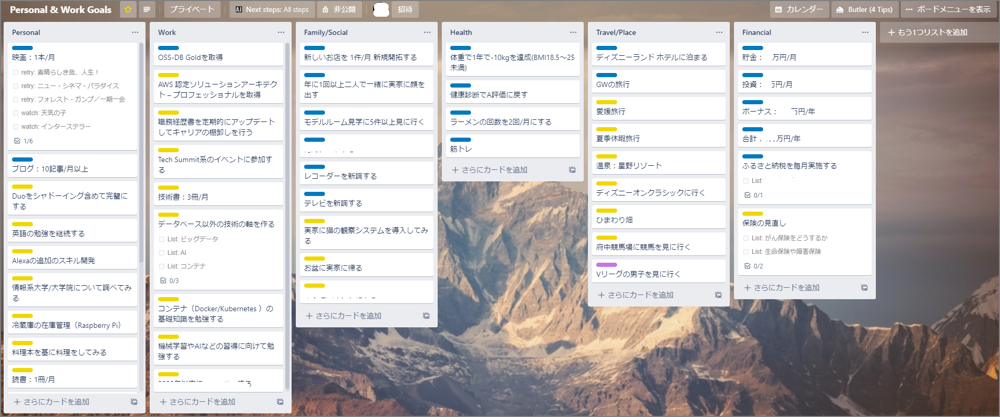

2019年は転職とブログの継続という２つの大きな目標は達成できた。次は2020年に向けて元旦に整理してみた。

#### 目標

今年は状況のアップデートや定期的に振り返りがしやすいようにtrelloで目標（ほぼやってみたいこと）を整理。目標の数は切りよく50個。一つ一つをもう少し定量的にして毎月振り返りを行いたい。（今年こそは・・・）

#### 一覧

重点目標は健康管理とPersonal系。

| List          | Title                                                        | Labels            |
| ------------- | ------------------------------------------------------------ | ----------------- |
| Personal      | 映画：1本/月                                                 | On Going          |
| Personal      | ブログ：10記事/月以上                                        | On Going          |
| Personal      | Duoをシャドーイング含めて完璧にする                          | Needs work/review |
| Personal      | 英語の勉強を継続する                                         | Needs work/review |
| Personal      | Alexaの追加のスキル開発                                      | Needs work/review |
| Personal      | 情報系大学/大学院について調べてみる                          | Needs work/review |
| Personal      | 冷蔵庫の在庫管理（Raspberry Pi）                             | Needs work/review |
| Personal      | 料理本を基に料理をしてみる                                   | Needs work/review |
| Personal      | 読書：1冊/月                                                 | Needs work/review |
| Personal      | ブログ：100pv/月                                             | Needs work/review |
| Personal      | Advent Calendarに3つエントリーする                           | Needs work/review |
| Personal      | リポジトリを作ってリリースしてみる                           | Needs work/review |
| Personal      | webサービスかbotを作る                                       | Needs work/review |
| Work          | OSS-DB Goldを取得                                            | On Going          |
| Work          | AWS 認定ソリューションアーキテクト – プロフェッショナルを取得 | Needs work/review |
| Work          | 職務経歴書を定期的にアップデートしてキャリアの棚卸しを行う   | Needs work/review |
| Work          | Tech Summit系のイベントに参加する                            | Needs work/review |
| Work          | 技術書：3冊/月                                               | Needs work/review |
| Work          | データベース以外の技術の軸を作る                             | Needs work/review |
| Work          | コンテナ（Docker/Kubernetes ）の基礎知識を勉強する           | Needs work/review |
| Work          | 機械学習やAIなどの習得に向けて勉強する                       | Needs work/review |
| Family/Social | 新しいお店を 1件/月 新規開拓する                             | On Going          |
| Family/Social | 年に1回以上二人で一緒に実家に顔を出す                        | On Going          |
| Family/Social | モデルルーム見学に5件以上見に行く                            | On Going          |
| Family/Social | レコーダーを新調する                                         | On Going          |
| Family/Social | テレビを新調する                                             | On Going          |
| Family/Social | 実家に猫の観察システムを導入してみる                         | Needs work/review |
| Family/Social | お盆に実家に帰る                                             | Needs work/review |
| Health        | 体重で1年で-10kgを達成(BMI18.5〜25未満)                      | On Going          |
| Health        | 健康診断でA評価に戻す                                        | On Going          |
| Health        | ラーメンの回数を2回/月にする                                 | On Going          |
| Health        | 筋トレ                                                       | On Going          |
| Travel/Place  | ディズニーランド ホテルに泊まる                              | On Going          |
| Travel/Place  | GWの旅行                                                     | On Going          |
| Travel/Place  | 愛媛旅行                                                     | Needs work/review |
| Travel/Place  | 夏季休暇旅行                                                 | Needs work/review |
| Travel/Place  | 温泉：星野リゾート                                           | Needs work/review |
| Travel/Place  | ディズニーオンクラシックに行く                               | Needs work/review |
| Travel/Place  | ひまわり畑                                                   | Needs work/review |
| Travel/Place  | 府中競馬場に競馬を見に行く                                   | Needs work/review |
| Travel/Place  | Vリーグの男子を見に行く                                      | Impossible        |
| Financial     | 貯金：○○万円/月                                              | On Going          |
| Financial     | 投資：○万円/月                                               | On Going          |
| Financial     | ボーナス：○○○万円/年                                         | On Going          |
| Financial     | 合計：○○○万円/年                                             | On Going          |
| Financial     | ふるさと納税を毎月実施する                                   | On Going          |
| Financial     | 保険の見直し                                                 | Needs work/review |