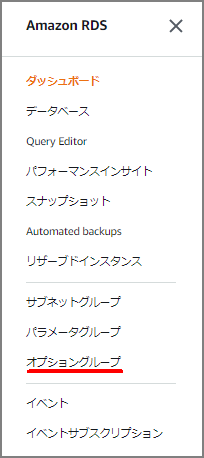
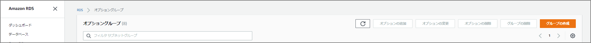
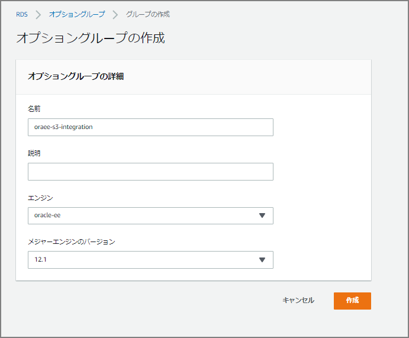
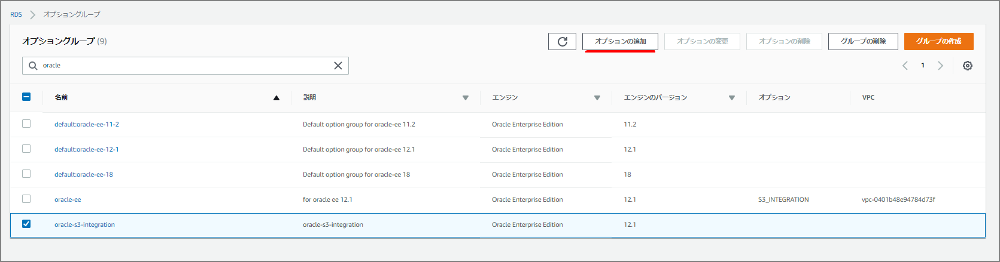
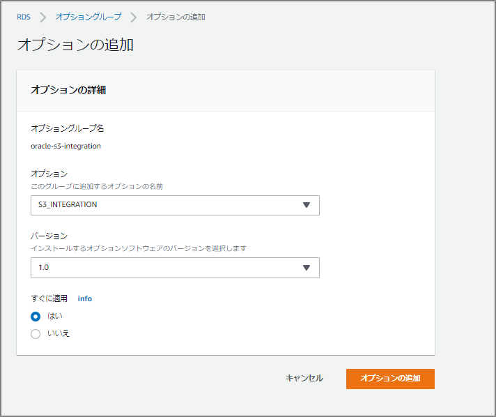
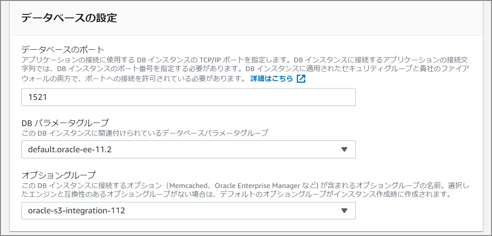

#### 注意事項の確認

まず始めにマニュアルを眺めてみる。データベース全体のインポートはサポートされておらず、スキーマ単位、テーブル単位でインポートを行う必要があるようだ。Amazon RDS for Oracle では、管理ユーザー `SYS` または `SYSDBA` へのアクセスは許可されていないため、`full` モードでインポートしたり、Oracle 管理のコンポーネントのスキーマをインポートしたりすると、Oracle データディレクトリが損傷し、データベースの安定性に影響を及ぼす可能性があります。とのこと。早くて便利なトランスポータブル表領域もサポートされていないことに注意。

> #### Amazon RDS での Oracle へのデータのインポート - Amazon Relational Database Service [https://docs.aws.amazon.com/ja_jp/AmazonRDS/latest/UserGuide/Oracle.Procedural.Importing.html](https://docs.aws.amazon.com/ja_jp/AmazonRDS/latest/UserGuide/Oracle.Procedural.Importing.html)

> - 特定のスキーマやオブジェクトをインポートするには、`schema` または `table` モードでインポートを実行します。
>
> - インポートするスキーマをアプリケーションに必要なスキーマに制限します。
>
> - `full` モードではインポートしないでください。
>
>   Amazon RDS for Oracle では、管理ユーザー `SYS` または `SYSDBA` へのアクセスは許可されていないため、`full` モードでインポートしたり、Oracle 管理のコンポーネントのスキーマをインポートしたりすると、Oracle データディレクトリが損傷し、データベースの安定性に影響を及ぼす可能性があります。
>
> - 大量のデータをロードする場合は、ダンプファイルをターゲットの Amazon RDS for Oracle DB インスタンスに転送し、インスタンスの DB スナップショットを作成後、インポートをテストして、問題なく完了したことを確認します。データベースコンポーネントが無効の場合は、DB インスタンスを削除後、DB スナップショットから再作成します。復元された DB インスタンスには、DB スナップショットの作成時に DB インスタンス上でステージングされたダンプファイルがすべて含まれています。
>
> - Oracle Data Pump エクスポートパラメータ (`TRANSPORT_TABLESPACES`、`TRANSPORTABLE`、`TRANSPORT_FULL_CHECK`) を使用して作成されたダンプファイルはインポートしないでください。Amazon RDS for Oracle DB インスタンスでは、このようなダンプファイルのインポートはサポートされていません。

Data PumpのダンプファイルをRDS内の DATA_PUMP_DIR （ディレクトリ・オブジェクト）に転送するので、一時的にRDS内の必要とされるストレージ量が多く必要なので特に注意が必要。`Storage Full`にならないように注意が必要。インポート後も自動的に削除されるわけではないため、必要に応じてUTL_FILE.FREMOVEを使用した削除が必要。

#### Data Pumpの手法

Data Pumpでインポートする場合は、下記2つの方法がある。

1. [Oracle Data Pump と Amazon S3 バケットを使用したデータのインポート](https://docs.aws.amazon.com/ja_jp/AmazonRDS/latest/UserGuide/Oracle.Procedural.Importing.html#Oracle.Procedural.Importing.DataPump.S3)
2. [Oracle Data Pump とデータベースリンクを使用したデータのインポート](https://docs.aws.amazon.com/ja_jp/AmazonRDS/latest/UserGuide/Oracle.Procedural.Importing.html#Oracle.Procedural.Importing.DataPump.DBLink)


#### S3バケットを経由したデータのインポートについて

##### オプショングループを作成して既存のRDS(Oracle)にアタッチする

オプショングループを選択




オプショングループの作成を行う




名前、説明、エンジン、メジャーエンジンのバージョンを選択する




グループ作成後に、オプションを追加する




「oracle-s3-integration」をオプションとして選択する。「すぐに適用」を「はい」にする。




「データベースの設定」に「オプショングループ」の指定欄があるのでさきほど作成したオプショングループを指定する。



##### 必要なポリシー、IAMロールを作成してRDSインスタンスにアタッチする。

> Amazon S3 の統合 - Amazon Relational Database Service [https://docs.aws.amazon.com/ja_jp/AmazonRDS/latest/UserGuide/oracle-s3-integration.html#oracle-s3-integration.preparing](https://docs.aws.amazon.com/ja_jp/AmazonRDS/latest/UserGuide/oracle-s3-integration.html#oracle-s3-integration.preparing)


##### 表領域の拡張

```sql
ALTER tablespace USERS resize 30G;
```


##### インポートするユーザに権限を付与

```sql
DROP USER "DPUSR" CASCADE;
CREATE USER "DPUSR" identified BY "oracle";

ALTER USER "DPUSR" QUOTA UNLIMITED ON USERS;

GRANT DBA to "DPUSR";
GRANT CREATE SESSION TO "DPUSR";
GRANT "RESOURCE" TO "DPUSR";
GRANT UNLIMITED TABLESPACE TO "DPUSR";
```


##### S3からData Pumpのダンプファイルの転送、及びインポート

事前にディレクトリオブジェクトを確認する。

```sql
set pages 2000 lin 2000
col filename for a30
col FILESIZE for 99999999999
alter session set nls_date_format='YYYY/MM/DD HH24:MI:SS';
select * from table (rdsadmin.rds_file_util.listdir(p_directory => 'BDUMP'));
select * from table (rdsadmin.rds_file_util.listdir(p_directory => 'DATA_PUMP_DIR'));
```


s3のバケットを指定して`DATA_PUMP_DIR`にダウンロードする。

```sql
select rdsadmin.rdsadmin_s3_tasks.download_from_s3(p_bucket_name => 'pluto-dev-s3-test', p_directory_name => 'DATA_PUMP_DIR') AS TASK_ID FROM DUAL;
```


必要に応じてログを確認する。`rdsadmin.rdsadmin_s3_tasks.download_from_s3`を実行したタイミングでタスクIDがコンソール上に出力されるのでそちらを確認して、rdsadmin.rds_file_util.read_text_fileの引数に指定する。

```sql
select text from table(rdsadmin.rds_file_util.read_text_file('BDUMP','dbtask-1574174424228-1248.log'));
```


DATA_PUMP_DIR配下にdmpファイルが配置されていることが確認できる

```sql
SQL> select * from table (rdsadmin.rds_file_util.listdir(p_directory => 'DATA_PUMP_DIR'));

FILENAME		       TYPE	      FILESIZE MTIME
------------------------------ ---------- ------------ -------------------
datapump/		       directory	  4096 2019/12/06 01:02:22
datapump_meta.dmp 	       file	       8237056 2019/12/06 01:02:22
```


dbms_datapumpプロシージャを使用してインポートする

```sql
DECLARE
    hdnl NUMBER;
BEGIN
    hdnl := dbms_datapump.open (operation => 'IMPORT', job_mode => 'FULL', version => 'COMPATIBLE');
    DBMS_DATAPUMP.ADD_FILE( handle => hdnl, filename => 'import.log', directory => 'DATA_PUMP_DIR', filetype => dbms_datapump.ku$_file_type_log_file);
    DBMS_DATAPUMP.ADD_FILE( handle => hdnl, filename => 'expdat.dmp', directory => 'DATA_PUMP_DIR', filetype => dbms_datapump.ku$_file_type_dump_file);
    DBMS_DATAPUMP.START_JOB(handle => hdnl);
end;
/
```


#### データベースリンクを経由したデータのインポートについて

データベースリンクを作成する。Data Pumpのダンプファイルを転送する転送元で実施する。

```sql
drop database link ora121;
create database link ora121 connect to master identified by "Oracle2019%" using '(DESCRIPTION=(ADDRESS=(PROTOCOL=TCP)(HOST=ora121rds.xxxxxxxxxx.ap-northeast-1.rds.amazonaws.com)(PORT=1521))(CONNECT_DATA=(SID=ora121)))';
```


ダンプファイルを転送する。

```sql
BEGIN
DBMS_FILE_TRANSFER.PUT_FILE(
    source_directory_object       => 'DP_DIR',
    source_file_name              => 'expdat.dmp',
    destination_directory_object  => 'DATA_PUMP_DIR',
    destination_file_name         => 'expdat.dmp',
    destination_database          => 'ora121'
);
END;
/
```


転送されているか確認する。RDS側で確認。

```sql
set pages 2000 lin 2000
col filename for a30
col FILESIZE for 99999999999
alter session set nls_date_format='YYYY/MM/DD HH24:MI:SS';
select * from table (rdsadmin.rds_file_util.listdir(p_directory => 'BDUMP'));
select * from table (rdsadmin.rds_file_util.listdir(p_directory => 'DATA_PUMP_DIR'));
```


インポートする。

```sql
DECLARE
hdnl NUMBER;
BEGIN
    hdnl := DBMS_DATAPUMP.open( operation => 'IMPORT', job_mode => 'SCHEMA', job_name=>null);
    DBMS_DATAPUMP.ADD_FILE( handle => hdnl, filename => 'expdat.dmp', directory => 'DATA_PUMP_DIR', filetype => dbms_datapump.ku$_file_type_dump_file);
    DBMS_DATAPUMP.add_file( handle => hdnl, filename => 'imp.log', directory => 'DATA_PUMP_DIR', filetype => dbms_datapump.ku$_file_type_log_file);
    DBMS_DATAPUMP.METADATA_FILTER(hdnl,'SCHEMA_EXPR','IN (''HR'')');
    DBMS_DATAPUMP.start_job(hdnl);
END;
/
```


必要に応じてログを確認する

```sql
SELECT TEXT FROM TABLE(RDSADMIN.RDS_FILE_UTIL.READ_TEXT_FILE('DATA_PUMP_DIR','imp.log'));
```


ログの削除方法

```sql
EXEC UTL_FILE.FREMOVE('DATA_PUMP_DIR','imp.log');
```


dbms_datapumpプロシージャを使用してインポートする

```sql
DECLARE
    hdnl NUMBER;
BEGIN
    hdnl := dbms_datapump.open (operation => 'IMPORT', job_mode => 'FULL', version => 'COMPATIBLE');
    DBMS_DATAPUMP.ADD_FILE( handle => hdnl, filename => 'import.log', directory => 'DATA_PUMP_DIR', filetype => dbms_datapump.ku$_file_type_log_file);
    DBMS_DATAPUMP.ADD_FILE( handle => hdnl, filename => 'expdat.dmp', directory => 'DATA_PUMP_DIR', filetype => dbms_datapump.ku$_file_type_dump_file);
    DBMS_DATAPUMP.START_JOB(handle => hdnl);
end;
/
```


#### その他

下記にはPerlスクリプトを使って、DATA_PUMP_DIRに転送する方法がある。

 [Strategies for Migrating Oracle Databases to AWS](https://d0.awsstatic.com/whitepapers/strategies-for-migrating-oracle-database-to-aws.pdf) 

​	Data Migration Using Oracle Data Pump -  Next Steps for a Database on Amazon RDS 

> [AWS] Data Pump のダンプファイルをRDS for Oracle インスタンスへ転送する ｜ Developers.IO [https://dev.classmethod.jp/cloud/aws/transfer-data-pump-file-to-rds-instace/](https://dev.classmethod.jp/cloud/aws/transfer-data-pump-file-to-rds-instace/)


