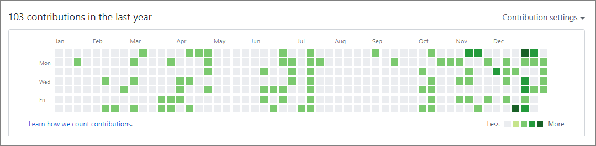

#### はじめに

このブログはGithub Pagesで運用していて、今年の目標が『ブログを定期的に更新してアウトプットする』ことなので可視化したいと考えていた。GithubにはContribution を可視化する通称『草』があるのでこれを使って可視化しようと考えた。


一方、Github Pagesを使い始める前に更新した記事も多いので更新した日をContributionに反映させたいと思い、過去日付でGithubの草を生やす方法を調べてみた。

#### 方法

草が生える条件は下記の通り。commitやissue、pull requestが条件となる。特にソースコードの修正は不要でこれだけで~~偽造~~Contribution出来る。

> https://help.github.com/en/github/setting-up-and-managing-your-github-profile/viewing-contributions-on-your-profile
>
> ### [What counts as a contribution](https://help.github.com/en/github/setting-up-and-managing-your-github-profile/viewing-contributions-on-your-profile#what-counts-as-a-contribution)
>
> On your profile page, certain actions count as contributions:
>
> - Committing to a repository's default branch or `gh-pages` branch
> - Opening an issue
> - Proposing a pull request
> - Submitting a pull request review

今回はAuthorDateを過去日付になるように`git commit`コマンドに`--date`を指定することにした。その後はpushして終わり。

##### コマンド

```sh
git commit --allow-empty -m "COMMIT" --date="Dec 29 23:59:59 2019 +0900"
git push origin master
```

##### 確認

```sh
git log --pretty=fuller

commit d0d02bd117419f4aacc7d8f16e78f192ec8ce79d
Author:     Imazato <xxxxx.xxxxxx@gmail.com>
AuthorDate: Sun Dec 29 23:59:59 2019 +0900
Commit:     Imazato <xxxxx.xxxxxx@gmail.com>
CommitDate: Wed Jan 8 17:46:25 2020 +0900

    COMMIT
```

##### 結果

記事から更新日付を引っ張ってきて、コマンドを実行することで過去日付でも草が生えた。草が生えていないと落ち着かない体を目指す。

