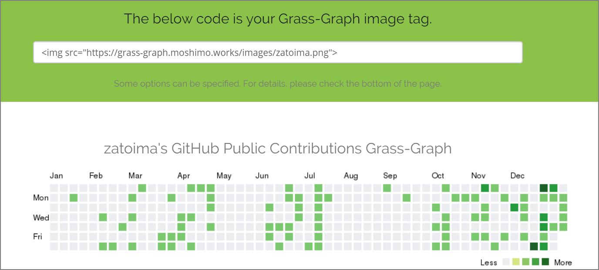
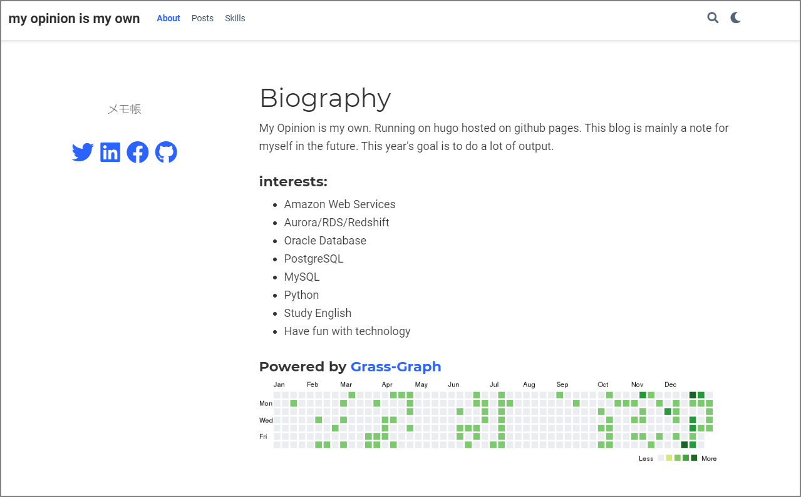

トップページにgithubのcontributionsが表示するようにした。github pagesでこのブログを運用しているのでブログを書いた場合に、この草が生えてくるという仕組み。

モチベーションと単純なかっこよさからトップページにgithubのcontributionsが表示するようにした。github pagesでこのブログを運用しているのでブログを書いた場合に、草が生えてくるという仕組み。

こちらのツールを使いました。

> GitHub の草状況を PNG 画像で返す heroku app をつくってみた - えいのうにっき https://blog.a-know.me/entry/2016/01/09/222210

##### 1.) アクセス

下記にアクセスする

> Grass-Graph / Imaging your GitHub Contributions Graph https://grass-graph.appspot.com/


##### 2.) githubのidを入力する


##### 3.) メタタグが生成されるのでメモする



##### 4.) 画像をクリックした場合にgithubの自分のページに飛ぶようにタグを追加する。

```html
<a href="https://github.com/zatoima" target="_blank">
  
</a>
```

##### 5.) このタグをブログサービスの指定の箇所に貼り付ける。

トップページに貼り付けてみた。



