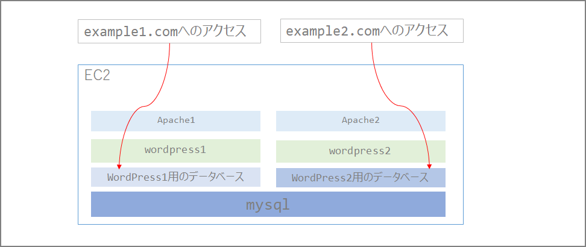
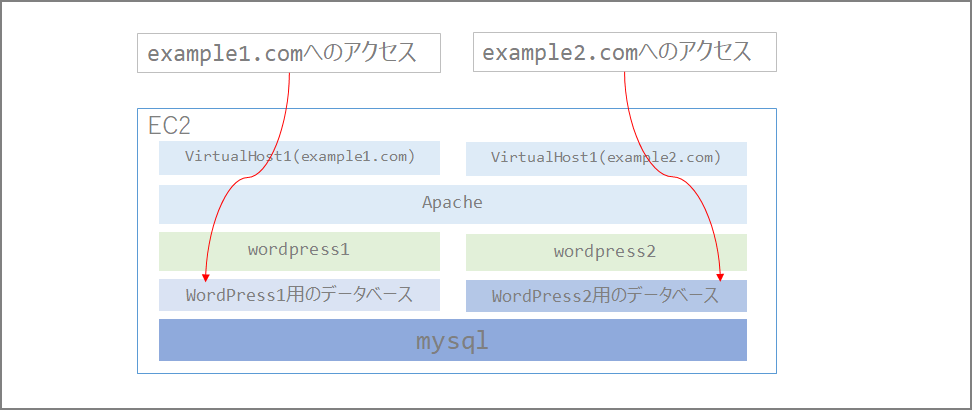

### はじめに

t2.microインスタンス上に複数WordPressをホストしたいと思ったことがあった。あまりネット上でググったところ情報が無かったのでメモしとおきます。

理由としては

- 各サイトPV数もなく重要度も高くなく負荷も高くないので、可能な限りt2.microの無料枠の中で運用したい
- WordPressごとにEC2インスタンス立てるのは費用の観点からよろしくない。(t2.microインスタンスといえど)
- 複数インスタンスの管理がめんどくさい

です。

### やり方

いくつか方法はありそうでした。

1. WordPress側のマルチサイト機能
2. Apache（Webサーバ）とDBを複数立てる
3. ApacheのVirtualHost機能を使用

#### 1. WordPress側のマルチサイト機能

1.のWordPress側のマルチサイト機能はサブディレクトリとサブドメイン形式しか選べず、「複数ドメインを一つのWordPress上で運用」するのは出来ないみたいです。（知らないだけかもしれない）

##### サブディレクトリ形式

http://example.com/blog1/

http://example.com/blog2/

##### サブドメイン形式

http://blog1.example.com/

http://blog2.example.com/

#### 2.Apache（Webサーバ）とDBを複数立てる

2.はt2.microで運用する上で限られたリソース食いそうなので出来ればやりたくなかった。

当初は下記の通りApache自体を複数に分けてリッスンポートも分けて…とする必要があるのかな、と思っていたのですが、3.のVirtualHost機能を使えばアクセス先のURLごとに制御が可能でした。



#### 3.ApacheのVirtualHost機能を使用

結果、3.のデータベース層とApacheのVirtualHost機能を使うこと出来ました。



### 設定方法

#### MySQL上にデータベースを追加する

```sql
create database wp2;

grant all privileges on `wp2`.* to 'wp2'@'localhost' IDENTIFIED BY 'xxxxxxxx';
show grants for wp2@localhost;
SELECT host, user FROM mysql.user;
```

#### Apacheのディレクトリを作成

```bash
mkdir -p /var/www/html1
```

#### Apacheのマルチサイト設定

```sh
vi /etc/httpd/conf/httpd.conf
```

下記設定を追加する。

ServerNameに記載している`example1.com`にアクセスした人は`/var/www/html/`のページが表示され、`example2.com`にアクセスした人は`/var/www/html1/`のページが表示されるようになります。なお、Apacheのバージョンは2.4です。

```sh
<VirtualHost *:80>
  DocumentRoot /var/www/html/
  ServerName example1.com:80
</VirtualHost>

<VirtualHost *:80>
  DocumentRoot /var/www/html1/
  ServerName example2.com:80
</VirtualHost>
```

以降は通常のWordPressのインストールと同様なのでこちらの「WordPress」のインストールをご参照ください。

> EC2上にWordPressをインストールする | my opinion is my own https://zatoima.github.io/wordpress-ec2-install.html

## 最後に

ApacheとMySQLを共有しているので何かトラブルがあった場合は仲良く一緒に影響を受けてしまうので重要度が高まってきたら別インスタンスを立ててホストするなど検討が必要だと思います。