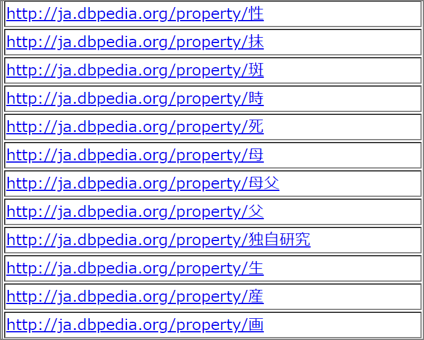
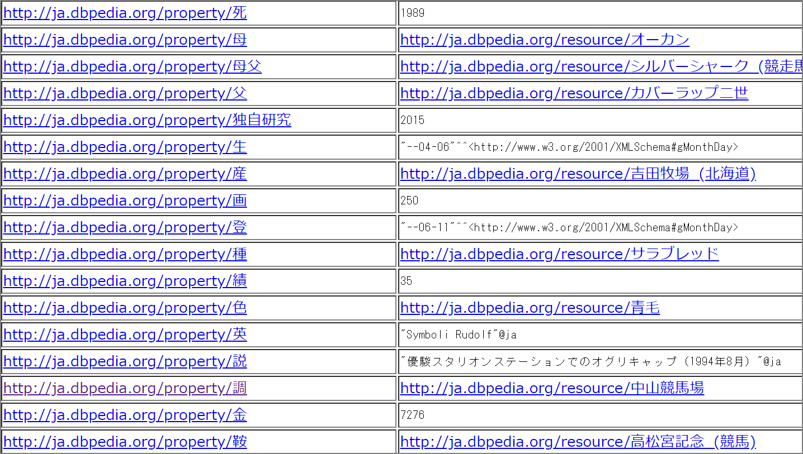
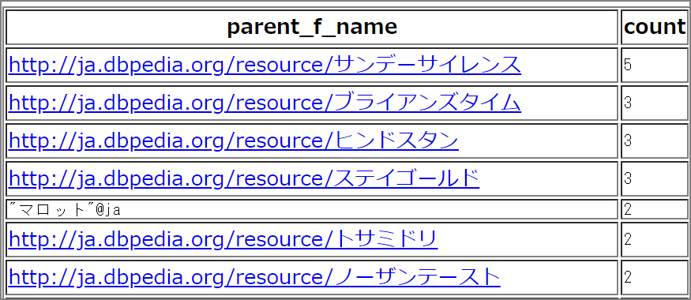
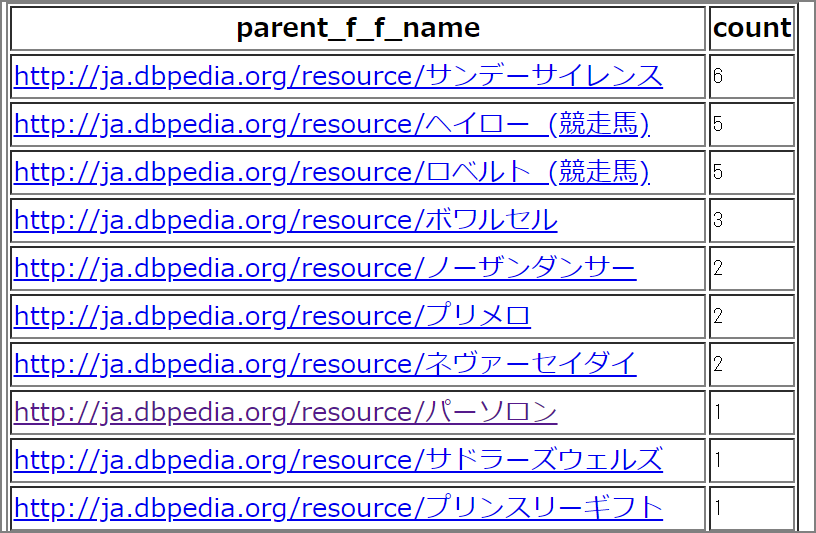
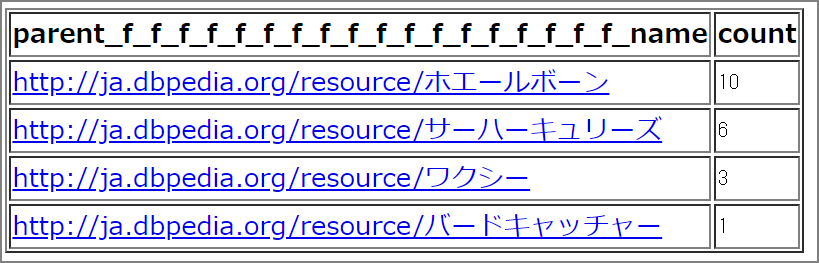
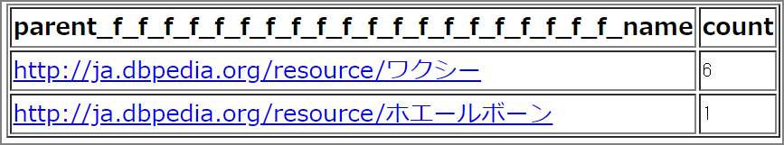
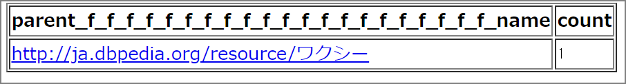

## はじめに

DBpediaはWikipediaから情報を抽出してLOD (Linked Open Data)として公開するコミュニティプロジェクトで、英語版と日本語版があります。日本語版は`ja.wikipedia.org`からデータを抽出しています。抽出したデータは構造化データ(RDF)として格納されています。RDFストアに対してはSPARQLというクエリ言語で情報を取得することが出来ます。今回は日本語版のDBpediaで情報を取得したいと思います。

<iframe src="//www.slideshare.net/slideshow/embed_code/key/8lHvTVasgBvWtE" width="595" height="485" frameborder="0" marginwidth="0" marginheight="0" scrolling="no" style="border:1px solid #CCC; border-width:1px; margin-bottom:5px; max-width: 100%;" allowfullscreen> </iframe> <div style="margin-bottom:5px"> <strong> <a href="//www.slideshare.net/takeda/what-isdpbedia" title="DBpedia Japaneseとは？" target="_blank">DBpedia Japaneseとは？</a> </strong> from <strong><a href="https://www.slideshare.net/takeda" target="_blank">National Institute of Informatics (NII)</a></strong> </div>
## SPARQLエンドポイント

DBpediaのエンドポイントはこちらになります。

> Virtuoso SPARQL Query Editor http://ja.dbpedia.org/sparql

## 有馬記念の勝ち馬に関する情報

### プロパティを調べる

勝ち馬を軸にまずはどんなプロパティを持っているかどうかを調べてみる。

```SQL
select distinct ?p {
  {
    ?name prop-ja:wikiPageUsesTemplate template-ja:有馬記念勝ち馬.
  }

  ?name rdfs:label ?label ;
    ?p ?o .
}
```



### サンプルを確認

勝ち馬を軸にまずはどんなプロパティを持っているかのサンプル値を出力する。

```SQL
select ?p (SAMPLE(?o) AS ?sample_value)
WHERE {
  {
    ?name prop-ja:wikiPageUsesTemplate template-ja:有馬記念勝ち馬.
  }

  ?name rdfs:label ?label ;
    ?p ?o .
} order by (?p)
```



### 血統を辿る

次に父の父の父の父・・・・・という感じで血統を調べていき、どこまで辿れるかやってみます。

RDBMSに格納されているデータで同じように特定の馬の父の父の父とした場合、同じテーブルに格納されている値をサブクエリ(副問合せ)で結合して取得すると思いますが、おそらく数世代先の馬を調べる時に性能限界が来ると思います。何度もjoinする必要があるので。

一方、RDFストアやSPARQLクエリは関係性を抽出することに優れた言語のため、特にリレーション抽出対象が増えたとしてもクエリの性能に影響を与えません。

ちなみに競馬で走る馬はサラブレッドと呼ばれますが、血統を辿ると全て3頭の馬(ダーレーアラビアン、ゴドルフィンアラビアン、バイアリーターク)にさかのぼると言います。**<u>WikipediaやDBPediaのデータが正しければ</u>**おそらくこの3頭のどれかには辿り付くはずです。

> 3大始祖と世界の血統：サラブレッド講座　JRA http://www.jra.go.jp/kouza/thoroughbred/founder/

#### 第1世代

まずは勝ち馬の父を調べてみる。

```SQL
select distinct ?parent_f_name (count(?parent_f_name) AS ?count) {
  {
    ?name prop-ja:wikiPageUsesTemplate template-ja:有馬記念勝ち馬.
  }

  ?name rdfs:label ?label ;
    prop-ja:父 ?parent_f_name .
} ORDER BY DESC(?count)
```



#### 第2世代

勝ち馬の父の父を調べてみる

```SQL
select distinct ?parent_f_f_name (count(?parent_f_f_name) AS ?count) {
  {
    ?name prop-ja:wikiPageUsesTemplate template-ja:有馬記念勝ち馬.
  }

  ?name rdfs:label ?label ;
    prop-ja:父 ?parent_f_name .
   ?parent_f_name prop-ja:父 ?parent_f_f_name .
} ORDER BY DESC(?count)
```



#### 第18世代

一気に飛んで第18世代です。こんな感じでどこまで辿れるか試してみます。`ホエルボーン`は`1807年-1831年`のイギリス馬です。現時点で`18世代`遡っています。

```SQL
select distinct ?parent_f_f_f_f_f_f_f_f_f_f_f_f_f_f_f_f_f_f_name (count(?parent_f_f_f_f_f_f_f_f_f_f_f_f_f_f_f_f_f_f_name) AS ?count) {
  {
    ?name prop-ja:wikiPageUsesTemplate template-ja:有馬記念勝ち馬.
  }

  ?name rdfs:label ?label ;
    prop-ja:父 ?parent_f_name .
   ?parent_f_name prop-ja:父 ?parent_f_f_name .
   ?parent_f_f_name prop-ja:父 ?parent_f_f_f_name .
   ?parent_f_f_f_name prop-ja:父 ?parent_f_f_f_f_name .
   ?parent_f_f_f_f_name prop-ja:父 ?parent_f_f_f_f_f_name .
   ?parent_f_f_f_f_f_name prop-ja:父 ?parent_f_f_f_f_f_f_name .
   ?parent_f_f_f_f_f_f_name prop-ja:父 ?parent_f_f_f_f_f_f_f_name .
   ?parent_f_f_f_f_f_f_f_name prop-ja:父 ?parent_f_f_f_f_f_f_f_f_name .
   ?parent_f_f_f_f_f_f_f_f_name prop-ja:父 ?parent_f_f_f_f_f_f_f_f_f_name .
   ?parent_f_f_f_f_f_f_f_f_f_name prop-ja:父 ?parent_f_f_f_f_f_f_f_f_f_f_name .
   ?parent_f_f_f_f_f_f_f_f_f_f_name prop-ja:父 ?parent_f_f_f_f_f_f_f_f_f_f_f_name .
   ?parent_f_f_f_f_f_f_f_f_f_f_f_name prop-ja:父 ?parent_f_f_f_f_f_f_f_f_f_f_f_f_name .
   ?parent_f_f_f_f_f_f_f_f_f_f_f_f_name prop-ja:父 ?parent_f_f_f_f_f_f_f_f_f_f_f_f_f_name .
   ?parent_f_f_f_f_f_f_f_f_f_f_f_f_f_name prop-ja:父 ?parent_f_f_f_f_f_f_f_f_f_f_f_f_f_f_name .
   ?parent_f_f_f_f_f_f_f_f_f_f_f_f_f_f_name prop-ja:父 ?parent_f_f_f_f_f_f_f_f_f_f_f_f_f_f_f_name .
   ?parent_f_f_f_f_f_f_f_f_f_f_f_f_f_f_f_name prop-ja:父 ?parent_f_f_f_f_f_f_f_f_f_f_f_f_f_f_f_f_name .
   ?parent_f_f_f_f_f_f_f_f_f_f_f_f_f_f_f_f_name prop-ja:父 ?parent_f_f_f_f_f_f_f_f_f_f_f_f_f_f_f_f_f_name .
   ?parent_f_f_f_f_f_f_f_f_f_f_f_f_f_f_f_f_f_name prop-ja:父 ?parent_f_f_f_f_f_f_f_f_f_f_f_f_f_f_f_f_f_f_name .
} ORDER BY DESC(?count)
```



#### 第19世代

```SQL

select distinct ?parent_f_f_f_f_f_f_f_f_f_f_f_f_f_f_f_f_f_f_f_f_name (count(?parent_f_f_f_f_f_f_f_f_f_f_f_f_f_f_f_f_f_f_f_f_name) AS ?count) {
  {
    ?name prop-ja:wikiPageUsesTemplate template-ja:有馬記念勝ち馬.
  }

  ?name rdfs:label ?label ;
    prop-ja:父 ?parent_f_name .
   ?parent_f_name prop-ja:父 ?parent_f_f_name .
   ?parent_f_f_name prop-ja:父 ?parent_f_f_f_name .
   ?parent_f_f_f_name prop-ja:父 ?parent_f_f_f_f_name .
   ?parent_f_f_f_f_name prop-ja:父 ?parent_f_f_f_f_f_name .
   ?parent_f_f_f_f_f_name prop-ja:父 ?parent_f_f_f_f_f_f_name .
   ?parent_f_f_f_f_f_f_name prop-ja:父 ?parent_f_f_f_f_f_f_f_name .
   ?parent_f_f_f_f_f_f_f_name prop-ja:父 ?parent_f_f_f_f_f_f_f_f_name .
   ?parent_f_f_f_f_f_f_f_f_name prop-ja:父 ?parent_f_f_f_f_f_f_f_f_f_name .
   ?parent_f_f_f_f_f_f_f_f_f_name prop-ja:父 ?parent_f_f_f_f_f_f_f_f_f_f_name .
   ?parent_f_f_f_f_f_f_f_f_f_f_name prop-ja:父 ?parent_f_f_f_f_f_f_f_f_f_f_f_name .
   ?parent_f_f_f_f_f_f_f_f_f_f_f_name prop-ja:父 ?parent_f_f_f_f_f_f_f_f_f_f_f_f_name .
   ?parent_f_f_f_f_f_f_f_f_f_f_f_f_name prop-ja:父 ?parent_f_f_f_f_f_f_f_f_f_f_f_f_f_name .
   ?parent_f_f_f_f_f_f_f_f_f_f_f_f_f_name prop-ja:父 ?parent_f_f_f_f_f_f_f_f_f_f_f_f_f_f_name .
   ?parent_f_f_f_f_f_f_f_f_f_f_f_f_f_f_name prop-ja:父 ?parent_f_f_f_f_f_f_f_f_f_f_f_f_f_f_f_name .
   ?parent_f_f_f_f_f_f_f_f_f_f_f_f_f_f_f_name prop-ja:父 ?parent_f_f_f_f_f_f_f_f_f_f_f_f_f_f_f_f_name .
   ?parent_f_f_f_f_f_f_f_f_f_f_f_f_f_f_f_f_name prop-ja:父 ?parent_f_f_f_f_f_f_f_f_f_f_f_f_f_f_f_f_f_name .
   ?parent_f_f_f_f_f_f_f_f_f_f_f_f_f_f_f_f_f_name prop-ja:父 ?parent_f_f_f_f_f_f_f_f_f_f_f_f_f_f_f_f_f_f_name .
   ?parent_f_f_f_f_f_f_f_f_f_f_f_f_f_f_f_f_f_f_name prop-ja:父 ?parent_f_f_f_f_f_f_f_f_f_f_f_f_f_f_f_f_f_f_f_name .
   ?parent_f_f_f_f_f_f_f_f_f_f_f_f_f_f_f_f_f_f_f_name prop-ja:父 ?parent_f_f_f_f_f_f_f_f_f_f_f_f_f_f_f_f_f_f_f_f_name .
} ORDER BY DESC(?count)

```



#### 第21世代

21世代まで遡ってみると、ワクシーという一頭に絞られてしまいました。ホエールボーンの父がワクシーです。

```SQL
select distinct ?parent_f_f_f_f_f_f_f_f_f_f_f_f_f_f_f_f_f_f_f_f_f_name (count(?parent_f_f_f_f_f_f_f_f_f_f_f_f_f_f_f_f_f_f_f_f_f_name) AS ?count) {
  {
    ?name prop-ja:wikiPageUsesTemplate template-ja:有馬記念勝ち馬.
  }

  ?name rdfs:label ?label ;
    prop-ja:父 ?parent_f_name .
   ?parent_f_name prop-ja:父 ?parent_f_f_name .
   ?parent_f_f_name prop-ja:父 ?parent_f_f_f_name .
   ?parent_f_f_f_name prop-ja:父 ?parent_f_f_f_f_name .
   ?parent_f_f_f_f_name prop-ja:父 ?parent_f_f_f_f_f_name .
   ?parent_f_f_f_f_f_name prop-ja:父 ?parent_f_f_f_f_f_f_name .
   ?parent_f_f_f_f_f_f_name prop-ja:父 ?parent_f_f_f_f_f_f_f_name .
   ?parent_f_f_f_f_f_f_f_name prop-ja:父 ?parent_f_f_f_f_f_f_f_f_name .
   ?parent_f_f_f_f_f_f_f_f_name prop-ja:父 ?parent_f_f_f_f_f_f_f_f_f_name .
   ?parent_f_f_f_f_f_f_f_f_f_name prop-ja:父 ?parent_f_f_f_f_f_f_f_f_f_f_name .
   ?parent_f_f_f_f_f_f_f_f_f_f_name prop-ja:父 ?parent_f_f_f_f_f_f_f_f_f_f_f_name .
   ?parent_f_f_f_f_f_f_f_f_f_f_f_name prop-ja:父 ?parent_f_f_f_f_f_f_f_f_f_f_f_f_name .
   ?parent_f_f_f_f_f_f_f_f_f_f_f_f_name prop-ja:父 ?parent_f_f_f_f_f_f_f_f_f_f_f_f_f_name .
   ?parent_f_f_f_f_f_f_f_f_f_f_f_f_f_name prop-ja:父 ?parent_f_f_f_f_f_f_f_f_f_f_f_f_f_f_name .
   ?parent_f_f_f_f_f_f_f_f_f_f_f_f_f_f_name prop-ja:父 ?parent_f_f_f_f_f_f_f_f_f_f_f_f_f_f_f_name .
   ?parent_f_f_f_f_f_f_f_f_f_f_f_f_f_f_f_name prop-ja:父 ?parent_f_f_f_f_f_f_f_f_f_f_f_f_f_f_f_f_name .
   ?parent_f_f_f_f_f_f_f_f_f_f_f_f_f_f_f_f_name prop-ja:父 ?parent_f_f_f_f_f_f_f_f_f_f_f_f_f_f_f_f_f_name .
   ?parent_f_f_f_f_f_f_f_f_f_f_f_f_f_f_f_f_f_name prop-ja:父 ?parent_f_f_f_f_f_f_f_f_f_f_f_f_f_f_f_f_f_f_name .
   ?parent_f_f_f_f_f_f_f_f_f_f_f_f_f_f_f_f_f_f_name prop-ja:父 ?parent_f_f_f_f_f_f_f_f_f_f_f_f_f_f_f_f_f_f_f_name .
   ?parent_f_f_f_f_f_f_f_f_f_f_f_f_f_f_f_f_f_f_f_name prop-ja:父 ?parent_f_f_f_f_f_f_f_f_f_f_f_f_f_f_f_f_f_f_f_f_name .
   ?parent_f_f_f_f_f_f_f_f_f_f_f_f_f_f_f_f_f_f_f_f_name prop-ja:父 ?parent_f_f_f_f_f_f_f_f_f_f_f_f_f_f_f_f_f_f_f_f_f_name .
} ORDER BY DESC(?count)
```



#### 第22世代

このワクシーの親を調べようとしたら出てきませんでした。[ホエールボーン](https://ja.wikipedia.org/wiki/%E3%83%9B%E3%82%A8%E3%83%BC%E3%83%AB%E3%83%9C%E3%83%BC%E3%83%B3)の父が「[ワクシー](https://ja.wikipedia.org/wiki/ワクシー)」なのですが、実際のWikipediaのページは「https://ja.wikipedia.org/wiki/ワキシー」となっています。「ワクシー」と「ワキシー」でURIが異なるためこれ以上辿れないのだと推測します。

```SQL
select distinct ?parent_f_f_f_f_f_f_f_f_f_f_f_f_f_f_f_f_f_f_f_f_f_f_name (count(?parent_f_f_f_f_f_f_f_f_f_f_f_f_f_f_f_f_f_f_f_f_f_f_name) AS ?count) {
  {
    ?name prop-ja:wikiPageUsesTemplate template-ja:有馬記念勝ち馬.
  }

  ?name rdfs:label ?label ;
    prop-ja:父 ?parent_f_name .
   ?parent_f_name prop-ja:父 ?parent_f_f_name .
   ?parent_f_f_name prop-ja:父 ?parent_f_f_f_name .
   ?parent_f_f_f_name prop-ja:父 ?parent_f_f_f_f_name .
   ?parent_f_f_f_f_name prop-ja:父 ?parent_f_f_f_f_f_name .
   ?parent_f_f_f_f_f_name prop-ja:父 ?parent_f_f_f_f_f_f_name .
   ?parent_f_f_f_f_f_f_name prop-ja:父 ?parent_f_f_f_f_f_f_f_name .
   ?parent_f_f_f_f_f_f_f_name prop-ja:父 ?parent_f_f_f_f_f_f_f_f_name .
   ?parent_f_f_f_f_f_f_f_f_name prop-ja:父 ?parent_f_f_f_f_f_f_f_f_f_name .
   ?parent_f_f_f_f_f_f_f_f_f_name prop-ja:父 ?parent_f_f_f_f_f_f_f_f_f_f_name .
   ?parent_f_f_f_f_f_f_f_f_f_f_name prop-ja:父 ?parent_f_f_f_f_f_f_f_f_f_f_f_name .
   ?parent_f_f_f_f_f_f_f_f_f_f_f_name prop-ja:父 ?parent_f_f_f_f_f_f_f_f_f_f_f_f_name .
   ?parent_f_f_f_f_f_f_f_f_f_f_f_f_name prop-ja:父 ?parent_f_f_f_f_f_f_f_f_f_f_f_f_f_name .
   ?parent_f_f_f_f_f_f_f_f_f_f_f_f_f_name prop-ja:父 ?parent_f_f_f_f_f_f_f_f_f_f_f_f_f_f_name .
   ?parent_f_f_f_f_f_f_f_f_f_f_f_f_f_f_name prop-ja:父 ?parent_f_f_f_f_f_f_f_f_f_f_f_f_f_f_f_name .
   ?parent_f_f_f_f_f_f_f_f_f_f_f_f_f_f_f_name prop-ja:父 ?parent_f_f_f_f_f_f_f_f_f_f_f_f_f_f_f_f_name .
   ?parent_f_f_f_f_f_f_f_f_f_f_f_f_f_f_f_f_name prop-ja:父 ?parent_f_f_f_f_f_f_f_f_f_f_f_f_f_f_f_f_f_name .
   ?parent_f_f_f_f_f_f_f_f_f_f_f_f_f_f_f_f_f_name prop-ja:父 ?parent_f_f_f_f_f_f_f_f_f_f_f_f_f_f_f_f_f_f_name .
   ?parent_f_f_f_f_f_f_f_f_f_f_f_f_f_f_f_f_f_f_name prop-ja:父 ?parent_f_f_f_f_f_f_f_f_f_f_f_f_f_f_f_f_f_f_f_name .
   ?parent_f_f_f_f_f_f_f_f_f_f_f_f_f_f_f_f_f_f_f_name prop-ja:父 ?parent_f_f_f_f_f_f_f_f_f_f_f_f_f_f_f_f_f_f_f_f_name .
   ?parent_f_f_f_f_f_f_f_f_f_f_f_f_f_f_f_f_f_f_f_f_name prop-ja:父 ?parent_f_f_f_f_f_f_f_f_f_f_f_f_f_f_f_f_f_f_f_f_f_name .
   ?parent_f_f_f_f_f_f_f_f_f_f_f_f_f_f_f_f_f_f_f_f_f_name prop-ja:父 ?parent_f_f_f_f_f_f_f_f_f_f_f_f_f_f_f_f_f_f_f_f_f_f_name .
} ORDER BY DESC(?count)
```


### 終わりに

次は英語版でやってみます。

今回は全て父を辿りましたが、他のプロパティを組み合わせて分析したいなと思いました。競馬の分析用途に自前のRDFストアを構築するということもやってみたいと思いました。