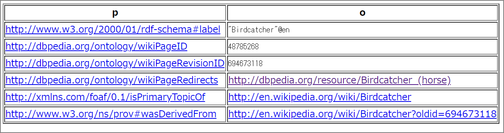

### はじめに

下記記事のリベンジ記事です。有馬記念の勝ち馬からサラブレッドの始祖まで辿ろうとしたが、dbpedia-jp(jp.wikipedia.org)のURI誤りで途中で終わってしまった。

> 日本語版DBPediaで有馬記念の勝ち馬からサラブレッドの始祖を辿る | my opinion is my own https://zatoima.github.io/sparql-graph-thoroughbred-search.html

リベンジとして、英語版のDBPediaを使いディープインパクトを起点として始祖まで辿ろうと思います。

> 競馬で走る馬はサラブレッドと呼ばれますが、血統を辿ると全て3頭の馬(ダーレーアラビアン、ゴドルフィンアラビアン、バイアリーターク)にさかのぼると言います。
>
> > 3大始祖と世界の血統：サラブレッド講座　JRA http://www.jra.go.jp/kouza/thoroughbred/founder/

### DBpedia（英語版）

> Virtuoso SPARQL Query Editor https://dbpedia.org/sparql

### SPARQLクエリ

最終的にこうしました。

述語部分はsireとなります。父という意味です。リーディングサイアー (Leading Sire)と言いますね。

```
PREFIX dbpedia: <http://dbpedia.org/ontology/>

select ?parent_gen1_name ?parent_gen2_name ?parent_gen3_name ?parent_gen4_name ?parent_gen5_name ?parent_gen6_name ?parent_gen7_name ?parent_gen8_name ?parent_gen9_name ?parent_gen10_name ?parent_gen11_name ?parent_gen12_name ?parent_gen13_name ?parent_gen14_name ?parent_gen15_name ?parent_gen16_name ?parent_gen17_name ?parent_gen18_name ?parent_gen19_name ?parent_gen20_name ?parent_gen21_name ?parent_gen22_name ?parent_gen23_name ?parent_gen24_name ?parent_gen25_name
where { 
  <http://dbpedia.org/resource/Deep_Impact_(horse)> dbpedia:sire ?parent_gen1_name . 
   ?parent_gen1_name dbpedia:sire ?parent_gen2_name . #Sunday_Silence
   ?parent_gen2_name dbpedia:sire ?parent_gen3_name . #Halo
   ?parent_gen3_name dbpedia:sire ?parent_gen4_name . #Hail_To_Reason
   ?parent_gen4_name dbpedia:sire ?parent_gen5_name . #Turn-To
   ?parent_gen5_name dbpedia:sire ?parent_gen6_name . #Royal_Charger
   ?parent_gen6_name dbpedia:sire ?parent_gen7_name . #Nearco
   ?parent_gen7_name dbpedia:sire ?parent_gen8_name . #Pharos
   ?parent_gen8_name dbpedia:sire ?parent_gen9_name . #Phalaris
   ?parent_gen9_name dbpedia:sire ?parent_gen10_name . #Polymelus
   ?parent_gen10_name dbpedia:sire ?parent_gen11_name . #Cyllene
   ?parent_gen11_name dbpedia:sire ?parent_gen12_name . #Bona_Vista
   ?parent_gen12_name dbpedia:sire ?parent_gen13_name . #Bend_Or
   ?parent_gen13_name dbpedia:sire ?parent_gen14_name . #Doncaster
   ?parent_gen14_name dbpedia:sire ?parent_gen15_name . #The_Baron
   ?parent_gen15_name dbpedia:sire ?parent_gen16_name . #Birdcatcher
   ?parent_gen16_name dbpedia:wikiPageRedirects ?Birdcatcher_wpr .
   ?Birdcatcher_wpr dbo:sire ?parent_gen17_name . #Sir_Hercules
   ?parent_gen17_name dbpedia:sire ?parent_gen18_name . #Whalebone
   ?parent_gen18_name dbpedia:sire ?parent_gen19_name . #Waxy
   ?parent_gen19_name dbpedia:sire ?parent_gen20_name . #Potoooooooo
   ?parent_gen20_name dbpedia:sire ?parent_gen21_name . #Eclipse
   ?parent_gen21_name dbpedia:sire ?parent_gen22_name . #Marske
   ?parent_gen22_name dbpedia:sire ?parent_gen23_name . #Squirt
   ?parent_gen23_name dbpedia:sire ?parent_gen24_name . #Bartlets_Childers
   ?parent_gen24_name dbpedia:wikiPageRedirects ?Bartlets_Childers .
   ?Bartlets_Childers dbo:sire ?parent_gen25_name . #Darley_Arabian
}

```

### 補足

`Birdcatcher`と`Bartlets_Childers`には他の競走馬にある`http://dbpedia.org/ontology/sire`プロパティがなく、そこからは親を辿れません。

```
PREFIX dbpedia: <http://dbpedia.org/ontology/>

select *
where { 
  <http://dbpedia.org/resource/Birdcatcher> ?p ?o .
}
```



述語が`http://dbpedia.org/ontology/wikiPageRedirects`の`http://dbpedia.org/resource/Birdcatcher_(horse)`に行くと`dbo:sire`がありましたのでこちらのPropertyを使用します。

こうすることでsireを取得することが出来ました。

```
PREFIX dbpedia: <http://dbpedia.org/ontology/>

select ?Birdcatcher_sire
where { 
  <http://dbpedia.org/resource/Birdcatcher> dbpedia:wikiPageRedirects ?Birdcatcher_wpr .
  ?Birdcatcher_wpr dbo:sire ?Birdcatcher_sire
}
```


### 結果

最終的な結果はこうなりました。ディープインパクトの始祖は[Darley_Arabian](https://ja.wikipedia.org/wiki/%E3%83%80%E3%83%BC%E3%83%AC%E3%83%BC%E3%82%A2%E3%83%A9%E3%83%93%E3%82%A2%E3%83%B3)となります！

| 世代 | 馬名               |
| ---- | ------------------ |
| 1    | Sunday_Silence     |
| 2    | Halo               |
| 3    | Hail_To_Reason     |
| 4    | Turn-To            |
| 5    | Royal_Charger      |
| 6    | Nearco             |
| 7    | Pharos             |
| 8    | Phalaris           |
| 9    | Polymelus          |
| 10   | Cyllene            |
| 11   | Bona_Vista         |
| 12   | Bend_Or            |
| 13   | Doncaster          |
| 14   | Stockwell          |
| 15   | The_Baron          |
| 16   | Birdcatcher        |
| 17   | Sir_Hercules       |
| 18   | Whalebone          |
| 19   | Waxy               |
| 20   | Potoooooooo        |
| 21   | Eclipse            |
| 22   | Marske             |
| 23   | Squirt             |
| 24   | Bartlet's_Childers |
| 25   | Darley_Arabian     |

