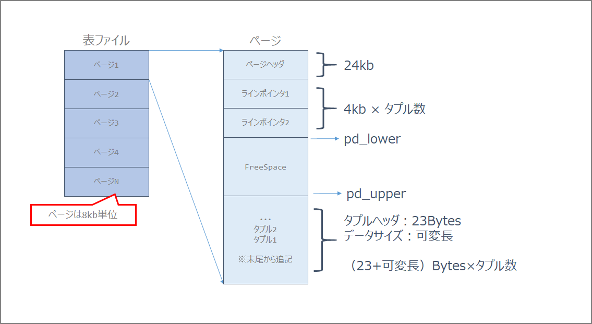
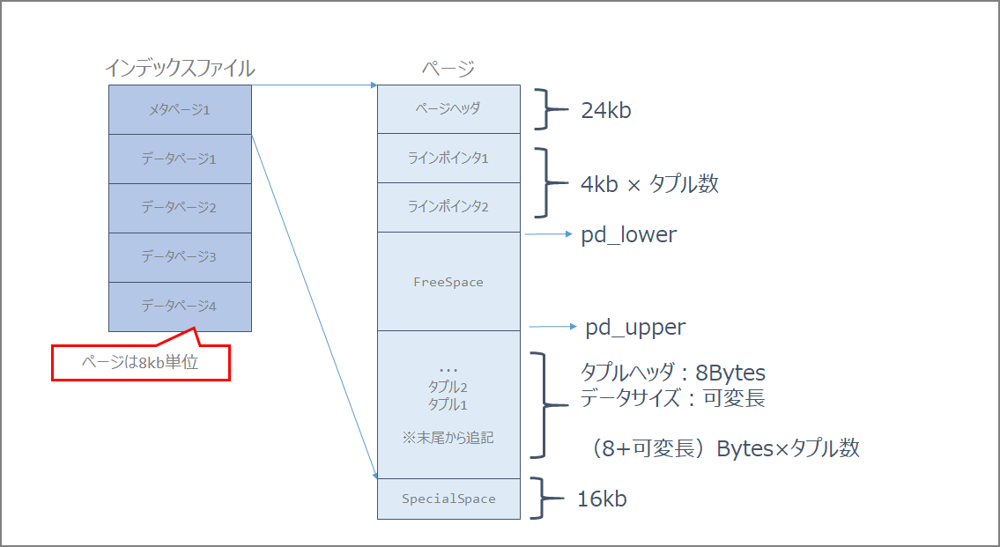

### はじめに

OSS-DB Gold(オープンソースデータベース技術者認定試験)を目指し勉強しようと思ったが、ここ5年以内にリリースされた本がないので試験概要を基にマニュアルや実機、Webの他の先駆者の情報を基に勉強していくことにした。

OSS-DBは他の試験に比べて出題範囲が明確で、ここには記載していませんが「重要な用語、コマンド、パラメータ」の記載がある。すべての試験範囲を確認したい場合は、下記の試験概要を見て頂ければ。

> OSS-DB Gold https://oss-db.jp/outline/gold

今回は運用管理のデータベースサーバ構築についてまとめてみる。大した内容はなく、ただのメモです。

#### 試験範囲

- 運用管理(30％)
  - データベースサーバ構築 【重要度：2】
  - 運用管理用コマンド全般 【重要度：4】
  - データベースの構造 【重要度：2】
  - ホット・スタンバイ運用 【重要度：1】
- 性能監視（30％）
  - アクセス統計情報 【重要度：3】
  - テーブル / カラム統計情報 【重要度：2】
  - クエリ実行計画 【重要度：3】
  - その他の性能監視 【重要度：1】
- パフォーマンス・チューニング（20％）
  - 性能に関係するパラメータ 【重要度：4】
  - チューニングの実施 【重要度：2】
- 障害対応（20％）
  - 起こりうる障害のパターン 【重要度：3】
  - 破損クラスタ復旧 【重要度：2】
  - ホット・スタンバイ復旧 【重要度：1】


### 運用管理 - データベースサーバ構築

この試験範囲の説明、主要な知識範囲、重要な用語、コマンド、パラメータは次の通り。

- 説明：
  - サーバ構築における容量見積もり、およびデータベースセキュリティに関する知識を問う
- 主要な知識範囲：
  - テーブル・インデックス容量見積もり
  - セキュリティ
    - 通信経路暗号化（SSL)
    - データ暗号化
    - クライアント認証
    - 監査ログ
  - データ型のサイズ
  - ユーザ・データベース単位のパラメータ設定
- 重要な用語、コマンド、パラメータなど：
  - チェックサム
  - pg_xact
  - pg_multixact
  - pg_notify
  - pg_serial
  - pg_snapshots
  - pg_stat_tmp
  - pg_subtrans
  - pg_tblspc
  - pg_twophase
  - ssl
  - pg_stat_ssl
  - pgcrypto
  - ALTER ROLE
  - ALTER DATABASE
  - initdb -data-checksums (-k)
  - log_statement
  - track_functions
  - track_activities

### 試験に向けた整理

#### テーブル・インデックス容量見積もり

テーブルの内部構造（ページ）は下記の通りとなる。

| 項目           | 説明                                                         |
| :------------- | :----------------------------------------------------------- |
| ページヘッダ   | 長さは24バイト。空き領域ポインタを含む、ページについての一般情報が含まれる |
| ラインポインタ | 実際のアイテムを指すアイテム識別子の配列。1アイテムにつき4バイト。 |
| FreeSpace      | 割り当てられていない空間。ラインポインタはこの領域の先頭から、新規のアイテム（タプル）は末尾から割り当てられる |
| タプル         | 実際のデータ（行データ）                                     |
| 特別な空間     | インデックスアクセスメソッド特有のデータなので通常のテーブルでは空となる。 |



下記のt1テーブルを例に計算する。

```sql
postgres=# select tablename, attname, avg_width from pg_stats where tablename = 't1';
 tablename | attname | avg_width 
-----------+---------+-----------
 t1        | a       |         4
 t1        | b       |         2
 t1        | c       |         6
 t1        | d       |         8
(4 rows)
```

上記の結果から1タプル（1行）で必要とされるbyte数は`（4+2+6+8）`で`20bytes`となる。1タプルごとにラインポインタ の`4バイト`が必要になるため、この例の場合、1タプルあたり`24bytes`が必要になる。

```
1ページに入るタプル数 = (8192 - PageHeaderData ) / ( 1タプルのサイズ + ItemIdData )
= (8192 - 24) / ( 20 + 4 )
= 8168 / 24 = 340.33
```

したがって、1ページ入るタプル数は約340となる。例えばタプル数が10000の場合、必要なblock数は 240,000byteとなる。ページ数の場合は30000ページとなる。

今回はFILLFACTORの考慮はしていないが、90％だとすると下記計算となる。

```
1ページに入るタプル数 = (8192 - PageHeaderData ) / ( 1タプルのサイズ + ItemIdData )
= (8192 - 24 - 819 ) / ( 20 + 4 )
= 8168 / 24 = 306
```

なお、インデックスの場合のページ構造は下記となる。



#### セキュリティ

- 通信経路暗号化（SSL)
- データ暗号化
- クライアント認証
- 監査ログ

#### データ型のサイズ

##### 文字型

| PostgreSQLデータ型 | 最大長 | 概要                                                         |
| ------------------ | ------ | ------------------------------------------------------------ |
| VARCHAR（n）       | 1GB    | 長さn文字の可変長文字列                                      |
| CHAR（n）          | 1GB    | 長さn文字の固定長文字データ。指定した長さより短CHAR,CLOBい値を挿入したときは、残りは空白で埋められる |
| TEXT               | 1GB    | 長さ指定なしの可変長文字列                                   |

##### 数値型

| PostgreSQLデータ型 | 最大長  | 概要                                                         |
| ------------------ | ------- | ------------------------------------------------------------ |
| INTEGER            | 4バイト | 整数型。数値の範囲と保存のサイズ、性能のバランスNUMBERが良い |
| SMALLINT           | 2バイト | 範囲の狭い整数型                                             |
| BIGINT             | 8バイト | 範囲の広い整数型                                             |
| NUMERIC            | 1000桁  | 正と負の固定小数点数。小数点より右側の桁数と全体の桁数を指定できる |
| REAL               | 4バイト | 単精度の浮動小数点数                                         |
| DOUBLE PRECISION   | 8バイト | 倍精度の浮動小数点数                                         |

##### 日付型

| PostgreSQLデータ型 | 最大長  | 概要                          |
| ------------------ | ------- | ----------------------------- |
| DATE               | 4バイト | 1日単位で日付のみを表すデータ |
| TIMESTAMP          | 8バイト | 日付と時刻の両方を表すデータ  |

##### バイナリ型

| PostgreSQLデータ型 | 最大長 | 概要                       |
| ------------------ | ------ | -------------------------- |
| bytea              | 1GB    | 可変長のバイナリデータ     |
| ラージオブジェクト | 2GB    | データベース内に格納される |

#### チェックサム（initdb -data-checksums (-k)）

データチェックサムは、PostgreSQLのデータベースクラスタ初期化時に、有効にするかどうかを指定。`-k`オプションを付ける。

```
initdb -D $PGDATA -k
```

#### pg_xact

#### pg_multixact

#### pg_notify

#### pg_serial

#### pg_snapshots

#### pg_stat_tmp

#### pg_subtrans

#### pg_tblspc

#### pg_twophase

66.1. データベースファイルのレイアウト https://www.postgresql.jp/document/10/html/storage-file-layout.html

| 項目                   | 説明                                                         |
| ---------------------- | ------------------------------------------------------------ |
| `PG_VERSION`           | PostgreSQLの主バージョン番号を保有するファイル               |
| `base`                 | データベースごとのサブディレクトリを保有するサブディレクトリ |
| `current_logfiles`     | ログ収集機構が現在書き込んでいるログファイルを記録するファイル |
| `global`               | `pg_database`のようなクラスタで共有するテーブルを保有するサブディレクトリ |
| `pg_commit_ts`         | トランザクションのコミット時刻のデータを保有するサブディレクトリ |
| `pg_dynshmem`          | 動的共有メモリサブシステムで使われるファイルを保有するサブディレクトリ |
| `pg_logical`           | 論理デコードのための状態データを保有するサブディレクトリ     |
| `pg_multixact`         | マルチトランザクションの状態のデータを保有するサブディレクトリ（共有行ロックで使用されます） |
| `pg_notify`            | LISTEN/NOTIFY状態データを保有するサブディレクトリ            |
| `pg_replslot`          | レプリケーションスロットデータを保有するサブディレクトリ     |
| `pg_serial`            | コミットされたシリアライザブルトランザクションに関する情報を保有するサブディレクトリ |
| `pg_snapshots`         | エクスポートされたスナップショットを保有するサブディレクトリ |
| `pg_stat`              | 統計サブシステム用の永続ファイルを保有するサブディレクトリ   |
| `pg_stat_tmp`          | 統計サブシステム用の一時ファイルを保有するサブディレクトリ   |
| `pg_subtrans`          | サブトランザクションの状態のデータを保有するサブディレクトリ |
| `pg_tblspc`            | テーブル空間へのシンボリックリンクを保有するサブディレクトリ |
| `pg_twophase`          | プリペアドトランザクション用の状態ファイルを保有するサブディレクトリ |
| `pg_wal`               | WAL（ログ先行書き込み）ファイルを保有するサブディレクトリ    |
| `pg_xact`              | トランザクションのコミット状態のデータを保有するサブディレクトリ |
| `postgresql.auto.conf` | `ALTER SYSTEM`により設定された設定パラメータを格納するのに使われるファイル |
| `postmaster.opts`      | 最後にサーバを起動した時のコマンドラインオプションを記録するファイル |
| `postmaster.pid`       | 現在のpostmasterプロセスID（PID）、クラスタのデータディレクトリパス、postmaster起動時のタイムスタンプ、ポート番号、Unixドメインソケットのディレクトリパス（Windowsでは空）、有効な監視アドレスの一番目（IPアドレスまたは`*`、TCPを監視していない場合は空）および共有メモリのセグメントIDを記録するロックファイル（サーバが停止した後は存在しません） |

#### ssl

#### pg_stat_ssl

`pg_stat_ssl`ビューは、バックエンドプロセスおよびWAL送信プロセスごとに1行を保持し、接続上でのSSLの使用に関する統計情報を示します。

> 28.2. 統計情報コレクタ https://www.postgresql.jp/document/10/html/monitoring-stats.html#PG-STAT-SSL-VIEW

#### pgcrypto

## インストール

```sh
pgbench=# CREATE EXTENSION pgcrypto;
CREATE EXTENSION
pgbench=# \dx
                   List of installed extensions
    Name     | Version |   Schema   |         Description          
-------------+---------+------------+------------------------------
 pgcrypto    | 1.3     | public     | cryptographic functions
 pgstattuple | 1.5     | public     | show tuple-level statistics
 plpgsql     | 1.0     | pg_catalog | PL/pgSQL procedural language
(3 rows)

pgbench=# \dx+
            Objects in extension "pgcrypto"
                  Object description                   
-------------------------------------------------------
 function armor(bytea)
 function armor(bytea,text[],text[])
 function crypt(text,text)
 function dearmor(text)
 function decrypt(bytea,bytea,text)
 function decrypt_iv(bytea,bytea,bytea,text)
 function digest(bytea,text)
 function digest(text,text)
 function encrypt(bytea,bytea,text)
 function encrypt_iv(bytea,bytea,bytea,text)
 function gen_random_bytes(integer)
 function gen_random_uuid()
 function gen_salt(text)
 function gen_salt(text,integer)
 function hmac(bytea,bytea,text)
 function hmac(text,text,text)
 function pgp_armor_headers(text)
 function pgp_key_id(bytea)
 function pgp_pub_decrypt(bytea,bytea)
 function pgp_pub_decrypt_bytea(bytea,bytea)
 function pgp_pub_decrypt_bytea(bytea,bytea,text)
 function pgp_pub_decrypt_bytea(bytea,bytea,text,text)
 function pgp_pub_decrypt(bytea,bytea,text)
 function pgp_pub_decrypt(bytea,bytea,text,text)
 function pgp_pub_encrypt_bytea(bytea,bytea)
 function pgp_pub_encrypt_bytea(bytea,bytea,text)
 function pgp_pub_encrypt(text,bytea)
 function pgp_pub_encrypt(text,bytea,text)
 function pgp_sym_decrypt_bytea(bytea,text)
 function pgp_sym_decrypt_bytea(bytea,text,text)
 function pgp_sym_decrypt(bytea,text)
 function pgp_sym_decrypt(bytea,text,text)
 function pgp_sym_encrypt_bytea(bytea,text)
 function pgp_sym_encrypt_bytea(bytea,text,text)
 function pgp_sym_encrypt(text,text)
 function pgp_sym_encrypt(text,text,text)
(36 rows)

```

pgcryptはcontribモジュールの一つなので必要に応じてcontribのインストールも実施が必要。

```sh
sudo yum -y install postgresql10-devel postgresql10-contrib
```

## 関数の使用方法

pgcryptには上記で確認したように多くの関数が用意されている。一般的な関数を試す。

#### digest

##### 汎用ハッシュ関数

```sql
digest(data text, type text) returns bytea
digest(data bytea, type text) returns bytea
```

md5、sha1、sha224、sha256、sha384、およびsha512が標準の暗号化アルゴリズムとして用意されている。

##### 使用例

```sql
pgbench=# select digest('aaaa','sha256');
                               digest                               
--------------------------------------------------------------------
 \x61be55a8e2f6b4e172338bddf184d6dbee29c98853e0a0485ecee7f27b9af0b4
```

#### hmac

keyをキーとしたdataのハッシュ化MACを計算。MACはMessage Authentication Code。

```
hmac(data text, key text, type text) returns bytea
hmac(data bytea, key bytea, type text) returns bytea
```

typeはdigestと同じくmd5、sha1、sha224、sha256、sha384、およびsha512が標準の暗号化アルゴリズム。

keyが一致しなければ同じハッシュ値にならない。

##### 使用例

```sql
pgbench=# select hmac('aaaa','key1','sha256');
                                hmac                                
--------------------------------------------------------------------
 \xbb9d9016b60ef5ebe72e859d5a5f630c62fff00571361998267a3f6d7c12e482
(1 row)

pgbench=# select hmac('aaaa','key2','sha256');
                                hmac                                
--------------------------------------------------------------------
 \xdca517b3144dc65219660ecd0e2d1c2e19f70b6122f5289e82f093f87e2daaa0
(1 row)
```

#### crypt()

##### パスワードハッシュ化関数

```sql
crypt(password text, salt text) returns text
```

saltは`gen_salt()`を使用して生成する必要がある。des、xdes、md5、bfがアルゴリズムとして使用可能。

##### 使用方法

```sql
pgbench=# select crypt('CRYPTPASSWORD', gen_salt('md5'));
               crypt                
------------------------------------
 $1$UniwWec.$NnpXvamtau8zEXjyoVHU./
(1 row)
```

#### log_statement

> エラー報告とログ取得 https://www.postgresql.jp/document/9.3/html/runtime-config-logging.html

> どのSQL文をログに記録するかを制御します。 有効な値は、none（off）、ddl、mod、およびall（全てのメッセージ）です。 ddlは、CREATE、ALTER、およびDROP文といった、データ定義文を全てログに記録します。 
>

#### track_functions

> 関数の呼び出し数と費やされた時間の追跡を有効にします。  デフォルトは、統計情報追跡機能を無効にする`none`です。 スーパーユーザのみがこの設定を変更できます。
>

#### track_activities

> 実行時統計情報 https://www.postgresql.jp/document/9.2/html/runtime-config-statistics.html

> 各セッションで実行中のコマンドに関する情報とそのコマンドの実行開始時刻の収集を有効にします。 このパラメータはデフォルトで有効です。 有効な場合であっても、すべてのユーザがこの情報を見ることができず、スーパーユーザと報告されたセッションの所有者のみから可視である点に注意してください。 このためセキュリティ上の危険性はありません。 スーパーユーザのみがこの設定を変更することができます。
>


