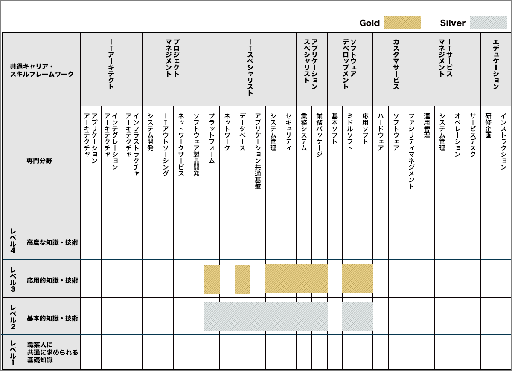
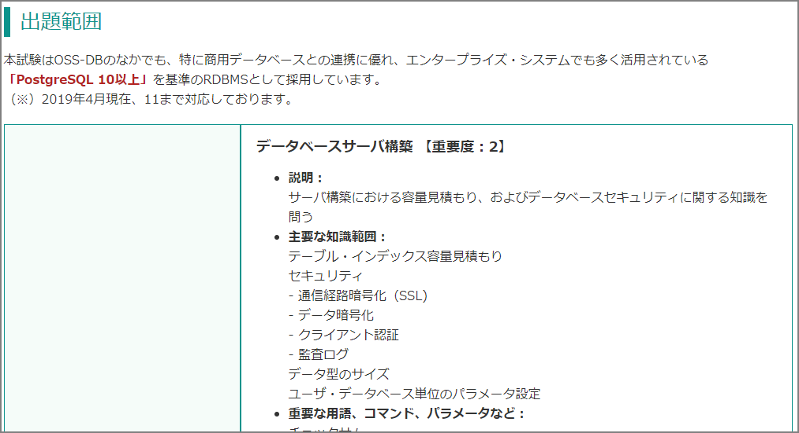

### はじめに

OSS-DB Gold Ver.2.0に合格しました。

この試験は下記の知識とスキルを証明してくれるみたいです。オープンソースデータベースと主語が大きいですが、身につくのはPostgreSQLオンリーだと思います。

-  RDBMSとSQLに関する知識を有する。
-  オープンソースデータベースに関する深い知識を有する。
-  オープンソースを利用して大規模なデータベースの運用管理ができる。
-  オープンソースを利用して大規模なデータベースの開発を行う事ができる。
-  PostgreSQLなどのOSS-DBの内部構造を熟知している。
-  PostgreSQLなどのOSS-DBの利用方法やデータベースの状態を検証してパフォーマンスチューニングをすることができる。
-  PostgreSQLなどのOSS-DBの利用方法やデータベースの状態を検証してトラブルシューティングをすることができる。

なお、OSS-DB Goldは「ITSSのキャリアフレームワークと認定試験・資格との関係」ではレベル3に位置付けられています。Oracle Master Goldと同等です。

> 資格取得のメリット https://oss-db.jp/merit

試験の概要などはこちらのページご参照ください。

> OSS-DB Gold https://oss-db.jp/outline/gold

### 試験の範囲

結構他の資格試験にはないレベルで詳細に試験範囲が書かれています。

下記は大項目レベルで抜粋しています。

- 運用管理(30％)
  - データベースサーバ構築 【重要度：2】
  - 運用管理用コマンド全般 【重要度：4】
  - データベースの構造 【重要度：2】
  - ホット・スタンバイ運用 【重要度：1】
- 性能監視（30％）
  - アクセス統計情報 【重要度：3】
  - テーブル / カラム統計情報 【重要度：2】
  - クエリ実行計画 【重要度：3】
  - その他の性能監視 【重要度：1】
- パフォーマンス・チューニング（20％）
  - 性能に関係するパラメータ 【重要度：4】
  - チューニングの実施 【重要度：2】
- 障害対応（20％）
  - 起こりうる障害のパターン 【重要度：3】
  - 破損クラスタ復旧 【重要度：2】
  - ホット・スタンバイ復旧 【重要度：1】

「データベースサーバ構築」では「テーブル・インデックス容量見積もり」や「通信経路暗号化（SSL)」が必要な知識とあります。「track_functions」や「pg_tblspc」、「pg_xact」などのパラメータ、システムカタログ、ディレクトリも試験範囲ということがわかります。

OSS-DB Gold Ver.2.0に特化した教科書というのは存在しない（※古い教科書はあります）ので、この試験範囲に相当するマニュアルと実機を使い勉強するのが一番かなーと思っています。

### 使用教材

①LPI-Japan OSS-DB Gold 認定教材 PostgreSQL 高度技術者育成テキスト

②公式サイトのサンプル問題

③OSS-DB Gold セミナー資料

④マニュアル、実機検証

#### LPI-Japan OSS-DB Gold 認定教材 PostgreSQL 高度技術者育成テキスト

公式テキストを買いました。OSS-DB Gold Ver.2.0に対応したテキストではないのですが、唯一手頃な値段で変えるテキストがあったので購入しました。ただ、こちらは2014年頃に発売、対応バージョンも9.xです。本書と公式ドキュメントとを突き合わせて実機で練習を重ねるのが前提です。Oracle Masterの白本や黒本を期待して買うと痛い目を見ると思います。

ただ、一部古いですが、試験範囲に対して網羅的にまとまってあるので有効です。（※もちろん試験バージョンが変わっているので一部抜けがあります。）問題集が付いているのが特に良い！実際の試験に対して難しく感じましたが、、、

<iframe style="width:120px;height:240px;" marginwidth="0" marginheight="0" scrolling="no" frameborder="0" src="//rcm-fe.amazon-adsystem.com/e/cm?lt1=_blank&bc1=000000&IS2=1&bg1=FFFFFF&fc1=000000&lc1=0000FF&t=&language=ja_JP&o=9&p=8&l=as4&m=amazon&f=ifr&ref=as_ss_li_til&asins=B00P4WD4QG&linkId=d8a13241e1e7e978e2217bb77c710c1b"></iframe>

#### 公式サイトのサンプル問題

> サンプル問題／例題解説 https://oss-db.jp/sample

#### OSS-DB Gold セミナー資料

> 参考資料ダウンロード https://oss-db.jp/measures/download

#### マニュアル、実機検証、市販本

高度技術者育成テキスト、サンプル問題、セミナー資料に一通り目を通したあとにあとは上記の試験範囲と見比べつつ、地道にマニュアルと実機検証を行いました。以前にこの本を読んでたいたのですが、読み直しました。

<iframe style="width:120px;height:240px;" marginwidth="0" marginheight="0" scrolling="no" frameborder="0" src="//rcm-fe.amazon-adsystem.com/e/cm?lt1=_blank&bc1=000000&IS2=1&bg1=FFFFFF&fc1=000000&lc1=0000FF&t=zatoima-22&language=ja_JP&o=9&p=8&l=as4&m=amazon&f=ifr&ref=as_ss_li_til&asins=B07H5GCJ8J&linkId=a2ec7429e7e8eab86b05329425cce382"></iframe>

### 所感

勉強期間は2週間～3週間くらいでした。OSS-DB Silverは2019年12月末に取得しています。

Goldに合格出来て思うことは、詳細に記載してある試験範囲に沿ってマニュアルを読んで、公式のサンプル問題を解くのが一番良いなって感じました。PostgreSQL 高度技術者育成テキストは範囲的には大きく被っていますが、記載内容が荒いのでこの本だけでは太刀打ちできません。内容的にも古いので、PostgreSQL 10や11あたりのマニュアルを読むことをお奨めします。

重箱の隅をつつくような問題も確かにあってマニュアル読んでても実機を触ってても覚えていないというのはあるのでその部分については、「サンプル問題」や「PostgreSQL 高度技術者育成テキスト」の問題部分でレベル感を掴んだほうが良いと思います。例えばpg_statsの各列の意味まで出題されるのですが、一つ一つ抑えていないので焦りました。

とはいえ、私はOracleの資格、知識は持っているので、その知識と比べつつ知識を埋めていく形でやりました。最短で受かることを目的とせずに実機触ることを目的として楽しくやれたのでそこまで苦ではなかったです。Oracleよりも機能がシンプルである分、勉強する範囲が少なくてすみました。マニュアルも時間が空いている時に読めば数日で一周出来ます。

試験問題数も30問と少ないので有効性に関しては個人的には疑問なのですが、マニュアルを一通り眺めて実機を触ることでPostgreSQLの入門は出来たかな、という印象です。普段はAuroraやRDSを触ることが多いのですが、生のPostgreSQLの知識やスキルも必要だとは思うので引き続き勉強していきます。