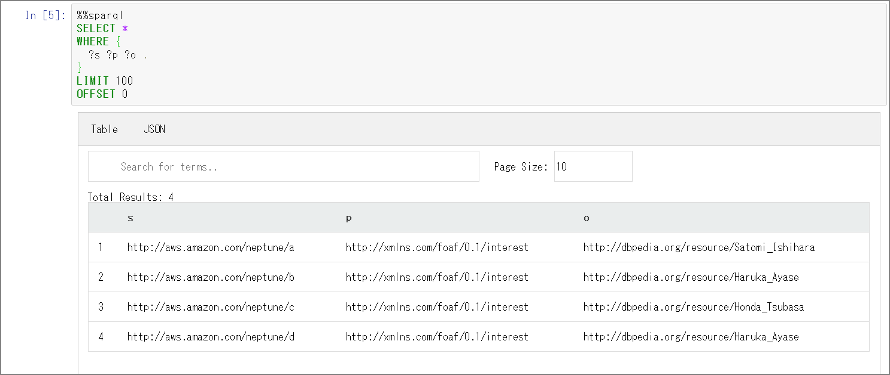

### はじめに

awslabsに用意されているNeptune用のツールを使用してRDFデータをTurtleへエクスポートしてみる。

> amazon-neptune-tools/neptune-export at master · awslabs/amazon-neptune-tools https://github.com/awslabs/amazon-neptune-tools/tree/master/neptune-export

詳細な使用方法について`readme.md`をご参照ください。

> amazon-neptune-tools/readme.md at master · awslabs/amazon-neptune-tools https://github.com/awslabs/amazon-neptune-tools/blob/master/neptune-export/readme.md
>
> awslabs/amazon-neptune-tools https://github.com/awslabs/amazon-neptune-tools/blob/master/neptune-export/docs/export-rdf.md

### 注意点

`Exporting an RDF Graph` については `At present neptune-export supports exporting an RDF dataset to Turtle with a single-threaded long-running query.`と記載があります。データ容量とか関わってきますが、シングルスレッドで動作する関係上長時間のエクスポートとなる可能性があります。実行時間や実行対象のインスタンスの負荷状況については留意する必要があると思います。クローンで別インスタンスを立てる、Read Replica側を使うなどの考慮は必要かと。

### 環境確認

実際に実行してみます。検証のためにデータを最小限にしています。ロードされているデータは下記の通りです。

```sql
SELECT *
WHERE {
  ?s ?p ?o .
}
LIMIT 100
OFFSET 0 
```



### 実行

outputのディレクトリの作成

```sh
mkdir -p /home/ec2-user/output
```

awslabsからneptune-exportツールのダウンロード

```sh
#sudo yum -y install git
git clone https://github.com/awslabs/amazon-neptune-tools.git
```

Mavenのインストール

```
sudo wget http://repos.fedorapeople.org/repos/dchen/apache-maven/epel-apache-maven.repo -O /etc/yum.repos.d/epel-apache-maven.repo
sudo sed -i s/\$releasever/6/g /etc/yum.repos.d/epel-apache-maven.repo
sudo yum install -y apache-maven
mvn --version
```

jarファイルのbuildを実行する

```
cd /home/ec2-user/amazon-neptune-tools/neptune-export
mvn clean install
```

targetディレクトリ配下にneptune-export.jarがビルドされる

```
[ec2-user@bastin neptune-export]$ ls -l target
total 62712
drwxrwxr-x 4 ec2-user ec2-user       28 Feb 24 05:13 classes
drwxrwxr-x 3 ec2-user ec2-user       25 Feb 24 05:13 generated-sources
drwxrwxr-x 3 ec2-user ec2-user       30 Feb 24 05:13 generated-test-sources
drwxrwxr-x 2 ec2-user ec2-user       28 Feb 24 05:13 maven-archiver
drwxrwxr-x 3 ec2-user ec2-user       35 Feb 24 05:13 maven-status
-rw-rw-r-- 1 ec2-user ec2-user   202719 Feb 24 05:13 neptune-export-1.0-SNAPSHOT.jar
-rw-rw-r-- 1 ec2-user ec2-user 64006996 Feb 24 05:14 neptune-export.jar
drwxrwxr-x 2 ec2-user ec2-user     4096 Feb 24 05:13 surefire-reports
drwxrwxr-x 3 ec2-user ec2-user       17 Feb 24 05:13 test-classes
[ec2-user@bastin neptune-export]$ 
```

#### neptune-export.shの実行

```sh
cd /home/ec2-user/amazon-neptune-tools/neptune-export
sh ./bin/neptune-export.sh export-rdf -e neptestdb.xxxxxxxxx.ap-northeast-1.neptune.amazonaws.com -d /home/ec2-user/output
```

※bin配下ではなく、一つ上のneptune-exportで実行する必要がある。neptune-export.jarを検索した上で変数に格納しているため。

```sh
jar=$(find . -name neptune-export.jar)
java -jar ${jar} "$@"
```

※neptuneのインスタンス名を指定しますが、「https」は抜いてください。怒られます。

```sh
Completed export-rdf in 0 seconds
An error occurred while exporting from Neptune:
java.lang.RuntimeException: org.eclipse.rdf4j.query.QueryEvaluationException: https: Name or service not known
	at com.amazonaws.services.neptune.rdf.NeptuneSparqlClient.executeQuery(NeptuneSparqlClient.java:166)
	at com.amazonaws.services.neptune.rdf.io.ExportRdfGraphJob.execute(ExportRdfGraphJob.java:31)
```

実行後は`output`ディレクトリ配下にttlが出力されています。トリプルは一致していますね。

```sh
cd /home/ec2-user/output/1584768727668/statements
[ec2-user@bastin statements]$ cat statements-0.ttl 

<http://aws.amazon.com/neptune/a> <http://xmlns.com/foaf/0.1/interest> <http://dbpedia.org/resource/Satomi_Ishihara> .
<http://aws.amazon.com/neptune/b> <http://xmlns.com/foaf/0.1/interest> <http://dbpedia.org/resource/Haruka_Ayase> .
<http://aws.amazon.com/neptune/c> <http://xmlns.com/foaf/0.1/interest> <http://dbpedia.org/resource/Honda_Tsubasa> .
<http://aws.amazon.com/neptune/d> <http://xmlns.com/foaf/0.1/interest> <http://dbpedia.org/resource/Haruka_Ayase> .
```

出力可能なフォーマット「turtle（デフォルト）」「nquads」「json(neptuneStreamsJson)」となります。

json(neptuneStreamsJson)の場合はこうなりました。

```sh
[ec2-user@bastin neptune-export]$ sh ./bin/neptune-export.sh export-rdf --format neptuneStreamsJson -e neptestdb.xxxxxxxxx.ap-northeast-1.neptune.amazonaws.com -d /home/ec2-user/output
Creating statement files

/home/ec2-user/output/1584769323164

[ec2-user@bastin statements]$ cat statements-0.json | jq
{
  "eventId": {
    "commitNum": -1,
    "opNum": 0
  },
  "data": {
    "stmt": "<http://aws.amazon.com/neptune/a> <http://xmlns.com/foaf/0.1/interest> <http://dbpedia.org/resource/Satomi_Ishihara> ."
  },
  "op": "ADD"
}
{
  "eventId": {
    "commitNum": -1,
    "opNum": 0
  },
  "data": {
    "stmt": "<http://aws.amazon.com/neptune/b> <http://xmlns.com/foaf/0.1/interest> <http://dbpedia.org/resource/Haruka_Ayase> ."
  },
  "op": "ADD"
}
{
  "eventId": {
    "commitNum": -1,
    "opNum": 0
  },
  "data": {
    "stmt": "<http://aws.amazon.com/neptune/c> <http://xmlns.com/foaf/0.1/interest> <http://dbpedia.org/resource/Honda_Tsubasa> ."
  },
  "op": "ADD"
}
{
  "eventId": {
    "commitNum": -1,
    "opNum": 0
  },
  "data": {
    "stmt": "<http://aws.amazon.com/neptune/d> <http://xmlns.com/foaf/0.1/interest> <http://dbpedia.org/resource/Haruka_Ayase> ."
  },
  "op": "ADD"
}
```

### 余談

最初はエラーが発生して正常完了出来なかったのですが、Stack Overflowに投稿したら修正してくれました。助かりました。

> amazon web services - regarding about export of neptune data - Stack Overflow https://stackoverflow.com/questions/60429428/regarding-about-export-of-neptune-data


