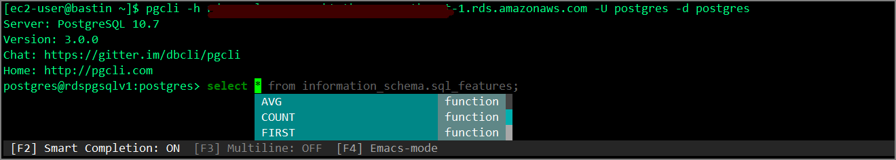

### はじめに

pgcliを使用してRDSやAuroraに接続したいので踏み台サーバへのEC2へインストールする。

pgcliはオートコンプリートと構文強調表示を備えたPostgres CLI。pipで簡単にインストール出来るかと思いきや意外とハマったのでメモしておく。

開発元は下記。

> dbcli/pgcli: Postgres CLI with autocompletion and syntax highlighting https://github.com/dbcli/pgcli

こちらの導入することで、下記のようにサジェストやハイライトシンタックスが出来るようになる。


### インストール手順

githubやその他の導入ブログを見る限りpythonさえ入っていれば大丈夫なようだったが、下記ライブラリやパッケージが必要なことに注意が必要。

##### 事前準備

```sh
sudo yum install -y python3
sudo pip3 install psycopg2-binary
sudo yum -y install postgresql-devel
sudo yum -y install gcc
sudo yum -y install python3-devel.x86_64
```

##### インストール

```sh
sudo pip3 install -U pgcli
```

##### 接続

```sh
[ec2-user@bastin ~]$ pgcli -h rdspgsqlv1.xxxxxxxxxx.ap-northeast-1.rds.amazonaws.com -U postgres -d postgres
Server: PostgreSQL 10.7
Version: 3.0.0
Chat: https://gitter.im/dbcli/pgcli
Home: http://pgcli.com
postgres@rdspgsqlv1:postgres>  
```

##### 画面イメージ



***

以下はエラーの内容とエラー対応のメモ。エラー②とエラー③についてはローカルにPostgreSQLがインストールされている環境であれば既にインストールされているはずなのでエラーは起きないと思われる。

### Python環境のインストール

pip は Python 3.4 以降では Python 本体に同梱されるようなっているのでpip3の個別のインストールは不要。

```sh
sudo yum install -y python3
```

### エラー①：psycopg2のエラー

この状態でpgcliをインストールしてみる。

```sh
sudo pip3 install -U pgcli
```

下記のエラーが発生する。

```sh
Command "python setup.py egg_info" failed with error code 1 in /tmp/pip-build-2mywyxn1/psycopg2/
```

`psycopg2-binary` をyumでインストールする。

```sh
sudo pip3 install psycopg2-binary
```

### エラー②：pg_configのエラー

次に実行すると`pg_config`に関連するエラーが発生

```sh
Error: pg_config executable not found.

pg_config is required to build psycopg2 from source.  Please add the directory
containing pg_config to the $PATH or specify the full executable path with the
option:

    python setup.py build_ext --pg-config /path/to/pg_config build ...

or with the pg_config option in 'setup.cfg'.
```

`postgresql-devel`の中にpg_configが含まれているのでインストール。

```sh
sudo yum -y install postgresql-devel
```

### エラー③：gccのエラー

`gcc`が見つからずにエラー。

```sh
unable to execute 'gcc': No such file or directory

It appears you are missing some prerequisite to build the package from source.

You may install a binary package by installing 'psycopg2-binary' from PyPI.
If you want to install psycopg2 from source, please install the packages
required for the build and try again.
```

`gcc`をインストール

```sh
sudo yum -y install gcc
```

### エラー④：python系のエラー

```sh
./psycopg/psycopg.h:35:10: fatal error: Python.h: No such file or directory
 #include <Python.h>
          ^~~~~~~~~~
compilation terminated.

It appears you are missing some prerequisite to build the package from source.

You may install a binary package by installing 'psycopg2-binary' from PyPI.
If you want to install psycopg2 from source, please install the packages
required for the build and try again.
```

`python3-devel.x86_64`をインストール

```sh
sudo yum -y install python3-devel.x86_64
```

### pgcliのインストール

ここまでインストールしてようやく`pgcli`のインストールが完了した。

```sh
[ec2-user@bastinv1 ~]$ sudo pip3 install -U pgcli
WARNING: Running pip install with root privileges is generally not a good idea. Try `pip3 install --user` instead.
Collecting pgcli

～中略～

Running setup.py install for psycopg2 ... done
  Running setup.py install for setproctitle ... done
Successfully installed cli-helpers-1.2.1 click-7.1.2 humanize-2.4.0 pgcli-3.0.0 pgspecial-1.11.10 prompt-toolkit-3.0.5 psycopg2-2.8.5 setproctitle-1.1.10 tabulate-0.8.7 terminaltables-3.1.0 wcwidth-0.1.9
```

