事前設定のIAMロールの設定から実際のRDS(PostgreSQL)に対してCSVファイルのロードを行う。RDSとAuroraで手順に関しては大きく差異はないが、Amazon S3 から Aurora PostgreSQL にインポートするには、データベースで PostgreSQL バージョン 10.7 以降を実行している必要がある。

詳細の手順や制限事項等は下記マニュアルを参照。

> PostgreSQL 互換で Amazon Aurora にデータを移行する - Amazon Aurora https://docs.aws.amazon.com/ja_jp/AmazonRDS/latest/AuroraUserGuide/AuroraPostgreSQL.Migrating.html#USER_PostgreSQL.S3Import

### IAMロールの設定

データロードのための下準備としてIAMロールの設定を行う。

IAMの画面から「ロールの作成」を選択

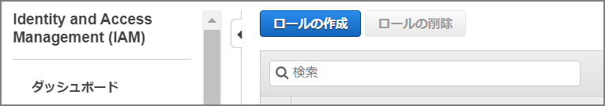

S3を選択

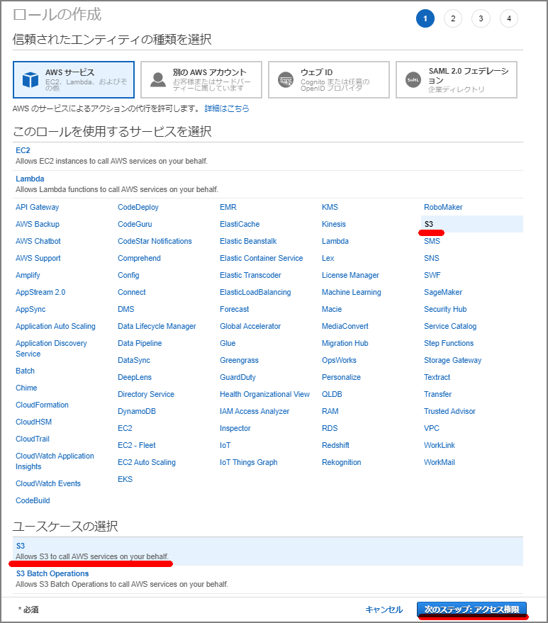

「`AmazonS3ReadOnlyAccess`」を選択してポリシーをアタッチする。

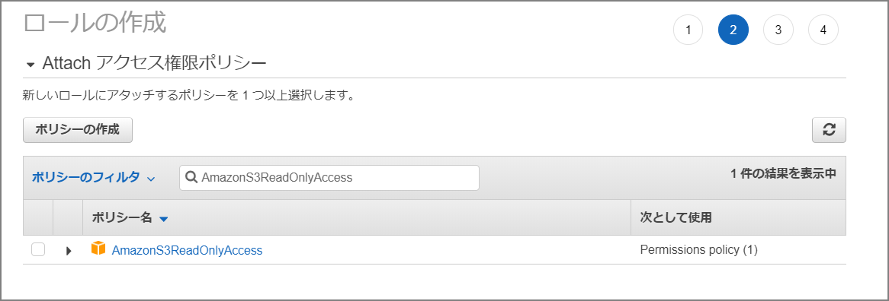

必要に応じてタグを設定。

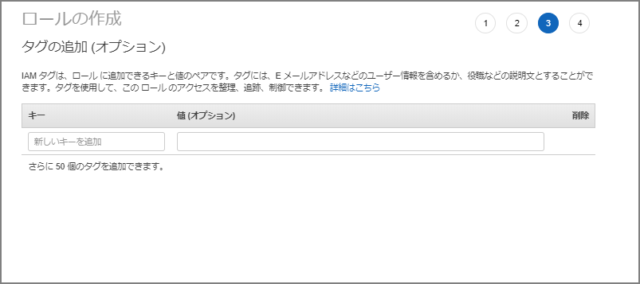

ロール名は「importfroms3」とした。

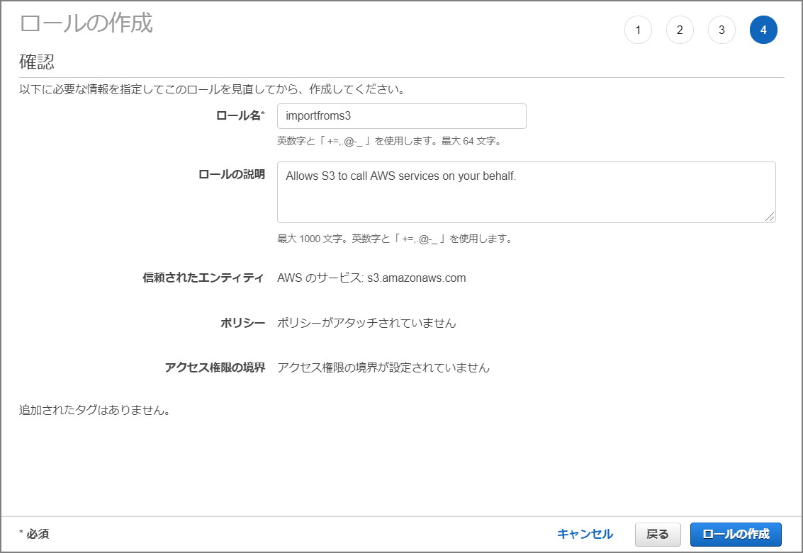

作成したロールの画面に移動する。

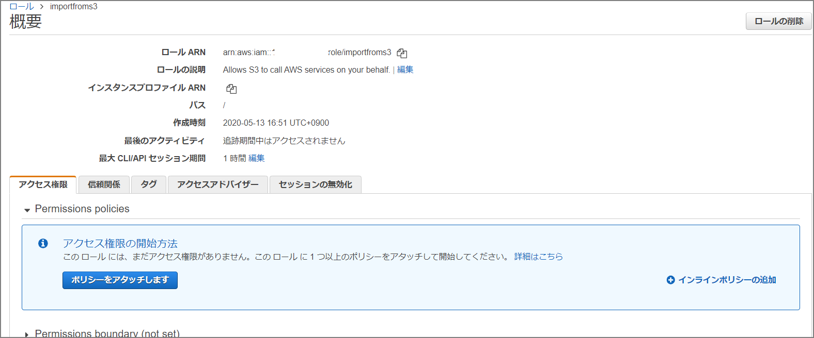

「信頼関係」-「信頼関係の編集」へと移動して下記を上書きして貼り付ける。

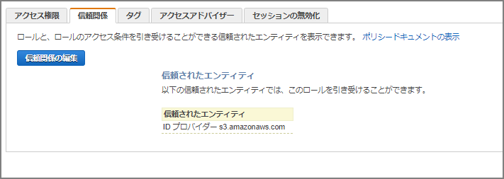

```json
{
  "Version": "2012-10-17",
  "Statement": [
    {
      "Sid": "",
      "Effect": "Allow",
      "Principal": {
        "Service": [
          "rds.amazonaws.com"
        ]
      },
      "Action": "sts:AssumeRole"
    }
  ]
}
```

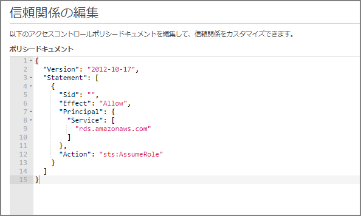

### 「Amazon Aurora クラスターに IAM ロール」を追加する

Aurora クラスタに移動して「IAMロールの管理」を選択。

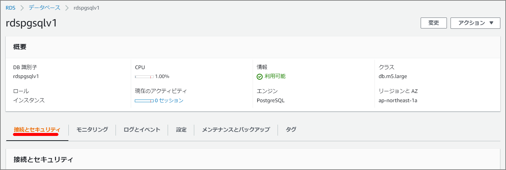

IAMロールの管理のところにて先程作成した「importfroms3」ロールを追加する。機能は「s3import」を指定。

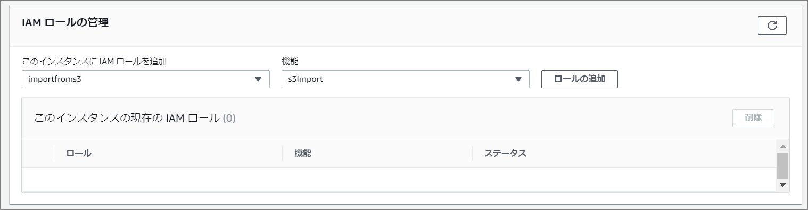

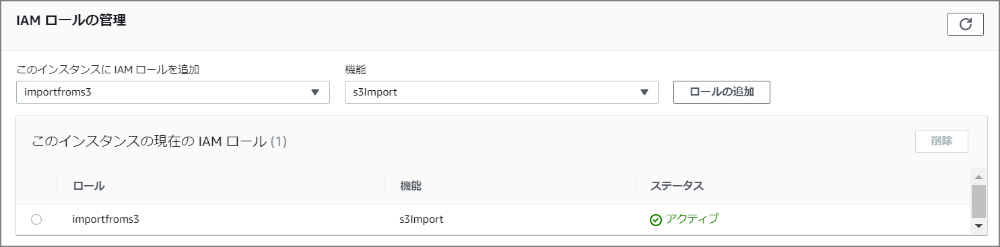

ここまでで事前設定が終わりとなる。

実際のインポート自体はCLI上でコマンドで実施するが、まずは`aws_s3`を有効化する。

```
CREATE EXTENSION aws_s3 CASCADE;
```

##### インポートコマンド

```
SELECT aws_s3.table_import_from_s3(
 'aozora_kaiseki',
 '',
 '(format csv)',
 'nep-s3-bk',
 'utf8_all.csv',
 'ap-northeast-1'
);
```

関数の引数は下記の通り。

> PostgreSQL 互換で Amazon Aurora にデータを移行する - Amazon Aurora https://docs.aws.amazon.com/ja_jp/AmazonRDS/latest/AuroraUserGuide/AuroraPostgreSQL.Migrating.html#USER_PostgreSQL.S3Import.FileFormats
>
> aws_s3.table_import_from_s3 関数を使用して Amazon S3 データをインポートする

```sh
dbname=> SELECT aws_s3.table_import_from_s3(
 'テーブル名',
 'カラムリスト', -- 空文字('')の場合は、テーブルのカラムと一致
 'PostgreSQL COPYの引数・フォーマット',
 'S3バケット名',
 'S3キー',
 'S3リージョン'
);
```

約10GB相当のデータを約4分でインポートすることが出来た。

```
postgres@rdspgsqlv1:postgres> SELECT aws_s3.table_import_from_s3( 
  'aozora_kaiseki', 
  '', 
  '(format csv)', 
  'nep-s3-bk', 
  'utf8_all.csv', 
  'ap-northeast-1' 
  );                                                                                                                                                                                   
+--------------------------------------------------------------------------------------------------+
| table_import_from_s3                                                                             |
|--------------------------------------------------------------------------------------------------|
| 87701673 rows imported into relation "aozora_kaiseki" from file utf8_all.csv of 6539180310 bytes |
+--------------------------------------------------------------------------------------------------+
SELECT 1
Time: 272.534s (4 minutes), executed in: 272.522s (4 minutes)
postgres@rdspgsqlv1:postgres>  

```

psqlのコピーコマンドを使ったCSVインポートと比較してみたが、特に時間としては変わらなかった。

```
■CSVインポート(COPYコマンド)	
[ec2-user@bastin ~]$ time psql -h rdspgsqlv1.xxxxxxxx.ap-northeast-1.rds.amazonaws.com -d postgres -U postgres -c "COPY aozora_kaiseki(file,num,row,word,subtype1,subtype2,subtype3,subtype4,conjtype,conjugation,basic,ruby,pronunce) from stdin with csv DELIMITER ','" < /home/ec2-user/utf8_all.csv	
COPY 87701673	
	
real	4m20.753s
user	0m19.471s
sys	0m6.427s
```

