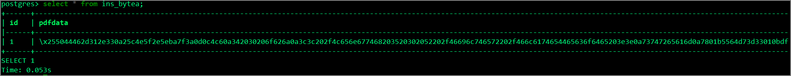

#### はじめに

バイナリデータの操作をpsqlから実施しようとする機会はあまりないと思うが、Aurora/RDSでは `pg_read_binary_file`ファンクションが`permission denied for function pg_read_binary_file`が使用できない。理由として`pg_read_binary_file`ファンクションの所有者がrdsadminというログイン不可なユーザとなっているため使用することが出来ない。また、pg_read_binary_fileはサーバサイドのファンクションなので、psqlでログインしている状態でEC2上(Bastin)のファイルをbytea列にINSERTということは不可となる。

```sql
postgres> create table test01(id serial primary key,data bytea);                                                                       CREATE TABLE

postgres> insert into test01 (data) values (pg_read_binary_file('/home/ec2-user/test.pdf'));
permission denied for function pg_read_binary_file

postgres> SELECT proacl FROM pg_proc WHERE proname='pg_read_binary_file';                   
+-----------------------+
| proacl                |
|-----------------------|
| {rdsadmin=X/rdsadmin} |
| {rdsadmin=X/rdsadmin} |
| {rdsadmin=X/rdsadmin} |
+-----------------------+
```

#### Pythonのpsycopg2を使ってAurora PostgreSQLにデータをインサートするサンプルスクリプト

`aws-overview.pdf`という[ファイル](https://d1.awsstatic.com/whitepapers/aws-overview.pdf)をDBに格納することとします。

python実行と同じディレクトリに`test.pdf`を配置して実行

```python
import psycopg2
import psycopg2.extras

conn = psycopg2.connect("host=aurorapgsqlv1.cluster-xxxxxx.ap-northeast-1.rds.amazonaws.com port=5432 dbname=postgres user=postgres password=postgres")

cur = conn.cursor()
img = open('aws-overview.pdf', 'rb').read()

cur.execute("create table ins_bytea(id serial,pdfdata bytea)")

cur.execute("INSERT INTO ins_bytea (pdfdata) values (%s)", 
    (psycopg2.Binary(img),))

conn.commit()
cur.close()
conn.close()
```

#### 結果



#### 格納されたバイナリデータを取り出す方法

`aws-overview_export.pdf`というファイル名で抽出。

```
import psycopg2
import psycopg2.extras

conn = psycopg2.connect("host=aurorapgsqlv1.cluster-xxxxxx.ap-northeast-1.rds.amazonaws.com port=5432 dbname=postgres user=postgres password=postgres")

cur = conn.cursor(cursor_factory=psycopg2.extras.DictCursor)
cur.execute("SELECT pdfdata FROM ins_bytea;")

row = cur.fetchone()
pic = row['pdfdata']

f = open('aws-overview_export.pdf', 'wb')
f.write(pic)
f.close()
cur.close()
conn.close()
```

特に差分も無し。

```
[ec2-user@bastin ~]$ diff aws-overview.pdf aws-overview_export.pdf 
[ec2-user@bastin ~]$ 
```

#### 参考

> PythonからPostgreSQLに接続する方法 | アシスト https://www.ashisuto.co.jp/db_blog/article/20160308_postgresql_with_python.html