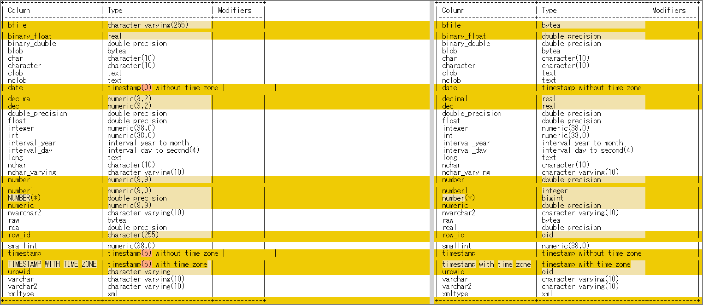

興味本位でOracleからPostgreSQLへスキーマ移行する場合によく使用される`ora2pg`と`SCT(AWS Schema Conversion Tool )`の変換結果を比較してみた。ora2pg、SCT共にデフォルト設定で実施してwinmergeで比較してみた。左側がSCT、右側がora2pgとなる。予想以上に結果が異なって驚いた。

ソースとなるOracle側に作ったテーブルはこちら。

### CREATE文

```
CREATE TABLE "DATATYPES"(
 "BFILE" BFILE,
 "BINARY_FLOAT" BINARY_FLOAT,
 "BINARY_DOUBLE" BINARY_DOUBLE,
 "BLOB" BLOB,
 "CHAR" CHAR(10 BYTE),
 "CHARACTER" CHAR(10 BYTE),
 "CLOB" CLOB,
 "NCLOB" NCLOB,
 "DATE" DATE,
 "DECIMAL" NUMBER(3,2),
 "DEC" NUMBER(3,2),
 "DOUBLE_PRECISION" FLOAT(126),
 "FLOAT" FLOAT(3),
 "INTEGER" NUMBER(*,0),
 "INT" NUMBER(*,0),
 "INTERVAL_YEAR" INTERVAL YEAR(4) TO MONTH,
 "INTERVAL_DAY" INTERVAL DAY(4) TO SECOND(4),
 "LONG" LONG,
 "NCHAR" NCHAR(10),
 "NCHAR_VARYING" NVARCHAR2(10),
 "NUMBER" NUMBER(9,9),
 "NUMBER1" NUMBER(9,0),
 "NUMBER(*)" NUMBER,
 "NUMERIC" NUMBER(9,9),
 "NVARCHAR2" NVARCHAR2(10),
 "RAW" RAW(10),
 "REAL" FLOAT(63),
 "ROW_ID" ROWID,
 "SMALLINT" NUMBER(*,0),
 "TIMESTAMP" TIMESTAMP(5),
 "TIMESTAMP WITH TIME ZONE" TIMESTAMP(5) WITH TIME ZONE,
 "UROWID" UROWID(10),
 "VARCHAR" VARCHAR2(10 BYTE),
 "VARCHAR2" VARCHAR2(10 BYTE),
 "XMLTYPE" "PUBLIC"."XMLTYPE"
);
```

### テーブル定義

```
SQL> desc DATATYPES;
 Name					   Null?    Type
 ----------------------------------------- -------- ----------------------------
 BFILE						    BINARY FILE LOB
 BINARY_FLOAT					BINARY_FLOAT
 BINARY_DOUBLE					BINARY_DOUBLE
 BLOB						    BLOB
 CHAR						    CHAR(10)
 CHARACTER					    CHAR(10)
 CLOB						    CLOB
 NCLOB						    NCLOB
 DATE						    DATE
 DECIMAL					    NUMBER(3,2)
 DEC						    NUMBER(3,2)
 DOUBLE_PRECISION				FLOAT(126)
 FLOAT						    FLOAT(3)
 INTEGER					    NUMBER(38)
 INT						    NUMBER(38)
 INTERVAL_YEAR					INTERVAL YEAR(4) TO MONTH
 INTERVAL_DAY					INTERVAL DAY(4) TO SECOND(4)
 LONG						    LONG
 NCHAR						    NCHAR(10)
 NCHAR_VARYING					NVARCHAR2(10)
 NUMBER 					    NUMBER(9,9)
 NUMBER1					    NUMBER(9)
 NUMBER(* )					    NUMBER
 NUMERIC					    NUMBER(9,9)
 NVARCHAR2					    NVARCHAR2(10)
 RAW						    RAW(10)
 REAL						    FLOAT(63)
 ROW_ID 					    ROWID
 SMALLINT					    NUMBER(38)
 TIMESTAMP					    TIMESTAMP(5)
 TIMESTAMP WITH TIME ZONE		 TIMESTAMP(5) WITH TIME ZONE
 UROWID 					    ROWID
 VARCHAR					    VARCHAR2(10)
 VARCHAR2					    VARCHAR2(10)
 XMLTYPE					    PUBLIC.XMLTYPE STORAGE BINARY
```

### 変換結果



表形式で記載。右側のora2pgとSCT側がPostgreSQL結果で`\d`で定義を出力した結果となる。

| No.  | Oracle  (※descの結果）        | SCT  (\d メタコマンド結果）    | ora2pg  (\d メタコマンド結果） |
| ---- | ----------------------------- | ------------------------------ | ------------------------------ |
| 1    | BINARY FILE LOB               | character varying(255)         | bytea                          |
| 2    | BINARY_FLOAT                  | real                           | double precision               |
| 3    | BINARY_DOUBLE                 | double precision               | double precision               |
| 4    | BLOB                          | bytea                          | bytea                          |
| 5    | CHAR(10)                      | character(10)                  | character(10)                  |
| 6    | CHAR(10)                      | character(10)                  | character(10)                  |
| 7    | CLOB                          | text                           | text                           |
| 8    | NCLOB                         | text                           | text                           |
| 9    | DATE                          | timestamp(0) without time zone | timestamp without time zone    |
| 10   | NUMBER(3,2)                   | numeric(3,2)                   | real                           |
| 11   | NUMBER(3,2)                   | numeric(3,2)                   | real                           |
| 12   | FLOAT(126)                    | double precision               | double precision               |
| 13   | FLOAT(3)                      | double precision               | double precision               |
| 14   | NUMBER(38)                    | numeric(38,0)                  | numeric(38,0)                  |
| 15   | NUMBER(38)                    | numeric(38,0)                  | numeric(38,0)                  |
| 16   | INTERVAL YEAR(4) TO MONTH     | interval year to month         | interval year to month         |
| 17   | INTERVAL DAY(4) TO SECOND(4)  | interval day to second(4)      | interval day to second(4)      |
| 18   | LONG                          | text                           | text                           |
| 19   | NCHAR(10)                     | character(10)                  | character(10)                  |
| 20   | NVARCHAR2(10)                 | character varying(10)          | character varying(10)          |
| 21   | NUMBER(9,9)                   | numeric(9,9)                   | double precision               |
| 22   | NUMBER(9)                     | numeric(9,0)                   | integer                        |
| 23   | NUMBER                        | double precision               | bigint                         |
| 24   | NUMBER(9,9)                   | numeric(9,9)                   | double precision               |
| 25   | NVARCHAR2(10)                 | character varying(10)          | character varying(10)          |
| 26   | RAW(10)                       | bytea                          | bytea                          |
| 27   | FLOAT(63)                     | double precision               | double precision               |
| 28   | ROWID                         | character(255)                 | oid                            |
| 29   | NUMBER(38)                    | numeric(38,0)                  | numeric(38,0)                  |
| 30   | TIMESTAMP(5)                  | timestamp(5) without time zone | timestamp without time zone    |
| 31   | TIMESTAMP(5) WITH TIME ZONE   | timestamp(5) with time zone    | timestamp with time zone       |
| 32   | ROWID                         | character varying              | oid                            |
| 33   | VARCHAR2(10)                  | character varying(10)          | character varying(10)          |
| 34   | VARCHAR2(10)                  | character varying(10)          | character varying(10)          |
| 35   | PUBLIC.XMLTYPE STORAGE BINARY | xml                            | xml                            |