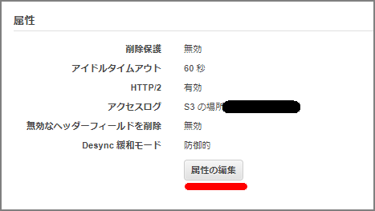
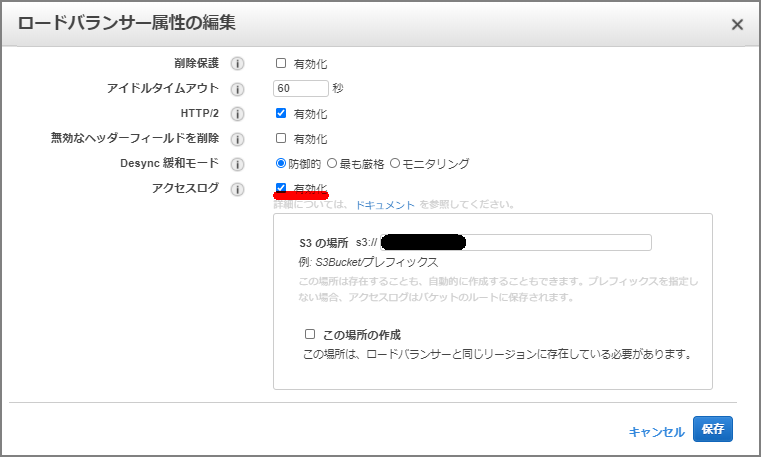
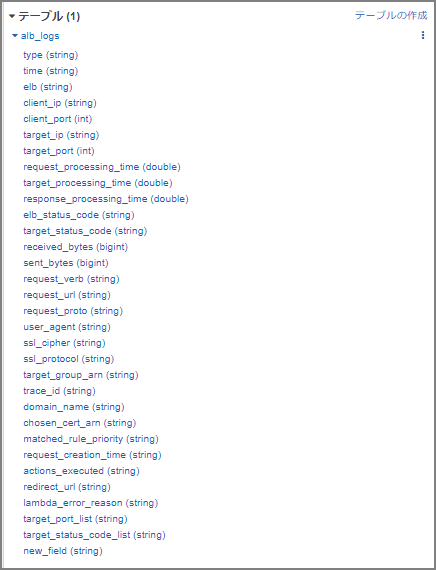

### ELBのログの有効化

属性の「属性の編集」からアクセスログを有効化。しばらく放置するとS3の指定したバケットにELBにログが蓄積されていく。





### Athena

#### Athenaでデータベース作成

```sql
create database alb_db
```

#### Athenaでテーブル作成

LOCATIONに指定するパスはELBアクセスログの設定した時に指定したBucketとpathとなる。このテーブル作成後は、Athenaを使用してSQLベースでクエリを発行することが出来る。

```sql
CREATE EXTERNAL TABLE IF NOT EXISTS alb_logs (
            type string,
            time string,
            elb string,
            client_ip string,
            client_port int,
            target_ip string,
            target_port int,
            request_processing_time double,
            target_processing_time double,
            response_processing_time double,
            elb_status_code string,
            target_status_code string,
            received_bytes bigint,
            sent_bytes bigint,
            request_verb string,
            request_url string,
            request_proto string,
            user_agent string,
            ssl_cipher string,
            ssl_protocol string,
            target_group_arn string,
            trace_id string,
            domain_name string,
            chosen_cert_arn string,
            matched_rule_priority string,
            request_creation_time string,
            actions_executed string,
            redirect_url string,
            lambda_error_reason string,
            target_port_list string,
            target_status_code_list string,
            new_field string
            )
            ROW FORMAT SERDE 'org.apache.hadoop.hive.serde2.RegexSerDe'
            WITH SERDEPROPERTIES (
            'serialization.format' = '1',
            'input.regex' = 
        '([^ ]*) ([^ ]*) ([^ ]*) ([^ ]*):([0-9]*) ([^ ]*)[:-]([0-9]*) ([-.0-9]*) ([-.0-9]*) ([-.0-9]*) (|[-0-9]*) (-|[-0-9]*) ([-0-9]*) ([-0-9]*) \"([^ ]*) ([^ ]*) (- |[^ ]*)\" \"([^\"]*)\" ([A-Z0-9-]+) ([A-Za-z0-9.-]*) ([^ ]*) \"([^\"]*)\" \"([^\"]*)\" \"([^\"]*)\" ([-.0-9]*) ([^ ]*) \"([^\"]*)\" \"([^\"]*)\" \"([^ ]*)\" \"([^\s]+)\" \"([^\s]+)\"(.*)')
            LOCATION 's3://<Bucket name>/AWSLogs/<Account ID>/elasticloadbalancing/ap-northeast-1/';
```

このテーブル作成後は、Athenaを使用してSQLベースでクエリを発行することが出来る。作成後のテーブル↓



各列の説明は下記を参照。

> https://docs.aws.amazon.com/ja_jp/elasticloadbalancing/latest/application/load-balancer-access-logs.html

| Field                     | 説明:                                                        |
| :------------------------ | :----------------------------------------------------------- |
| type                      | リクエストまたは接続のタイプ。有効な値は次のとおりです (その他の値は無視してください)。`http` — HTTP`https` — HTTP over SSL/TLS`h2` — HTTP/2 over SSL/TLS`ws` — WebSockets`wss` — WebSockets over SSL/TLS |
| time                      | ロードバランサーがクライアントに対してレスポンスを生成した時刻 (ISO 8601 形式)。WebSocket の場合、これは接続を閉じる時間です。 |
| elb                       | ロードバランサーのリソース ID。アクセスログエントリを解析する場合、リソース ID にはスラッシュ (/) を含めることができます。 |
| client:port               | リクエストを送信したクライアントの IP アドレスとポート。     |
| target:port               | このリクエストを処理したターゲットの IP アドレスとポート。クライアントがリクエスト全体を送信しなかった場合、ロードバランサーはターゲットにリクエストをディスパッチできず、この値が - に設定されます。ターゲットが Lambda 関数の場合、この値は - に設定されます。リクエストが AWS WAF によってブロックされた場合、この値は - に設定され、elb_status_code の値は 403 に設定されます。 |
| request_processing_time   | ロードバランサーがリクエストを受け取った時点からターゲットに送信するまでの合計経過時間 (ミリ秒精度の秒単位)。ロードバランサーがリクエストをターゲットにディスパッチできない場合、この値は -1 に設定されます。この状況が発生するのは、ターゲットがアイドルタイムアウト前に接続を閉じた場合か、クライアントが誤った形式のリクエストを送信した場合です。登録済みターゲットからアイドルタイムアウトまで応答がない場合にも、この値は -1 に設定される場合があります。 |
| target_processing_time    | ロードバランサーがターゲットにリクエストを送信した時点から、そのターゲットが応答ヘッダーの送信を開始した時点までの合計経過時間 (ミリ秒精度の秒単位)。ロードバランサーがリクエストをターゲットにディスパッチできない場合、この値は -1 に設定されます。この状況が発生するのは、ターゲットがアイドルタイムアウト前に接続を閉じた場合か、クライアントが誤った形式のリクエストを送信した場合です。登録済みターゲットからアイドルタイムアウトまで応答がない場合にも、この値は -1 に設定される場合があります。 |
| response_processing_time  | ロードバランサーがターゲットから応答ヘッダーを受け取った時点から、クライアントへの応答の送信を開始した時点までの合計経過時間 (ミリ秒精度の秒単位)。これには、ロードバランサーでの待機時間と、ロードバランサーからクライアントへの接続の取得時間の両方が含まれます。ロードバランサーがリクエストをターゲットに送信できない場合、この値は -1 に設定されます。この状況が発生するのは、ターゲットがアイドルタイムアウト前に接続を閉じた場合か、クライアントが誤った形式のリクエストを送信した場合です。 |
| elb_status_code           | ロードバランサーからの応答のステータスコード。               |
| target_status_code        | ターゲットから応答のステータスコード。この値は、ターゲットへの接続が確立され、ターゲットが応答を送信した場合のみ記録されます。それ以外の場合は、- に設定されます。 |
| received_bytes            | クライアント (リクエスタ) から受け取ったリクエストのサイズ (バイト単位)。HTTP リクエストの場合、これにはヘッダーが含まれます。WebSocket の場合、これは接続でクライアントから受信した合計バイト数です。 |
| sent_bytes                | クライアント (リクエスタ) に返される応答のサイズ(バイト単位)。HTTP リクエストの場合、これにはヘッダーが含まれます。WebSocket の場合、これは接続でクライアントに送信した合計バイト数です。 |
| "request"                 | クライアントからのリクエスト行。二重引用符で囲まれ、次の形式でログされます。HTTP メソッド + プロトコル://host:port/uri + HTTP バージョン。ロードバランサーは、リクエスト URI を記録するときに、クライアントから送信された URL をそのまま保持します。アクセスログファイルのコンテンツタイプは設定されません。このフィールドを処理するときは、クライアントが URL を送信した方法を考慮してください。 |
| "user_agent"              | リクエスト元のクライアントを特定する User-Agent 文字列 (二重引用符で囲まれます)。この文字列は、1 つ以上の製品 ID (製品[/バージョン]) から構成されます。文字列が 8 KB より長い場合は切り捨てられます。 |
| ssl_cipher                | [HTTPS リスナー] SSL 暗号。リスナーが HTTPS リスナーではない場合、この値は - に設定されます。 |
| ssl_protocol              | [HTTPS リスナー] SSL プロトコル。リスナーが HTTPS リスナーではない場合、この値は - に設定されます。 |
| target_group_arn          | ターゲットグループの Amazon リソースネーム (ARN)。           |
| "trace_id"                | **X-Amzn-Trace-Id** ヘッダーのコンテンツ (二重引用符で囲まれます)。 |
| <domain_name>             | [HTTPS リスナー] TLS ハンドシェイク中にクライアントから提供される SNI ドメイン (二重引用符で囲まれます)。クライアントが SNI をサポートしない場合、あるいはドメインが証明書と一致せず、デフォルトの証明書がクライアントに提示された場合、この値は - となります。 |
| chosen_cert_arn           | [HTTPS リスナー] クライアントに提示される証明書の ARN (二重引用符で囲まれます)。セッションが再利用される場合、この値は `session-reused` に設定されます。リスナーが HTTPS リスナーではない場合、この値は - に設定されます。 |
| matched_rule_priority     | リクエストに一致したルールの優先度の値。ルールが一致した場合、この値は 1～50,000 になります。一致するルールがなく、デフォルトのアクションが実行された場合、この値は 0 に設定されます。ルールの評価中にエラーが発生した場合は、-1 に設定されます。その他のエラーの場合は、- に設定されます。 |
| request_creation_time     | ロードバランサーがクライアントからリクエストを受け取った時刻 (ISO 8601 形式)。 |
| "actions_executed"        | リクエストの処理時に実行されるアクション (二重引用符で囲まれます)。この値は、「[Actions taken](https://docs.aws.amazon.com/ja_jp/elasticloadbalancing/latest/application/load-balancer-access-logs.html#actions-taken)」で説明されている値を含めることができるカンマ区切りリストです。形式が正しくないリクエストなどでアクションが実行されない場合、この値は - に設定されます。 |
| "redirect_url"            | HTTP レスポンスのロケーションヘッダーのリダイレクトターゲットの URL (二重引用文字で囲む)。リダイレクトアクションが実行されなかった場合、この値は - に設定されます。 |
| "error_reason"            | エラー理由コード (二重引用符で囲まれます)。リクエストが失敗した場合、これは「[Error reason codes](https://docs.aws.amazon.com/ja_jp/elasticloadbalancing/latest/application/load-balancer-access-logs.html#error-reason-codes)」で説明されているいずれかのエラーコードになります。実行されたアクションが認証アクションを含まない、またはターゲットが Lambda 関数ではない場合、この値は - に設定されます。 |
| "target:port_list"        | このリクエストを処理したターゲットの IP アドレスとポートのスペース区切りのリスト (二重引用符で囲まれます)。現在、このリストには 1 つの項目を含めることができ、target:port フィールドと一致します。クライアントがリクエスト全体を送信しなかった場合、ロードバランサーはターゲットにリクエストをディスパッチできず、この値が - に設定されます。ターゲットが Lambda 関数の場合、この値は - に設定されます。リクエストが AWS WAF によってブロックされた場合、この値は - に設定され、elb_status_code の値は 403 に設定されます。 |
| "target_status_code_list" | ターゲットの応答からのステータスコードのスペース区切りのリスト (二重引用符で囲まれます)。現在、このリストには 1 つの項目を含めることができ、target_status_code フィールドと一致します。この値は、ターゲットへの接続が確立され、ターゲットが応答を送信した場合のみ記録されます。それ以外の場合は、- に設定されます。 |

クエリサンプル例はこちら。外向けに公開しているELBの場合、怪しげのアタックがたくさん来ていることがわかると思います。

##### 最初の 100 個のアクセスログエントリを新しい順に表示

```sql
SELECT *
FROM alb_logs
ORDER by time ASC
LIMIT 100;
```

##### ALB にアクセスしたすべてのクライアント IP アドレスと、それらが ALB にアクセスした回数を一覧表示

```sql
SELECT distinct client_ip, count() as count from alb_logs
GROUP by client_ip
ORDER by count() DESC;
```

##### リクエスト/レスポンスのペアで ALB を通過しているデータの平均量 (キロバイト) を一覧表示

```sql
SELECT (avg(sent_bytes)/1000.0 + avg(received_bytes)/1000.0)
as prewarm_kilobytes from alb_logs;
```

##### 指定された URL を訪問した回数をクライアント別、降順に一覧表示

```sql
SELECT client_ip, elb, request_url, count(*) as count from alb_logs
GROUP by client_ip, elb, request_url
ORDER by count DESC;
```

##### Firefox ユーザーが最も頻繁にアクセスした上位 10 個の URL を一覧表示

```sql
SELECT request_url, user_agent, count(*) as count
FROM alb_logs
WHERE user_agent LIKE '%Firefox%'
GROUP by request_url, user_agent
ORDER by count(*) DESC
LIMIT 10;
```

##### ALB へのリクエストで送信したデータ量 (メガバイト) で、クライアント別、降順で一覧表示

```sql
SELECT client_ip, sum(received_bytes/1000000.0) as client_datareceived_megabytes
FROM alb_logs
GROUP by client_ip
ORDER by client_datareceived_megabytes DESC;
```

### 参考

> Athena を使用してロードバランサーのアクセスログを分析する https://aws.amazon.com/jp/premiumsupport/knowledge-center/athena-analyze-access-logs/