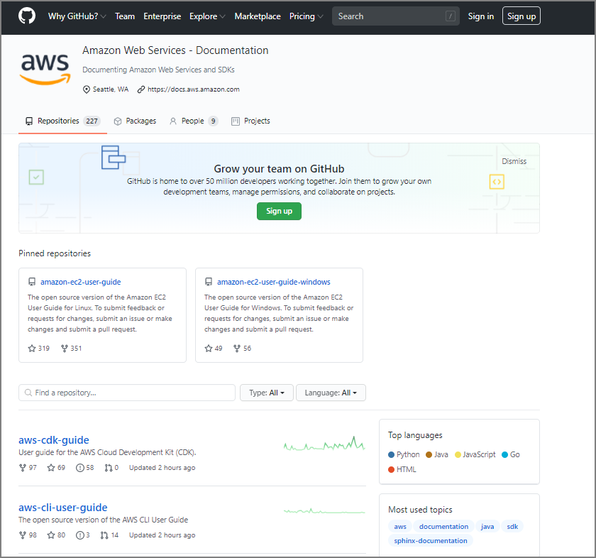
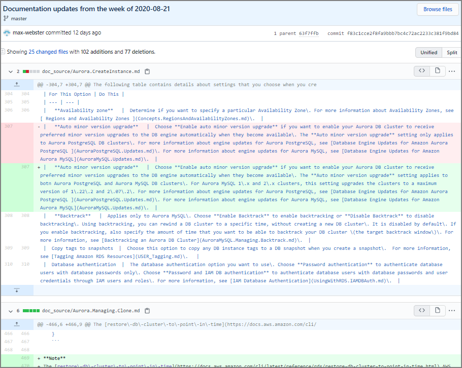
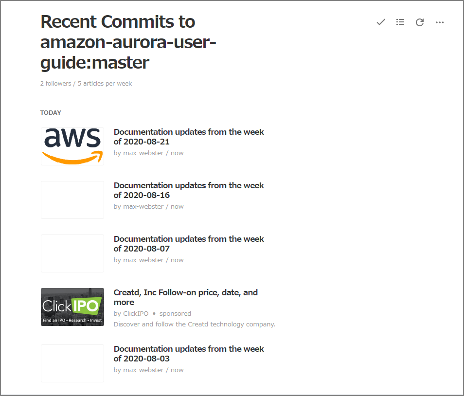

### 

今更ながらAWSのドキュメントがgithubから確認出来ることを知った。2018年にオープンソースになった模様。

> AWS ドキュメントがオープンソースになり、GitHub でご利用可能に | Amazon Web Services ブログ https://aws.amazon.com/jp/blogs/news/aws-documentation-is-now-open-source-and-on-github/

下記のURLからユーザガイドや開発者ガイドのリポジトリにアクセスすることが出来る。

> https://github.com/awsdocs

例えばAuroraのユーザガイドのリポジトリはこちら。

> https://github.com/awsdocs/amazon-aurora-user-guide

githubなのでcommitのログも確認出来るし、具体的にどこの部分が変わったか、というのも見ることが出来る。

> https://github.com/awsdocs/amazon-aurora-user-guide/commit/f83c1cce2f8fa9bbb7bc4c72ac2233c381f9bd84

GitHubは色々なatomフィードを出力出来るのでRSSに登録しといて、更新があれば確認してみる、というような使い方も出来る。例えば、Auroraのユーザガイドのcommitログのフィードは下記となる。リポジトリ名をそれぞれのものに変えることで気にあるリポジトリの更新を受け取ることが出来るのでこういう使い方も。

> https://github.com/awsdocs/amazon-aurora-user-guide/commits/master.atom

私はFeedlyを使っているが、こんな感じに通知が飛んでくる。

