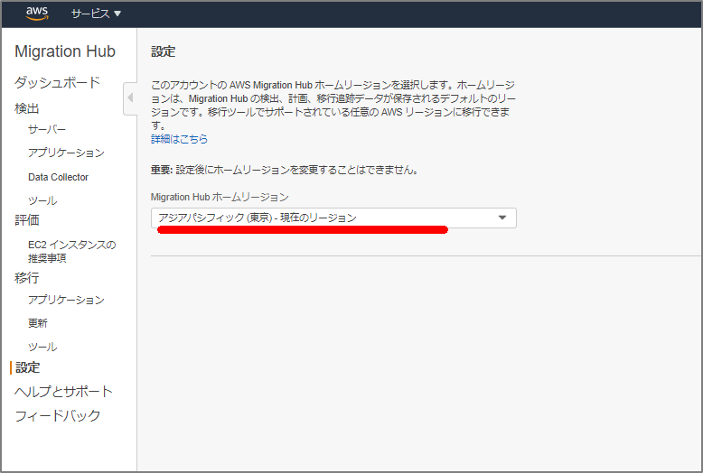
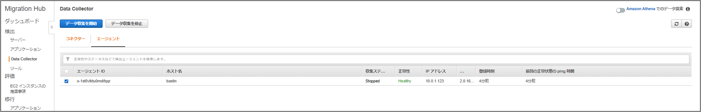
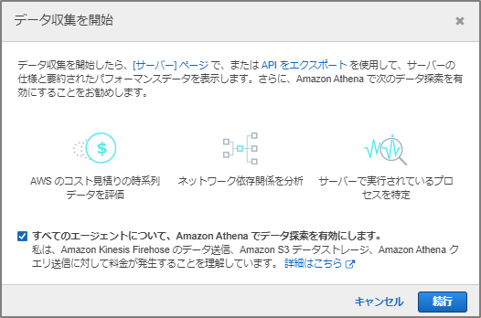
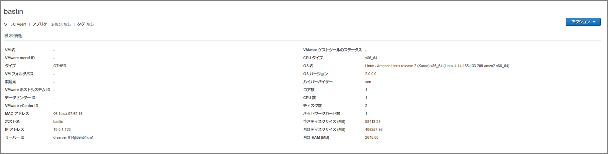
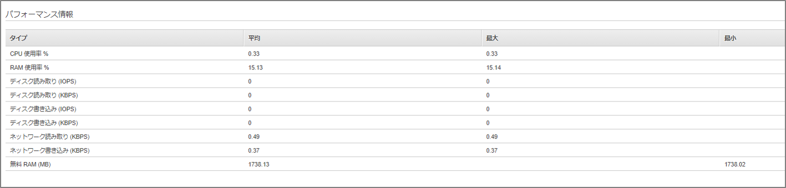
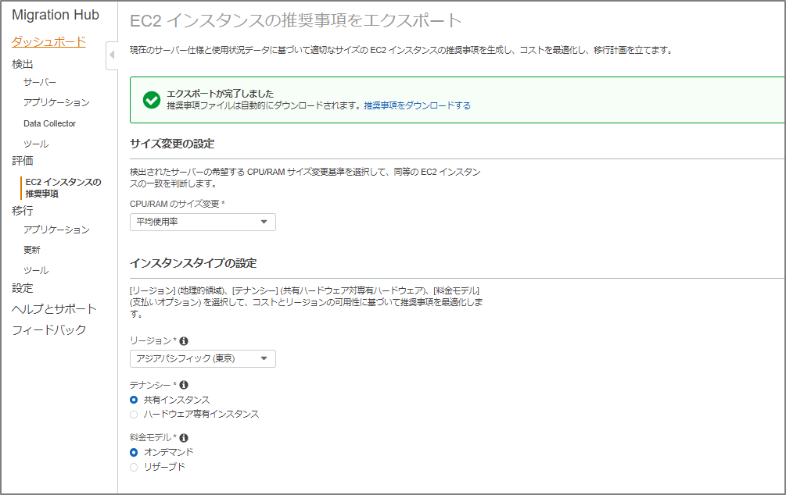

### AWS Application Discovery Serviceとは？

> https://aws.amazon.com/jp/application-discovery/
>
> AWS Application Discovery Service では、オンプレミスデータセンターに関する情報を収集することにより、エンタープライズのお客様の移行プロジェクト計画を支援しています。
>
> データセンター移行計画には何千ものワークロードが存在し、多くの場合それらが相互に深く依存しあっています。サーバーの使用率データや依存関係のマッピングは、移行プロセス初期の重要なステップです。AWS Application Discovery Service では、サーバーの設定データ、使用状況データ、動作データが収集され、お客様に提供されます。これにより、お客様はワークロードを十分に把握することができます。
>
> 収集されたデータは、AWS Application Discovery Service のデータストアに暗号化形式で保存されます。このデータを CSV ファイルとしてエクスポートし、AWS で稼働した場合の総所有コスト (TCO) の見積もりや、AWS への移行計画に使用できます。また、このデータは AWS Migration Hub でも利用できます。このサービスでは、検出したサーバーを AWS に移行し、AWS に移行する際の進捗を追跡できます。

### エージェントインストール、情報収集

ということで、VMware vCenter向けのエージェントレス構成ではなく、Linuxにエージェントを導入してどのような情報を取得出来るか見てみる。

#### 前準備

`Migration Hub`の設定画面でMigration Hubホームリージョンを指定する。



#### エージェントをダウンロード

```sh
[ec2-user@bastin ads]$ curl -o ./aws-discovery-agent.tar.gz https://s3-us-west-2.amazonaws.com/aws-discovery-agent.us-west-2/linux/latest/aws-discovery-agent.tar.gz
  % Total    % Received % Xferd  Average Speed   Time    Time     Time  Current
                                 Dload  Upload   Total   Spent    Left  Speed
100 36.6M  100 36.6M    0     0  7330k      0  0:00:05  0:00:05 --:--:-- 8357k
[ec2-user@bastin ads]$ ls -l
total 37536
-rw-rw-r-- 1 ec2-user ec2-user 38433031 Oct  2 21:16 aws-discovery-agent.tar.gz
[ec2-user@bastin ads]$ 
```

#### エージェントの暗号署名を確認

`7638 F24C 6717 F97C 4F1B  3BC0 5133 255E 4DF4 2DA2`となることを確認

```sh
[ec2-user@bastin ads]$ curl -o ./agent.sig https://s3.us-west-2.amazonaws.com/aws-discovery-agent.us-west-2/linux/latest/aws-discovery-agent.tar.gz.sig
  % Total    % Received % Xferd  Average Speed   Time    Time     Time  Current
                                 Dload  Upload   Total   Spent    Left  Speed
100   819  100   819    0     0   1628      0 --:--:-- --:--:-- --:--:--  1625
[ec2-user@bastin ads]$ 
[ec2-user@bastin ads]$ curl -o ./discovery.gpg https://s3.us-west-2.amazonaws.com/aws-discovery-agent.us-west-2/linux/latest/discovery.gpg
  % Total    % Received % Xferd  Average Speed   Time    Time     Time  Current
                                 Dload  Upload   Total   Spent    Left  Speed
100  2255  100  2255    0     0   5207      0 --:--:-- --:--:-- --:--:--  5195
[ec2-user@bastin ads]$ 
[ec2-user@bastin ads]$ gpg --no-default-keyring --keyring ./discovery.gpg --verify agent.sig aws-discovery-agent.tar.gz
gpg: Signature made Fri 18 Sep 2020 07:33:42 AM JST using RSA key ID 4DF42DA2
gpg: directory `/home/ec2-user/.gnupg' created
gpg: new configuration file `/home/ec2-user/.gnupg/gpg.conf' created
gpg: WARNING: options in `/home/ec2-user/.gnupg/gpg.conf' are not yet active during this run
gpg: /home/ec2-user/.gnupg/trustdb.gpg: trustdb created
gpg: Good signature from "AWS Application Discovery Service <aws-application-discovery-service@amazon.com>"
gpg: WARNING: This key is not certified with a trusted signature!
gpg:          There is no indication that the signature belongs to the owner.
Primary key fingerprint: 7638 F24C 6717 F97C 4F1B  3BC0 5133 255E 4DF4 2DA2
[ec2-user@bastin ads]$ 
```

#### エージェントを解凍

```sh
[ec2-user@bastin ads]$ tar -xzf aws-discovery-agent.tar.gz
[ec2-user@bastin ads]$ ls -l
total 75244
-rw-rw-r-- 1 ec2-user ec2-user      819 Oct  2 21:16 agent.sig
-rw-r--r-- 1 ec2-user ec2-user 25637518 Sep  3 09:03 aws-discovery-agent.deb
-rw-r--r-- 1 ec2-user ec2-user 12934413 Sep  3 09:02 aws-discovery-agent.rpm
-rw-rw-r-- 1 ec2-user ec2-user 38433031 Oct  2 21:16 aws-discovery-agent.tar.gz
-rw-rw-r-- 1 ec2-user ec2-user     2255 Oct  2 21:16 discovery.gpg
-rw-r--r-- 1 ec2-user ec2-user    27548 Sep  3 09:02 install
```

#### エージェントのインストール

`aws-access-key-id`や`aws-secret-access-key`は各自のidとkeyを設定

```sh
[ec2-user@bastin ads]$ sudo bash install -r ap-northeast-1 -k xxxxxxxxxxxx -s xxx/xxxxxxxxxxxx+xxxxxxx
AWS region option specified as: ap-northeast-1.
AWS key ID option specified as: xxxxxxxxxxxxxxx.
AWS key secret option specified.


**************************************************
    INIT PHASE
**************************************************
Distribution type of the machine is amzn.
Distribution of the machine is Amazon Linux.
Revision of the distribution is 2.
bastin is using IAM authentication with AWS region ap-northeast-1.
There is no existing version of the AWS Discovery Agent on the machine.
Using rpm and yum for package management. Expected agent package name is aws-discovery-agent.rpm.
Installing using local file /home/ec2-user/ads/aws-discovery-agent.rpm
～中略～
**************************************************
    FINISH PHASE
**************************************************
Notice:
By installing the Amazon Discovery Agent, you agree that your use is subject to the terms of your existing 
AWS Customer Agreement or other agreement with Amazon Web Services, Inc. or its affiliates governing your 
use of AWS services. You may not install and use the Amazon Discovery Agent unless you have an account in 
good standing with AWS.
*  *  *
Current running agent reports version as: 2.0.1618.0
This install script was created to install agent version: 2.0.1618.0
In most cases, these version numbers should be the same.
[ec2-user@bastin ads]$ 
[ec2-user@bastin ads]$ echo $?
0
[ec2-user@bastin ads]$ 

```

#### エージェントの起動確認

```sh
[ec2-user@bastin ads]$ sudo systemctl status aws-discovery-daemon.service
● aws-discovery-daemon.service - AWS Discovery Agent: Collects system configuration and usage statistics for AWS Discovery.
   Loaded: loaded (/usr/lib/systemd/system/aws-discovery-daemon.service; enabled; vendor preset: disabled)
   Active: active (running) since Fri 2020-10-02 21:23:42 JST; 59s ago
 Main PID: 11023 (aws-discoveryd)
   CGroup: /system.slice/aws-discovery-daemon.service
           └─11023 /opt/aws/discovery/aws-discoveryd nodaemon

Oct 02 21:23:43 bastin aws-discoveryd[11023]: values
Oct 02 21:23:43 bastin aws-discoveryd[11023]: (?, ?, ?, ?, ?, ?, ?)
Oct 02 21:23:43 bastin aws-discoveryd[11023]: [2020-10-02 21:23:43.355855] [0xf7d19700] [debug]   Executing SQL REPLACE INTO commit_points (id, high_seq_num, end_time, end_utc_offset ) VALUES ('LastCommit', 1, 1601641423355, 540 )
Oct 02 21:23:43 bastin aws-discoveryd[11023]: [2020-10-02 21:23:43.355915] [0xf7d19700] [debug]   Executing SQL DELETE FROM last_known_states WHERE commit_point_id = 'LastCommit'
Oct 02 21:23:43 bastin aws-discoveryd[11023]: [2020-10-02 21:23:43.355958] [0xf7d19700] [debug]   Executing SQL INSERT INTO last_known_states (commit_point_id, type, state, event_seq_num, event_time, event_utc_offset ) VALUES ('LastCommit', 1, 0, 1, 1601641423355, 540 )
Oct 02 21:23:43 bastin aws-discoveryd[11023]: [2020-10-02 21:23:43.356013] [0xf7d19700] [debug]   Executing SQL INSERT INTO last_known_states (commit_point_id, type, state, event_seq_num, event_time, event_utc_offset ) VALUES ('LastCommit', 3, 0, 1, 1601641423355, 540 )
Oct 02 21:23:43 bastin aws-discoveryd[11023]: [2020-10-02 21:23:43.356044] [0xf7d19700] [debug]   Executing SQL INSERT INTO last_known_states (commit_point_id, type, state, event_seq_num, event_time, event_utc_offset ) VALUES ('LastCommit', 2, 0, 1, 1601641423355, 540 )
Oct 02 21:23:43 bastin aws-discoveryd[11023]: [2020-10-02 21:23:43.356070] [0xf7d19700] [debug]   Executing SQL INSERT INTO last_known_states (commit_point_id, type, state, event_seq_num, event_time, event_utc_offset ) VALUES ('LastCommit', 5, 0, 1, 1601641423355, 540 )
Oct 02 21:23:43 bastin aws-discoveryd[11023]: [2020-10-02 21:23:43.356094] [0xf7d19700] [debug]   Executing SQL INSERT INTO last_known_states (commit_point_id, type, state, event_seq_num, event_time, event_utc_offset ) VALUES ('LastCommit', 4, 0, 1, 1601641423355, 540 )
Oct 02 21:23:43 bastin aws-discoveryd[11023]: [2020-10-02 21:23:43.356116] [0xf7d19700] [debug]   Executing SQL COMMIT TRANSACTION commit_states
Hint: Some lines were ellipsized, use -l to show in full.
[ec2-user@bastin ads]$ 
```

#### ログ・ファイルや設定ファイルの配置場所

ログ・ファイル

```sh
/var/log/aws/discovery/
```

設定ファイル

```sh
/var/opt/aws/discovery/
```

#### Data Collector

チェックを入れて`データ収集を開始`する。



データ収集を開始する。ここで`Amazon Athenaでデータ探索を有効`にするとKinesis経由でS3にデータが保存される。




#### 収集されるデータ

##### サーバ基本情報



##### パフォーマンス情報



収集される情報は次の通り。

> https://docs.aws.amazon.com/ja_jp/application-discovery/latest/userguide/agent-data-collected.html
>
> 検出エージェントで収集されるデータ

#### 他の機能

EC2インスタンスの推奨事項も検出してくれる。




