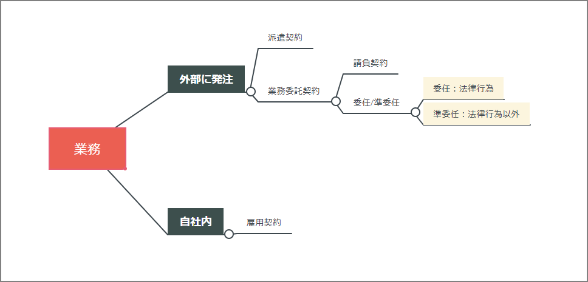

業務委託契約には「請負契約」と「準委任契約」がある。ここの2つの契約についてメモ。

|                  | 請負契約               | 準委任契約                     |
| ---------------- | ---------------------- | ------------------------------ |
| 受注者の義務     | 仕事の完成義務         | 善管注意義務                   |
| 成果物の納品     | 必須                   | 必須ではない                   |
| 報酬のタイミング | 成果物の引き渡しと同時 | 事務行為が完了した後           |
| 瑕疵担保責任     | 有り                   | 規定無し                       |
| 中途解約         | 発注者は契約を解除可   | いつでも契約を解除可           |
| 再委託           | 可能                   | 再委託などは原則として出来ない |

