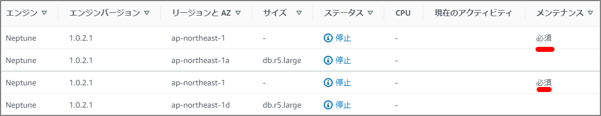
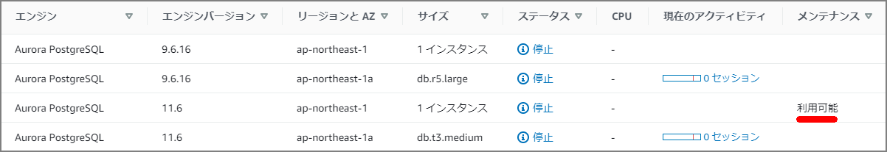

# はじめに

RDSのメンテナンスの種類は「Available(利用可能) 」と「Required(必須) 」の種類が存在する。Aurora(PostgreSQL)とNeptuneにそれぞれAvailableとRequiredのパッチがあったので確認してみる。

NeptuneはRDSのと運用周りは同じな模様。（全てが一緒というわけではないと思うが。）

> https://docs.aws.amazon.com/ja_jp/neptune/latest/userguide/limits.html
>
> \> 特定の管理機能のために、Amazon Neptune は Amazon Relational Database Service (Amazon RDS) と共有の運用テクノロジーを使用します。

#### Neptune



#### Aurora



# Available(利用可能) とRequired(必須) について

- **必須** – メンテナンスアクションがリソースに適用され、延期はできません。
- **利用可能** – メンテナンスアクションは利用可能ですが、自動的にはリソースに適用されません。手動で適用できます。

### DescribePendingMaintenanceActions API

メンテナンスについては[DescribePendingMaintenanceActions API](http://docs.aws.amazon.com/AmazonRDS/latest/APIReference/API_DescribePendingMaintenanceActions.html)から確認することが出来る。

```
[ec2-user@bastin ~]$ aws rds describe-pending-maintenance-actions
{
    "PendingMaintenanceActions": [
        {
            "PendingMaintenanceActionDetails": [
                {
                    "Action": "system-update", 
                    "Description": "Upgrade to Aurora PostgreSQL 3.1.2"
                }
            ], 
            "ResourceIdentifier": "arn:aws:rds:ap-northeast-1:xxxxxx:cluster:xxxxxxxpostgresv11"
        }, 
        {
            "PendingMaintenanceActionDetails": [
                {
                    "Action": "system-update", 
                    "CurrentApplyDate": "2020-05-08T18:33:00Z", 
                    "AutoAppliedAfterDate": "2020-05-08T18:33:00Z", 
                    "Description": "Engine Patch Upgrade"
                }
            ], 
            "ResourceIdentifier": "arn:aws:rds:ap-northeast-1:xxxxxxx:cluster:xxxxxxx-cluster"
        } 
    ]
}

```

CLIの場合はAvailable(利用可能)かRequired(必須) かどうかは項目を見るだけではわからない。Required(必須)の場合は`AutoAppliedAfterDate`、`CurrentApplyDate`が出力されるようである。

各項目の説明は以下の通り。

| 項目                 | 説明                                                         |
| -------------------- | ------------------------------------------------------------ |
| Action               | リソースで使用可能な保留中のメンテナンスアクションのタイプ<br />system-update、db-upgrade、hardware-maintenance、とca-certificate-rotation。 |
| Description          | メンテナンスアクションの詳細を説明                           |
| AutoAppliedAfterDate | アクションが適用されるメンテナンスウィンドウの日付           |
| CurrentApplyDate     | 保留中のメンテナンスアクションがリソースに適用される発効日   |
| ForcedApplyDate      | メンテナンスアクションが自動的に適用される日付。（延期不可） |
| OptInStatus          | リソースに対して受信されたオプトイン要求のタイプ<br />明示的に[apply-pending-maintenance-action](https://docs.aws.amazon.com/cli/latest/reference/rds/apply-pending-maintenance-action.html)を実行した場合に出力される。<br />"next-maintenance"、"immediate"、"undo-opt-in" |

OptInStatusのステータスは`apply-pending-maintenance-action`で明示的に指定した場合に出力される。もしくはマネージメントコンソール上の「Upgrade at Next Window(次のウィンドウでアップグレード)」や「Upgrade Now(今すぐアップグレード)」を選択する。

```
[ec2-user@bastin ~]$ aws rds apply-pending-maintenance-action --resource-identifier arn:aws:rds:ap-northeast-1:xxxxxxxxxxxxxx:cluster:neptestdb-cluster --apply-action system-update --opt-in-type next-maintenance
```

次の通り、`OptInStatus`が出力されるようになる

```
[ec2-user@bastin ~]$ aws rds describe-pending-maintenance-actions --resource-identifier arn:aws:rds:ap-northeast-1:xxxxxxxxxxxxxx:cluster:neptestdb-cluster
{
    "PendingMaintenanceActions": [
        {
            "PendingMaintenanceActionDetails": [
                {
                    "Action": "system-update", 
                    "Description": "Engine Patch Upgrade", 
                    "CurrentApplyDate": "2020-05-03T15:58:00Z", 
                    "AutoAppliedAfterDate": "2020-05-03T15:58:00Z", 
                    "OptInStatus": "next-maintenance"
                }
            ], 
            "ResourceIdentifier": "arn:aws:rds:ap-northeast-1:xxxxxxx:cluster:xxxxxxx-cluster"
        }
    ]
}

```

参考：

> https://docs.aws.amazon.com/AmazonRDS/latest/APIReference/API_PendingMaintenanceAction.html
>
> https://docs.aws.amazon.com/cli/latest/reference/rds/apply-pending-maintenance-action.html
>

