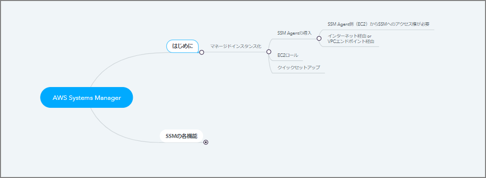
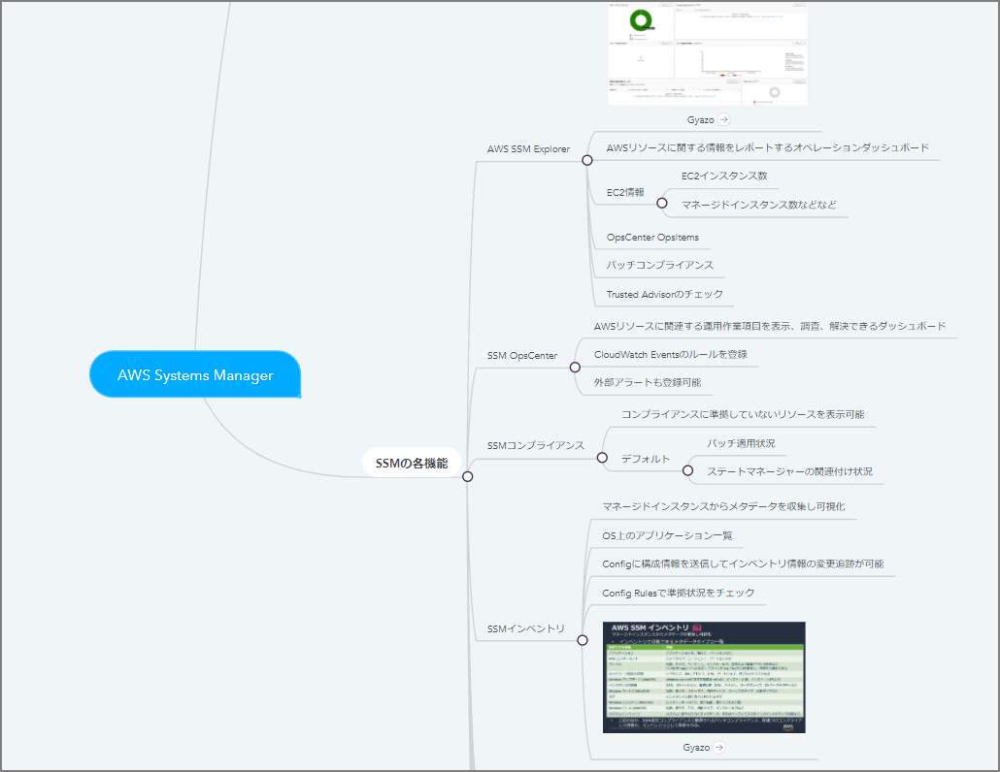
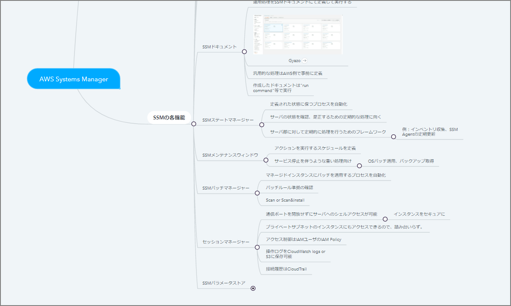

# はじめに

「AWS 認定 DevOps エンジニア – プロフェッショナル」に向けた勉強メモ

# 殴り書きメモ

# AWS Systems Manager

- はじめに
    - マネージドインスタンス化
        - SSM Agentの導入
            - SSM Agent側（EC2）からSSMへのアクセス権が必要
            - インターネット経由 or VPCエンドポイント経由
- EC2ロール
        - クイックセットアップ

- SSMの各機能
  
    - AWS SSM Explorer
        - Gyazo
        - AWSリソースに関する情報をレポートするオペレーションダッシュボード
        - EC2情報
            - EC2インスタンス数
            - マネージドインスタンス数などなど
        - OpsCenter OpsItems
        - パッチコンプライアンス
        - Trusted Advisorのチェック
    - SSM OpsCenter
        - AWSリソースに関連する運用作業項目を表示、調査、解決できるダッシュボード
        - CloudWatch Eventsのルールを登録
        - 外部アラートも登録可能
    - SSMコンプライアンス
        - コンプライアンスに準拠していないリソースを表示可能
        - デフォルト
            - パッチ適用状況
            - ステートマネージャーの関連付け状況
    - SSMインベントリ
        - マネージドインスタンスからメタデータを収集し可視化
        - OS上のアプリケーション一覧
        - Configに構成情報を送信してインベントリ情報の変更追跡が可能
        - Config Rulesで準拠状況をチェック
        - Gyazo
    
    
    
    - SSMドキュメント
    - 運用処理をSSMドキュメントにて定義して実行する
        - Gyazo
        - 汎用的な処理はAWS側で事前に定義
        - 作成したドキュメントは"run
    command"等で実行
    - SSMステートマネージャー
    - 定義された状態に保つプロセスを自動化
        - サーバの状態を確認、是正するための定期的な処理に向く
        - サーバ郡に対して定期的に処理を行うためのフレームワーク
            - 例：インベントリ収集、SSMAgentの定期更新
    - SSMメンテナンスウィンドウ
        - アクションを実行するスケジュールを定義
        - サービス停止を伴うような重い処理向け
            - OSパッチ適用、バックアップ取得
    - SSMパッチマネージャー
        - マネージドインスタンスにパッチを適用するプロセスを自動化
        - パッチルール準拠の確認
        - Scan
        - Scan&amp;Install
    - セッションマネージャー
        - 通信ポートを開放せずにサーバへのシェルアクセスが可能
        - インスタンスをセキュアに
        - プライベートサブネットのインスタンスにもアクセスできるので、踏み台いらず。
        - アクセス制御はIAMユーザのIAM Policy
        - 操作ログをCloudWatch logs or S3に保存可能
    - 接続履歴はCloudTrail
    - SSMパラメータストア
        - 構成や設定情報の管理のためのストレージ
        - パスワードの機密情報をKMSで暗号化

