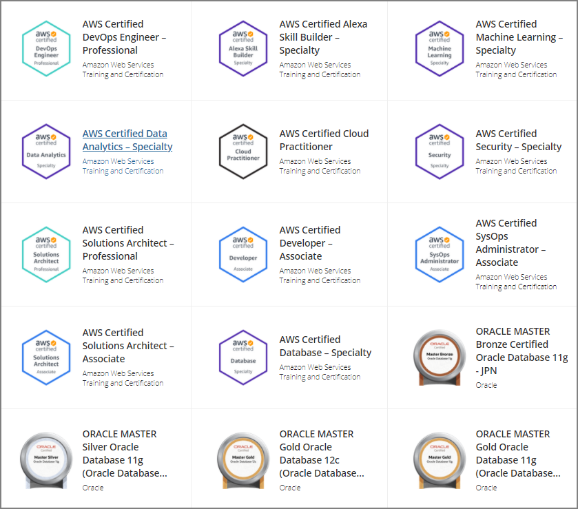

約1ヶ月の勉強で[AWS 認定 DevOps エンジニア – プロフェッショナル](https://aws.amazon.com/jp/certification/certified-devops-engineer-professional/)を合格することが出来たので簡単にメモ。

# 準備方法

- [試験ガイド](https://d1.awsstatic.com/ja_JP/training-and-certification/docs-devops-pro/AWS-Certified-DevOps-Engineer-Professional_Exam-Guide.pdf)
- 重要サービスの[BlackBelt資料](https://aws.amazon.com/jp/aws-jp-introduction/aws-jp-webinar-service-cut/)
- 公式の無料対策E-Learning
  - [Exam Readiness: AWS Certified DevOps Engineer – Professional](https://www.aws.training/Details/eLearning?id=40664)
- 実機検証（特にCF、Codeシリーズあたり）
- 公式模擬試験
- [有料問題集（Whizlabs）](https://www.whizlabs.com/aws-devops-certification-training/)
- ホワイトペーパー
  - [AWS における継続的インテグレーションと継続的デリバリーの実践](https://d1.awsstatic.com/International/ja_JP/Whitepapers/practicing-continuous-integration-continuous-delivery-on-AWS_JA_final.pdf)

# 勉強対象

Solution Architect Professionalや各種Specialityの勉強で幅広く勉強していたので、重要サービスだけ重点的に実機触ったり勉強したりした。スムーズに勉強が進んだのは既にSAP等を取得しているのも大きいと思う。

### 重要なサービス

- Systems Manager
- CloudFormation
- Elastic Beanstalk
- Config
- CodePipeline/CodeBuild/CodeDeploy
- CloudWatch（特にLogs、Events等）
- AutoScaling
- ECS

### 必要な概念

- CICD
- 災対設計
- デプロイメント（ブルーグリーン/カナリアリリースなど）
  - これがわかりやすい
    - [【AWS Black Belt Online Seminar】Deployment on AWS](https://d0.awsstatic.com/webinars/jp/pdf/services/20170822_AWS-BlackBelt_Deployment_on_AWS.pdf)
- RTO/RPOの概念
  - ユースケースごとにバックアップや設計が異なるので適切なケースを選択できるか
- バックアップ/リカバリ

### できればざっくり勉強した方が良いサービス

- Inspector
- EC2
- Opsworks
- StepFunction
- GuardDuty
- Macie
- KMS
- DynamoDB

# 所感・その他

CICDを始めとしたDevOpsで必要な概念、運用時に必要な知識、スキルが身についた気がする。問題のケースが実務で検討していたシチュエーションと酷似しており、普段の仕事でも生かせそうと試験中に思った。

無事に合格して11冠に。ここまで来ると12冠が最終目標だが、機械学習の知識定着に向けた[G検定](https://www.jdla.org/certificate/general/)やIPA試験に向けて冬・春は勉強予定。

https://www.youracclaim.com/users/jumpei-imazato/badges

- AWS Certified Cloud Practitioner
- AWS Certified Solutions Architect – Associate
- AWS Certified Developer – Associate
- AWS Certified SysOps Administrator – Associate
- AWS Certified Solutions Architect – Professional
- AWS Certified DevOps Engineer – Professional
- AWS Certified Security – Specialty
- AWS Certified Machine Learning – Specialty
- AWS Certified Database – Specialty
- AWS Certified Data Analytics – Specialty
- AWS Certified Alexa Skill Builder – Specialty

