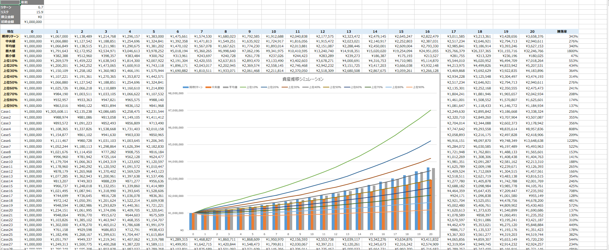
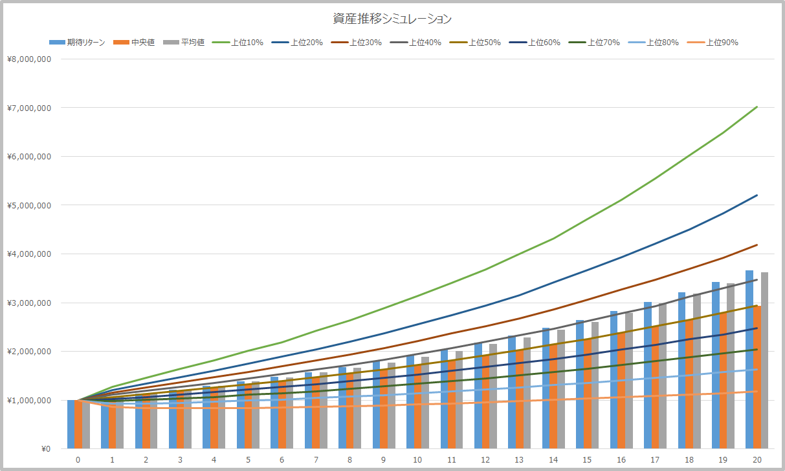

モンテカルロ法はランダム試行をサンプル回数ほど繰り返すことで解に近い値に収束するという結果を導くもので、乱数によりリターンとリスクに従った正規分布を作る。Excelの関数だと下記となる。

> NORM.INV（RAND（），リターン（平均），リスク（標準偏差）） 

分散投資の代名詞である全世界株式インデックスのベンチマークで使われるACWIの20年の年率平均リターンは`6.7％`で年率平均リスク（標準偏差）は`15.9`％となり、この2つの変数を使ってシミュレーションをしてみる。

|              | 6か月 | 1年  | 3年  | 5年  | 10年 | 15年 | 20年 | 30年 |
| ------------ | ----- | ---- | ---- | ---- | ---- | ---- | ---- | ---- |
| リターン (%) | 24.3  | 16.8 | 10.6 | 12.9 | 9.7  | 7.8  | 6.7  | 8.4  |
| リスク (%)   | 14.3  | 26   | 18.4 | 15.1 | 14.1 | 16.3 | 15.9 | 15   |

> 『MSCI オール・カントリー・ワールド・インデックス (ACWI)』　｜株価指数 https://myindex.jp/data_i.php?q=MS1025USD

上記のリターンとリスクを元に、`100万円`スタート（追加の積立資金は無し）で50,000回ほどモンテカルロ法でシミュレーションを実施して最終的に出力された結果がこちら。計算用のExcelシートは[こちら](https://github.com/zatoima/zatoima.github.io/blob/master/%E3%82%B7%E3%83%9F%E3%83%A5%E3%83%AC%E3%83%BC%E3%82%B7%E3%83%A7%E3%83%B3.xlsx)。20MB前後あるので注意。

5万回ほどのサンプルケースをごにょごにょして下記の数値を計算してグラフ化している。再計算のたびに少し値はズレるが大体の傾向は変わらない。

- 期待リターン
- 中央値
- 平均値
- 上位xx％

上位xx％という表現がわかりにくさを招いているが、ワースト10％（=上位90％）の場合でも元本からは多少増えており、中央値は複利の効果で約3倍という結果になった。

