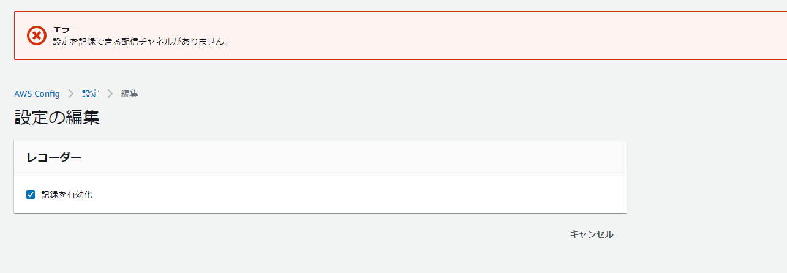

## 問題

AWS Configで記録を有効化しようとすると「設定を記録できる配信チャネルがありません。」が出力されて有効化出来ないケース



下記のように、配信チャネルが無い状態になっていると思われるので、配信チャネルを手動作成する。DeliveryChannelsが確かにnullになっている。

```json
[ec2-user@bastin ~]$ aws configservice describe-delivery-channels
{
    "DeliveryChannels": []
}
[ec2-user@bastin ~]$ aws configservice describe-configuration-recorders
{
    "ConfigurationRecorders": [
        {
            "name": "default",
            "roleARN": "arn:aws:iam::xxxxxx:role/aws-service-role/config.amazonaws.com/AWSServiceRoleForConfig",
            "recordingGroup": {
                "allSupported": true,
                "includeGlobalResourceTypes": true,
                "resourceTypes": []
            }
        }
    ]
}
```

### 解決方法：配信チャネルの作成

配信チャネル作成後にConfigの再設定を行う

```sh
[ec2-user@bastin ~]$ aws configservice put-delivery-channel --delivery-channel name=default,s3BucketName=config-bucket-xxxxxxxxxx --region ap-northeast-1
```

参考

- [put\-delivery\-channel — AWS CLI 1\.22\.73 Command Reference](https://docs.aws.amazon.com/cli/latest/reference/configservice/put-delivery-channel.html)

### 設定確認

```json
[ec2-user@bastin ~]$ aws configservice describe-delivery-channels
{
    "DeliveryChannels": [
        {
            "name": "default",
            "s3BucketName": "config-bucket-xxxxx"
        }
    ]
}
[ec2-user@bastin ~]$ aws configservice describe-configuration-recorders
{
    "ConfigurationRecorders": [
        {
            "name": "default",
            "roleARN": "arn:aws:iam::xxxx:role/aws-service-role/config.amazonaws.com/AWSServiceRoleForConfig",
            "recordingGroup": {
                "allSupported": true,
                "includeGlobalResourceTypes": true,
                "resourceTypes": []
            }
        }
    ]
}

```

