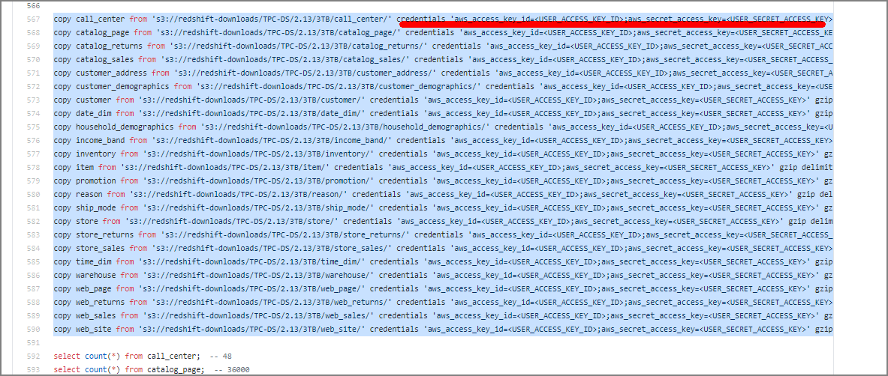

Redshiftのベンチマークにも使用されているTPCDSのデータロードと分析クエリの実行をやってみた。一定容量のデータ（100GBから1PBまで）が用意されていて、大容量データに対する分析用クエリを流したい時に簡易実行できる。

TPCDSベンチマークについては[こちら](http://www.tpc.org/tpc_documents_current_versions/pdf/tpc-ds_v2.5.0.pdf)。小売製品サプライヤーの意思決定支援機能をモデル化している模様。

# リソース確認

スクリプト系は`amazon-redshift-utils`にまとまっている。

> amazon-redshift-utils/src/CloudDataWarehouseBenchmark/Cloud-DWB-Derived-from-TPCDS at master · awslabs/amazon-redshift-utils · GitHub https://github.com/awslabs/amazon-redshift-utils/tree/master/src/CloudDataWarehouseBenchmark/Cloud-DWB-Derived-from-TPCDS

データロード用のスクリプトは、`US-EAST-1`リージョンにあるので東京リージョンでRedshiftを実行する場合、転送オーバーヘッドには注意が必要かもしれない。

> https://s3.console.aws.amazon.com/s3/buckets/redshift-downloads?prefix=TPC-DS%2F&region=us-east-1

# 手順概要

1. ddl.sqlを編集し、<USER_ACCESS_KEY_ID>と<USER_SECRET_ACCESS_KEY>を任意の有効なS3認証情報に置き換える。

2. データセットを読み込むための新しいデータベースを作成します

3. 作成したデータベースに接続し、ddl.sqlを実行

   <u>※データの規模やデータウェアハウスのサイズによっては、数時間かかる場合があるので注意</u>

4. query_0.sql等を実行して実行時間を計測する

# 手順

1. ### ddl.sqlを編集

下記部分を自分のクレデンシャル情報に書き換える。対象のddl.sqlはこちら。git cloneなどでローカルに落として上で編集。

> https://github.com/awslabs/amazon-redshift-utils/blob/master/src/CloudDataWarehouseBenchmark/Cloud-DWB-Derived-from-TPCDS/3TB/ddl.sql



もちろんIAMロールを利用するように書き換えても大丈夫

```
copy call_center from 's3://redshift-downloads/TPC-DS/2.13/3TB/call_center/' iam_role 'arn:aws:iam::xxxxxxxxxxxxxxx:role/myRedshiftRole' gzip delimiter '|' EMPTYASNULL region 'us-east-1';
copy catalog_page from 's3://redshift-downloads/TPC-DS/2.13/3TB/catalog_page/' iam_role 'arn:aws:iam::xxxxxxxxxxxxxxx:role/myRedshiftRole' gzip delimiter '|' EMPTYASNULL region 'us-east-1';
copy catalog_returns from 's3://redshift-downloads/TPC-DS/2.13/3TB/catalog_returns/' iam_role 'arn:aws:iam::xxxxxxxxxxxxxxx:role/myRedshiftRole' gzip delimiter '|' EMPTYASNULL region 'us-east-1';
～中略～
```

### 2. データベースの作成

```
drop database tpcds_3tb;
CREATE DATABASE tpcds_3tb;
```

### 3. 作成したデータベースに対してロードの実施

```
psql -h redshift-cluster.xxxxx.ap-northeast-1.redshift.amazonaws.com -U awsuser -d tpcds_3tb -p 5439 -f /home/ec2-user/amazon-redshift-utils-master/src/CloudDataWarehouseBenchmark/Cloud-DWB-Derived-from-TPCDS/3TB/ddl.sql
```

テーブル作成、データロード、件数確認が実行される。（<u>時間が掛かるので注意</u>）

### 4. queryを実行

query_0.sql ～ query_10.sqlまで用意されているので、適宜実行。ベンチマークする際にはリザルトキャッシュの無効化なども忘れずに。

```
psql -h redshift-cluster.xxxxx.ap-northeast-1.redshift.amazonaws.com -U awsuser -d tpcds_3tb -p 5439 -f /home/ec2-user/amazon-redshift-utils-master/src/CloudDataWarehouseBenchmark/Cloud-DWB-Derived-from-TPCDS/3TB/queries/query_0.sql
```

