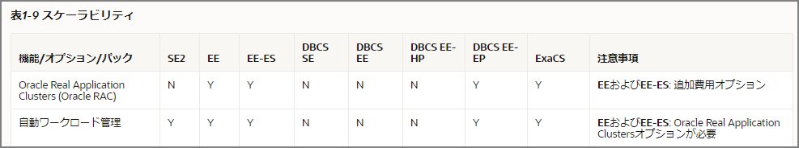

Enterprise EditionとStandard Editionで異なるところや移行する際に検討すべきことをメモ。以下、EnterPrise EditionはEE、Standard Edition2はSE2と略。[MECE](https://ja.wikipedia.org/wiki/MECE)の視点も足りていないのでご注意ください。

### SE2の概要

- 最大2ソケット
- データベースごとに16スレッドの実行に制限
  - 移行元のシステムのCPU数に注意
- EE限定の機能は使用できない
  - 有償オプション製品のほぼ全て
    - Oracle Advanced Security
    - Oracle Real Application Testing
    - Oracle Tuning Pack
    - Oracle Diagnostics Pack
    - Oracle Real Application Clusters (Oracle RAC)
      - RACは18c以前まで無償で使用出来ていたが、19c以降はSE2では不可となった
    - Oracle Partitioning
    - Oracle Active Data Guard
    - 他にも多数
  - EE特有の機能
    - Oracle Data Guard
    - オンライン再編成
    - 表領域のPoint-in-Timeリカバリ
    - 各種パラレル処理
    - 他にも多数

### EEとSE2の使用出来る、使用できない機能の一覧

Exadata限定の機能とかOracle Cloudでのみ使用可能な機能があるので、左側の<u>SE2</u>と<u>EE</u>を確認。

> Oracle Database Release 19 Databaseライセンス情報ユーザー・マニュアル
>
> https://docs.oracle.com/cd/F19136_01/dblic/Licensing-Information.html#GUID-B6113390-9586-46D7-9008-DCC9EDA45AB4

### EEでもSE2でも変わらないこと

下記の通り、データベースとしての基本的な機能については変わらない。既存の資産（アプリケーション、ツール、スキル）は大部分は流用出来るはず。

- トランザクション
- ストアド・プロシージャ
- RMAN
- ディクショナリビュー、静的ディクショナリ

### 注意すべきEE限定の機能について

セキュリティ要件や可用性要件をどのように実現するかに関わってくるのでSE2化には第一ステップとしてアセスメントが必要。第二に性能。

個人的に<u>よく使われている or 使っていた or 素晴らしい機能</u>をピックアップしてみた。他にもあるので、現在使用している機能を抽出した上で検討すべき。性能や可用性、セキュリティ要件の非機能要件だけではなく、既存運用にも大幅に影響が出てくるのでこれを一つ一つ大丈夫かどうか確認し、他の手段の検討含めてやっていく必要がある。

- 有償オプション
  - Oracle Advanced Security（セキュリティ）
  - Oracle Tuning Pack（チューニング関連）
  - Oracle Diagnostics Pack（診断系）
  - Oracle Real Application Clusters (可用性、性能）
  - Oracle Partitioning（性能、運用面）
  - Oracle Active Data Guard（可用性、性能）

  
  
- EE特有の機能
  
  - Basic Table Compression
  - 各種パラレル処理
  - Data Guard
  - オンライン系の操作（オンサイン索引再ビルド、オンライン再編成など）
  - 表領域のPoint-in-Timeリカバリ
  - パラレル・バックアップおよびリカバリ
  - フラッシュバック操作
  - RMANバックアップから表や表パーティションを回復
  - 結果キャッシュ

### 機能の代替をどうするか

マネージドサービスであるRDS for Oracleを移行先として考える。ざっと気になったものを考えてみたが、一部はAWS特有の機能、もしくは機能が劣る代替機能（AWR→StatsPack）等に置き換えることで移行は可能。ただ、パーティション系やパラレル系や各種オプション製品が使えなくなることで非機能要件が満たせるかの確認が最初の検討の肝となる。

※Oracleに対応した3rd Party製品は多くあるので、それと組み合わせるパターンも多く存在する。

| カテゴリ                 | EE                                             | SE2                    | AWS RDS for Oracle                   | 備考                               |
| ------------------------ | ---------------------------------------------- | ---------------------- | ------------------------------------ | ---------------------------------- |
| Security                 | 表領域暗号化                                   | -                      | ストレージ暗号化で要件を満たすか確認 | 保護出来るレイヤーが違うことに注意 |
| Security                 | ネットワーク暗号化                             | ネットワーク暗号化     |                                      | 元々有償だったが、変わった模様     |
| Performance              | 自動ワークロード・リポジトリ(AWR)              | Statspack              | Performance Insights、CloudWatch     |                                    |
| Performance              | ASH（Active Session History）                  | -                      | Performance Insights？               |                                    |
| Performance              | SQL Trace                                      | SQL Trace              |                                      |                                    |
| Performance              | Enterprise Manager の Performance周り          | -                      | Performance Insights、CloudWatch     |                                    |
| Performance              | SQLアクセス・アドバイザ                        | -                      |                                      |                                    |
| Performance              | SQLチューニング・アドバイザ                    | -                      |                                      |                                    |
| Performance              | 自動SQLチューニング                            | -                      |                                      |                                    |
| Performance              | SQLプロファイル                                | -                      |                                      |                                    |
| Performance              | Oracle Partitioning                            | ビューパーティション？ | -                                    | 要検討                             |
| Availability&Performance | Oracle Real Application Clusters               | -                      | Multi-AZ構成                         |                                    |
| Availability             | Data Guard                                     | -                      | Multi-AZ構成                         |                                    |
| EE Feature               | オンライン系の操作                             | -                      |                                      |                                    |
| EE Feature               | 表領域のPoint-in-Timeリカバリ                  | -                      |                                      |                                    |
| EE Feature               | パラレル・バックアップおよびリカバリ           | -                      | スナップショット                     |                                    |
| EE Feature               | フラッシュバック操作                           | -                      |                                      |                                    |
| EE Feature               | RMANバックアップから表や表パーティションを回復 | -                      |                                      |                                    |
| EE Feature               | 結果キャッシュ                                 | -                      |                                      |                                    |

### 補足

Partitionオプション無しでPartitionっぽくやる方法をやってみた

[Oracle Partiotionオプションの代替策\(View\+Trigger\)を試してみる \| my opinion is my own 👋](https://zatoima.github.io/oracle-ee-se2-partition-trigger-view.html)

### 参考

> EE Features in SE2 https://www.doag.org/formes/pubfiles/11343091/2019-NN-Clemens_Bleile-Oracle_Standard_Edition_2_Fehlende_Features_ergaenzen-Praesentation.pdf
>
> dbts19_cosol_oracle_se2.pdf http://cosol.jp/techdb/dbts19_cosol_oracle_se2.pdf

