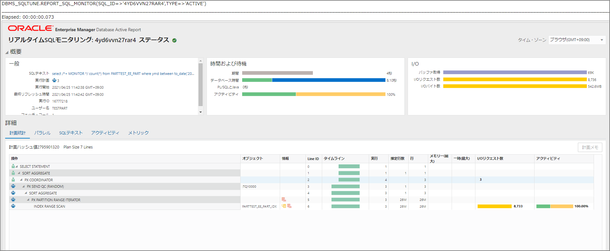

チューニングや解析時にAWR、ASHと並んで便利だと思っているリアルタイムSQL監視のメモ。実行中のSQLを自動で監視し、詳細な統計を取得出来る。パラレルクエリ、もしくは5秒以上のSQLであれば自動で収集されているが、ヒント文を付与することでも本機能を使用することが出来る。TEXTタイプとACTIVEタイプがある。

# SQL実行

```sql
exec rdsadmin.rdsadmin_util.flush_shared_pool;
exec rdsadmin.rdsadmin_util.flush_buffer_cache;
set autotrace on
set timing on
select /*+ MONITOR */ count(*) from PARTTEST_EE_PART where ymd between to_date('2017/05/01 11:00:00','YYYY/MM/DD HH24:MI:SS') and to_date('2019/05/11 12:00:00','YYYY/MM/DD HH24:MI:SS');
```

# SQL_IDの確認

```
SELECT sql_id, hash_value, substr(sql_text,1,40) sql_text  
FROM  v$sql 
WHERE sql_text like 'select /*+ MONITOR */ count(*) from%';
```

# リアルタイムSQL監視の実行<TEXT>

```sql
SET LONG 1000000
SET LONGC 1000000
SET LINESIZE 300;
SET PAGESIZE 1000;
VAR c_rep CLOB;
EXEC :c_rep := DBMS_SQLTUNE.REPORT_SQL_MONITOR(sql_id => '4yd6vvn27rar4', TYPE => 'TEXT');
PRINT c_rep;
```

# 実行ログ

```sql
SQL> select dbms_sqltune.report_sql_monitor(sql_id => '4yd6vvn27rar4', TYPE => 'TEXT') from dual;
                                                                                        DBMS_SQLTUNE.REPORT_SQL_MONITOR(SQL_ID=>'4YD6VVN27RAR4',TYPE=>'TEXT') 

SQL Monitoring Report

SQL Text
------------------------------
select /*+ MONITOR */ count(*) from PARTTEST_EE_PART where ymd between to_date('2017/05/01 11:00:00','YYYY/MM/DD HH24:MI:SS') and to_date('2019/05/11 12:00:00','YYYY/MM/DD HH24:MI:SS')

Global Information
------------------------------
 Status              :  DONE (ALL ROWS)       
 Instance ID         :  1                     
 Session             :  TESTPART (1291:39506) 
 SQL ID              :  4yd6vvn27rar4         
 SQL Execution ID    :  16777217              
 Execution Started   :  04/25/2021 02:33:34   
 First Refresh Time  :  04/25/2021 02:33:34   
 Last Refresh Time   :  04/25/2021 02:33:39   
 Duration            :  5s                    
 Module/Action       :  SQLcl/-               
 Service             :  SYS$USERS             
 Program             :  SQLcl                 
 Fetch Calls         :  1                     

Global Stats
=================================================
| Elapsed |   Cpu   |  Other   | Fetch | Buffer |
| Time(s) | Time(s) | Waits(s) | Calls |  Gets  |
=================================================
|      10 |      10 |     0.00 |     1 |  68826 |
=================================================

Parallel Execution Details (DOP=3 , Servers Allocated=3)
==========================================================================================
|      Name      | Type  | Server# | Elapsed |   Cpu   |  Other   | Buffer | Wait Events |
|                |       |         | Time(s) | Time(s) | Waits(s) |  Gets  | (sample #)  |
==========================================================================================
| PX Coordinator | QC    |         |    0.00 |    0.00 |          |      9 |             |
| p000           | Set 1 |       1 |    4.92 |    4.92 |          |  33963 |             |
| p001           | Set 1 |       2 |    3.08 |    3.08 |          |  22698 |             |
| p002           | Set 1 |       3 |    2.12 |    2.12 |     0.00 |  12156 |             |
==========================================================================================

SQL Plan Monitoring Details (Plan Hash Value=2795901320)
========================================================================================================================================================
| Id |             Operation             |         Name         |  Rows   | Cost  |   Time    | Start  | Execs |   Rows   | Activity | Activity Detail |
|    |                                   |                      | (Estim) |       | Active(s) | Active |       | (Actual) |   (%)    |   (# samples)   |
========================================================================================================================================================
|  0 | SELECT STATEMENT                  |                      |         |       |         1 |     +5 |     1 |        1 |          |                 |
|  1 |   SORT AGGREGATE                  |                      |       1 |       |         1 |     +5 |     1 |        1 |          |                 |
|  2 |    PX COORDINATOR                 |                      |         |       |         1 |     +5 |     4 |        3 |          |                 |
|  3 |     PX SEND QC (RANDOM)           | :TQ10000             |       1 |       |         4 |     +2 |     3 |        3 |          |                 |
|  4 |      SORT AGGREGATE               |                      |       1 |       |         4 |     +2 |     3 |        3 |          |                 |
|  5 |       PX PARTITION RANGE ITERATOR |                      |     26M | 69179 |         6 |     +0 |     3 |      26M |          |                 |
|  6 |        INDEX RANGE SCAN           | PARTTEST_EE_PART_IDX |     26M | 69179 |         6 |     +0 |     3 |      26M |          |                 |
========================================================================================================================================================    


Elapsed: 00:00:00.045

```

# リアルタイムSQL監視の実行<ACTIVE>

```sql
spool sqlmon_active.html
select dbms_sqltune.report_sql_monitor(sql_id => '4yd6vvn27rar4', TYPE => 'ACTIVE') from dual;
spool off
```

# レポート



# 参照

> 複雑なSQLチューニングもラクにする！SQL監視機能とは https://www.oracle.com/technetwork/jp/ondemand/db-basic/d-16-ssqltuning-1448439-ja.pdf
>
> データベース操作の監視 https://docs.oracle.com/cd/F19136_01/tgsql/monitoring-database-operations.html#GUID-4048D00E-2635-42C8-A37D-71EFAC619062