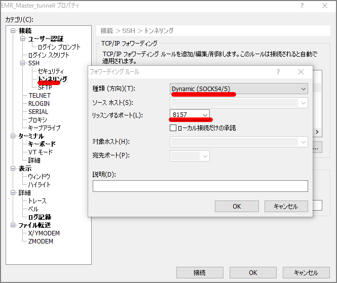
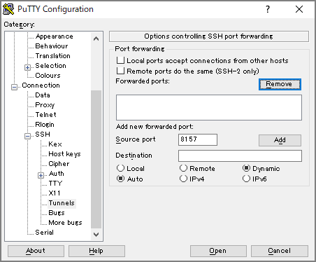
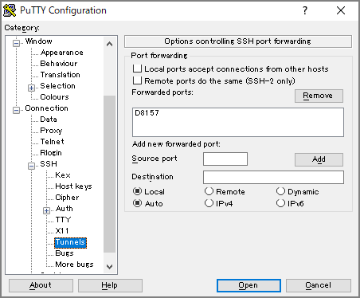
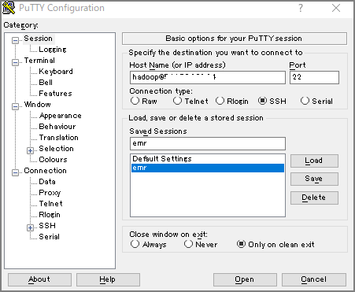
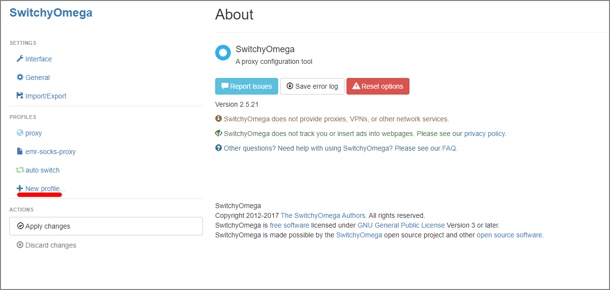
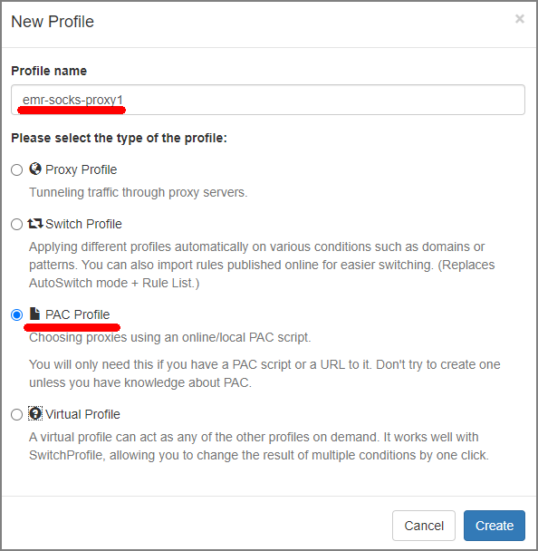
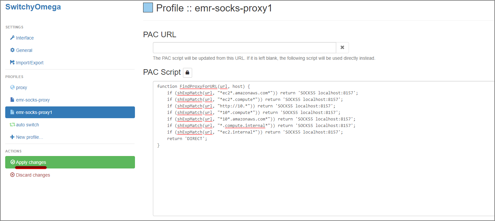
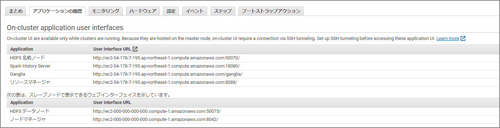

Spark Web UI等はマネージメントコンソールでポチっとやれば見れるようになっているが、その他のWeb系のGUIツールはSSHトンネルを駆使して見る必要がある。ステップとしては下記2つをやる必要がある。

1. SSHクライアント側でフォワーディングの設定を行う
2. ブラウザ側でプロキシの設定を行う

1度やってみると簡単だが、後でやるときに忘れそうなのでメモ。

1. ### SSHクライアント側でフォワーディングの設定を行う

> 参考マニュアル
>
> オプション2: パート 1: ダイナミックポートフォワーディングを使用してマスターノードへの SSH トンネルをセットアップする - Amazon EMR https://docs.aws.amazon.com/ja_jp/emr/latest/ManagementGuide/emr-ssh-tunnel.html

- Xshell6の場合

  - トンネリングの設定のフォワーディングルールでDynamicを選択してリッスンポートを8157にする。（使っていないポートなら何でも良いが、後続のプロキシ設定と合わせる必要あり。）

  

- Puttyの場合

Connection-SSH-Tunnelsでダイナミックポートフォワードを設定する





Sessionはマスターノードの接続を通常通り行う



2. ### ブラウザ側のプロキシ設定

   > 参考マニュアル
   >
   > オプション2: パート 2: マスターノードでホストされる Web サイトを表示するようにプロキシを設定する - Amazon EMR https://docs.aws.amazon.com/ja_jp/emr/latest/ManagementGuide/emr-connect-master-node-proxy.html

   

   - Proxy Switchy Omegaをインストール

   https://chrome.google.com/webstore/detail/proxy-switchyomega/padekgcemlokbadohgkifijomclgjgif

   - Proxy Switchy Omegaのオプションを開いてNew Profileを選択

     

     

   - Profile NameとPAC Profileを選択

   

   

   - PAC Scriptの入力項目に下記を貼り付けた後にApply Changesを選択

     ```
     function FindProxyForURL(url, host) {
         if (shExpMatch(url, "*ec2*.amazonaws.com*")) return 'SOCKS5 localhost:8157';
         if (shExpMatch(url, "*ec2*.compute*")) return 'SOCKS5 localhost:8157';
         if (shExpMatch(url, "http://10.*")) return 'SOCKS5 localhost:8157';
         if (shExpMatch(url, "*10*.compute*")) return 'SOCKS5 localhost:8157';
         if (shExpMatch(url, "*10*.amazonaws.com*")) return 'SOCKS5 localhost:8157';
         if (shExpMatch(url, "*.compute.internal*")) return 'SOCKS5 localhost:8157';
         if (shExpMatch(url, "*ec2.internal*")) return 'SOCKS5 localhost:8157';
         return 'DIRECT';
     }
     ```

     

ここまで終わったら下記のURLにアクセスすることで各Web UIにアクセスが出来るようになる。




