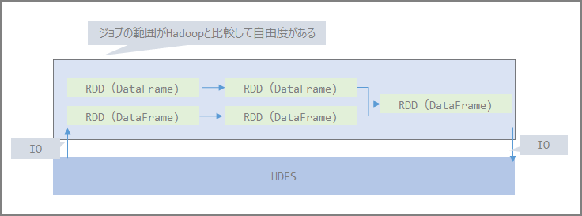
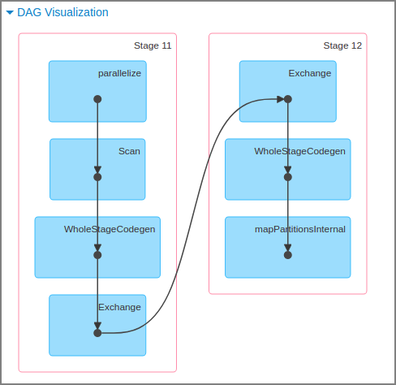

### HadoopとSparkの違い

分散ファイルシステム層のHDFSやリソース管理のYARN等の層はHadoopもSparkも同じ。（StandAloneやmesos等もある。）

Map Reduce部分がSparkになる。

- Hadoop

- Spark

### Sparkコンポーネント

- Driver、及び実際にジョブを実行するWorker Nodeが存在。Worker Nodeの中にExecutorが存在して、複数のタスクを実行可能

> https://spark.apache.org/docs/3.1.1/cluster-overview.html

- Driverの役割
  - Spark Shellのエントリーポイント
  - SparkContextが作られる場所
  - RDDを実行グラフに翻訳する
  - 実行グラフをステージに分割する
  - 実行のタスクをスケジュールして制御する
  - RDDとパーティションのメタデータを保存
  - Spark WebUIを提供
- Executorの役割
  - JVM HeapまたはDiskのキャッシュにデータを保存
  - 外部データソースからデータを読み込む
  - データを書き出す
  - すべてのデータ処理を実行する

### RDD（Resilient Distributed Data）

- Recordの集合体がPartition、Partitionの集まりがRDDとなる。

- Partition単位で各Executorノードに配布される

- Partitionの数は設定可能。少ない場合はExecutorに割り当てられるタスクが減るので同時実行性の低下、データの偏り、分散処理の利点が活かせない。

- デフォルトではPartition数＝コア数

- SparkはPartitionごとに1つのタスクを割り当て、各Workerは一度に1つのタスクを処理する

  

### DataFrame

- RDDと同じように各ノードに分散配置されたデータのコレクション

- DataFrameはRDBMSにおけるテーブルに似ており、このようにデータを構造化することによってSpark SQLを使ってクエリを実行

- Pythonの場合、RDDでのデータ処理は一般的に遅いと言われていたが、DataFrameベースで処理を行うことで他言語と性能的なデメリットはない

  

### Data Set

- Python（Pyspark）やRでは使えない。割愛。

### DAG（Directed Acyclic Graph：有向非巡回グラフ）

- グラフ理論における閉路のない有向グラフのことである。有向グラフは頂点と有向辺（方向を示す矢印付きの辺）からなり、辺は頂点同士をつなぐが、ある頂点vから出発し、辺をたどり、頂点vに戻ってこないのが有向非巡回グラフである
- DAG schedulerがDAGをstageに変換してステージの各パーティションを1つずつのtaskに変換する。この時、RDDの変換(Transform)とアクション(Action)を分けることによって、データの不要なシャッフルをできるだけ回避するようにしたりしてクエリを最適化する。
- このDAGは遅延評価と呼ばれており、実際のアクションが走った段階で、RDDやDataFrameが各パーティション単位で配分されて計算処理が実施される
- 分散処理をするには、データだけでなくロジックも渡す必要がある。最初にデータパイプライン全体をDAGとして組み立ててから実行に移すことで、内部のスケジューラが分散システムにとって効率の良い実行計画を建てる
- SparkにおけるDAGの例

### Job、Stage、Taskの関係

- Job - Stage - Taskという処理単位
  - ジョブの分割単位（関数イメージ）
- Stageの単位で各Executorに配布される
  - 合わせてRDDのPartition単位で各ノードで処理される

### Shuffle

- データの再分散を行うことであり、reduceByKeyやgroupByKeyのような特定の処理の場合に発生する
- Shuffleはネットワーク越しのデータ転送が行なわれるので、特に巨大なデータに対してShuffleをする場合は大量のディスクIOやネットワークIOが発生することになり、パフォーマンスに影響を与える。

> [翻訳] Spark Architecture: Shuffle - Qiita https://qiita.com/giwa/items/08ac5bda1eabb8c597b3
>
> https://qiita.com/kimutansk/items/3ae363bce568677f79b6

### 参考資料

> Sparkの内部処理を理解する - Qiita https://qiita.com/uryyyyyyy/items/ba2dceb709f8701715f7
>
> Spark on EMRの基礎をおさらいする - Qiita https://qiita.com/uryyyyyyy/items/34f3d228f339b32e6fb0
>
> Apache Sparkの概要 - Qiita https://qiita.com/whata/items/8915182cbd3759eebe6d
>
> Spark の RDD、DataFrame、DAG と Glue の DynamicFrame などについて - ablog https://yohei-a.hatenablog.jp/entry/20180916/1537085186
>

