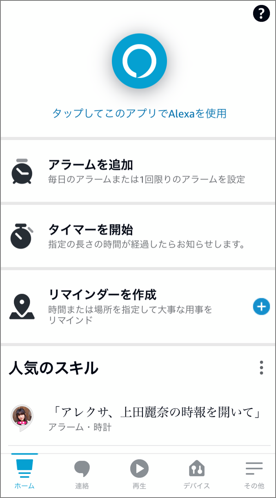
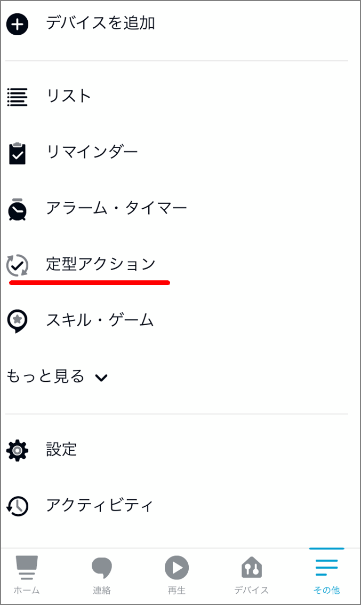
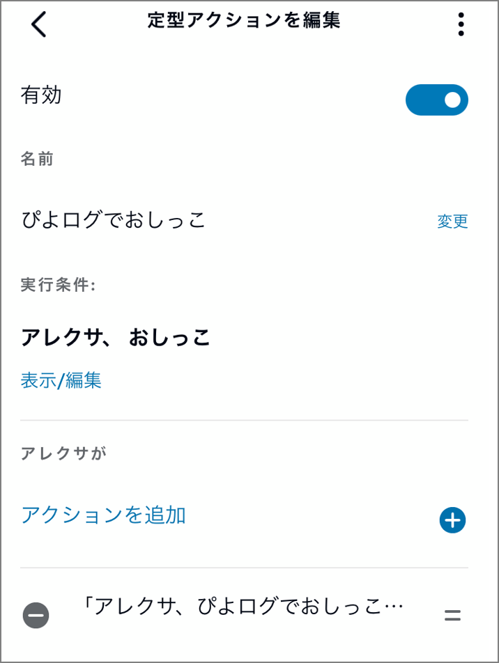

ここ最近、初めての育児に奮闘中です。Alexa経由でぴよログを使用して育児記録、育児ログを使っており、妻も含めて大変好評です。導入する前はスマホを起動して記録して、、、ということをやっていました。この記録操作がめんどくさいのに加えて、記録を忘れて怒られがちということが頻発したので、Alexa経由でぴよログをつけることにしました。（見つけたときは感動した…！）

> https://www.amazon.co.jp/PiyoLog-Inc-%E3%81%B4%E3%82%88%E3%83%AD%E3%82%B0/dp/B08KFD3FWF

ただ一点だけ問題がありました。大変素晴らしいスキルなのですが、レビューにも記載されている通り、一部操作の音声入力がうまくいかないケースがありました。頻発というほどでもないですが、5回に1回くらい発生してしまうというレベルです。具体的にはレビューの下記の事象です。

> ｢アレクサ、ぴよログでおしっこを記録して｣とテンプレワードを唱えても記録できるケースがかなり稀。大体のケースは、｢ぴよログです。ミルクや睡眠、排泄などの記録と確認ができます。何を記録しますか？｣と聞き返されて仕方なく｢おしっこ｣ともう一度言う必要があるので手間が倍かかることになります。

寝起きの夜中の4時とかにミスられるとストレス値が倍増するのでどうにか改善したいと思って定型アクションを使って文章のシノニム（別名）を設定することにしました。Alexaを使った音声操作の文言を変更したい場合は定型アクションを使うのが簡単です。

- ##### 右下の「その他」を選択

- ##### 「定型アクション」を選択

- ##### 右上の「+」ボタンをクリック

- ##### 「定型アクション名」、「実行条件」、「アクション」を指定する。「定型アクション名」は任意なので省略

- ##### 実行条件は「音声」を選択する。次の画面にて起動する際のフレーズを入力する。

- ##### 「アクション」ではAlexaに入力するフレーズをここに記載する

ここまで設定することで、Alexaに対しておしっこというだけで「ぴよログでおしっこを記録して」と同じような内容となります。フレーズが短いのでAlexa側で他の言葉に間違えられることも無いので大変便利になりました。あとは他にどんなフレーズをいうか洗い出して同じ操作で定型アクションを作っていくことで、「おしっこ」、「お風呂」等の短いフレーズでぴよログにログを残せるようになりました。

### アレクサとぴよログよありがとう！

