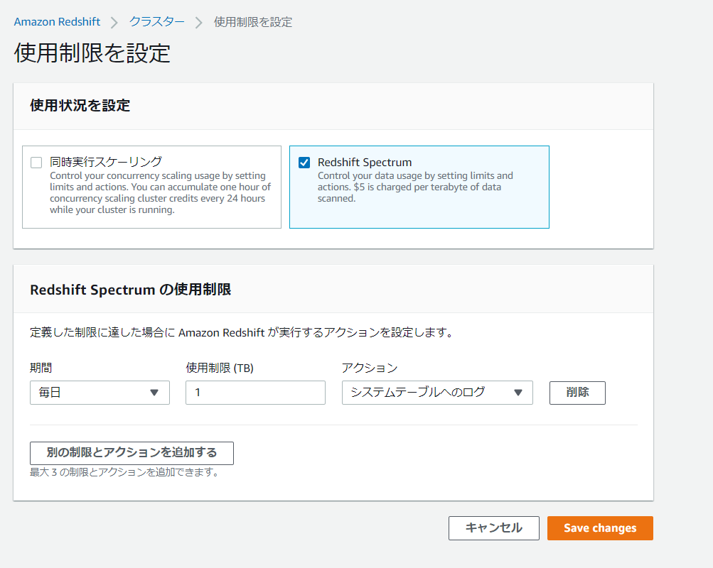

殴り書きメモ

### 参考

> Amazon Redshift Advanced Guide − 最新ベストプラクティスとアップデート https://d1.awsstatic.com/webinars/jp/pdf/services/20200729_AWS_BlackBelt_RedshiftAdvancedGuide.pdf
>
> Amazon Redshift Spectrum 12 のベストプラクティス | Amazon Web Services ブログ https://aws.amazon.com/jp/blogs/news/10-best-practices-for-amazon-redshift-spectrum/

### ベストプラクティス

1. ファイル/テーブル属性
   - 列志向フォーマット（Purquet）
   - 必要な列のみを選択
   - 最適なファイルサイズ
   - 適切なデータ型

2. パーティションプルーニング
   - 不要なパーティションをSkipさせるため
   - コスト削減
  - Spectrum Usage Limitというアラームを上げる機能がある
        

3. Min/Maxプルーニング
   - Parquet, ORCなど列指向フォーマットの最小/最大値の統計を活用する
   - 頻繁に絞り込みを行うカラムでデータをソートしておくと効果的

4. Spectrum層へのプッシュダウン

   - 頻繁に絞り込みを行うカラムでデータをソートしておくと効果的

   - 最後に実行されたクエリの詳細を取得

     ```sql
     select query, segment, elapsed, s3_scanned_rows, s3_scanned_bytes, s3query_returned_rows, s3query_returned_bytes, files 
     from svl_s3query_summary 
     where query = pg_last_query_id() 
     order by query,segment;
     ```

   - https://docs.aws.amazon.com/ja_jp/redshift/latest/dg/r_SVL_S3QUERY_SUMMARY.html

5. データレイアウト

   - データレイアウトを意識する

6. 実行計画の最適化
   - テーブルプロパティのnumRowsを更新する
     - ANALYZE等で更新出来ない
     - ALTER TABLE spectrum_schema.eventSET TABLE PROPERTIES ('numRows'='122857504');
       - もしくはGlue Data Catalog側を更新

7. Redshift クラスターサイズ

   - 並列度を上げるためにはノード数を増やす必要がある。

     - スライス数の確認

       ```sql
       select node,count(slice) from stv_slices group by node order by node;
       ```

     - スライス毎のリクエストは最大10となる

   - <iframe src="//www.slideshare.net/slideshow/embed_code/key/EVgGT3phwOs9fQ?startSlide=24" width="595" height="485" frameborder="0" marginwidth="0" marginheight="0" scrolling="no" style="border:1px solid #CCC; border-width:1px; margin-bottom:5px; max-width: 100%;" allowfullscreen> </iframe> <div style="margin-bottom:5px"> <strong> <a href="//www.slideshare.net/AmazonWebServicesJapan/20200729-aws-black-belt-online-seminar-amazon-redshift-advanced-guide" title="20200729 AWS Black Belt Online Seminar Amazon Redshift Advanced Guide −最新ベストプラクティスとアップデート" target="_blank">20200729 AWS Black Belt Online Seminar Amazon Redshift Advanced Guide −最新ベストプラクティスとアップデート</a> </strong> from <strong><a href="//www.slideshare.net/AmazonWebServicesJapan" target="_blank">Amazon Web Services Japan</a></strong> </div>

