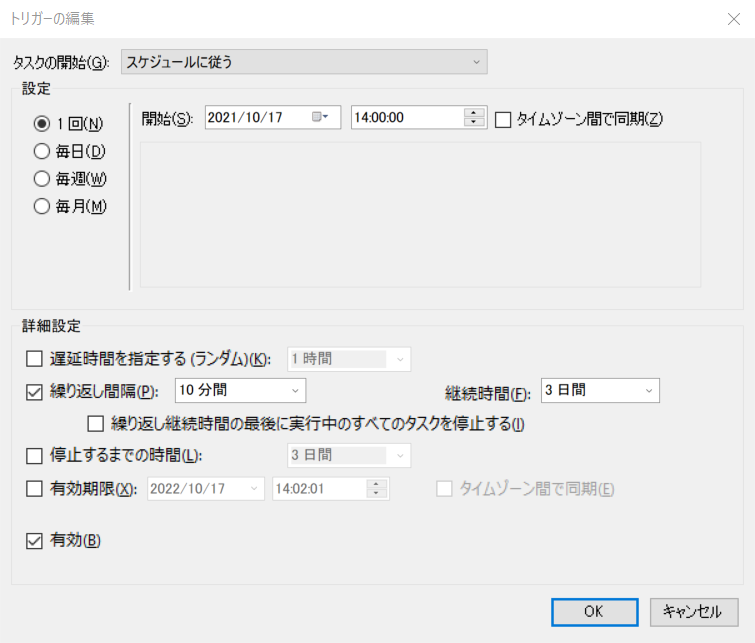
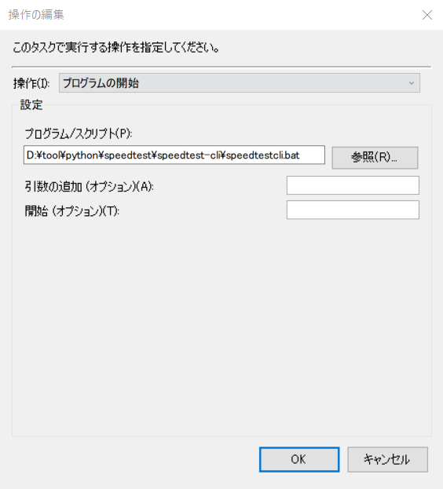

引越し前に自宅インターネット環境の劣悪さを可視化しておく。引越し後にどうなるか楽しみ。

## 前提

- 自宅のインターネット環境はマンション付属の無料で使えるものを使っています。

## データ取得

### 実行環境の構築

```sh
cd /d D:\tool\python\speedtest
git clone https://github.com/sivel/speedtest-cli
cd speedtest-cli/
python speedtest.py
```

### 実行ログ

```sh
D:\tool\python\speedtest>git clone https://github.com/sivel/speedtest-cli
Cloning into 'speedtest-cli'...
remote: Enumerating objects: 1177, done.
remote: Counting objects: 100% (17/17), done.
remote: Compressing objects: 100% (10/10), done.
remote: Total 1177 (delta 6), reused 13 (delta 5), pack-reused 1160
Receiving objects: 100% (1177/1177), 328.93 KiB | 135.00 KiB/s, done.
Resolving deltas: 100% (695/695), done.

D:\tool\python\speedtest>cd speedtest-cli/

D:\tool\python\speedtest\speedtest-cli>python speedtest.py
Retrieving speedtest.net configuration...
Testing from Biglobe (60.237.50.214)...
Retrieving speedtest.net server list...
Selecting best server based on ping...
Hosted by NEVERLOSS LLC. (Tokyo) [11.98 km]: 16.147 ms
Testing download speed................................................................................
Download: 4.73 Mbit/s
Testing upload speed......................................................................................................
Upload: 1.39 Mbit/s
```

#### CLIで実行

```
speedtest.py --csv >> result.csv
```

#### 出力結果

```sh
id,test_server,city,date,distance,rtt,download,upload,,ip
14623,IPA CyberLab,Bunkyo,2021-10-17T04:59:01.153340Z,2.1137195505386357,10.001,16558788.37488678,85872237.08767469,,xxx.xxx.xxx
```

#### Windowsのタスクスケジューラで定期実行

3日分を10分感覚で取得し続ける例。さすがに間隔が短すぎると感じて30分に変更しました。





## 可視化

安定しているときで10MB/Sec、悪い時は1MB/sec。これでリモートワークやれているのが凄い…


