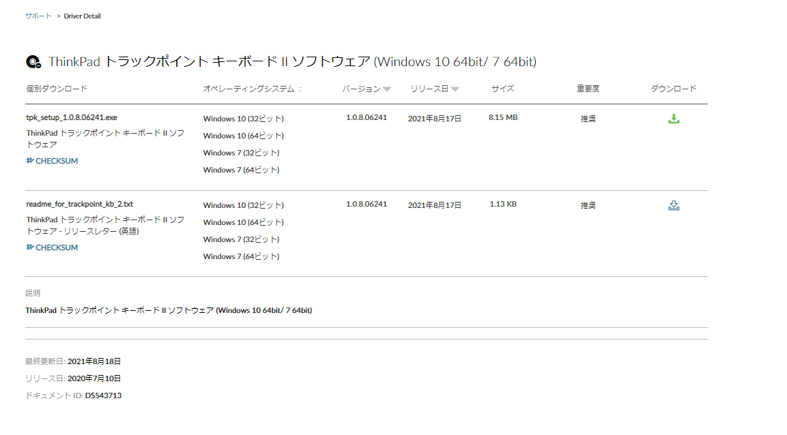
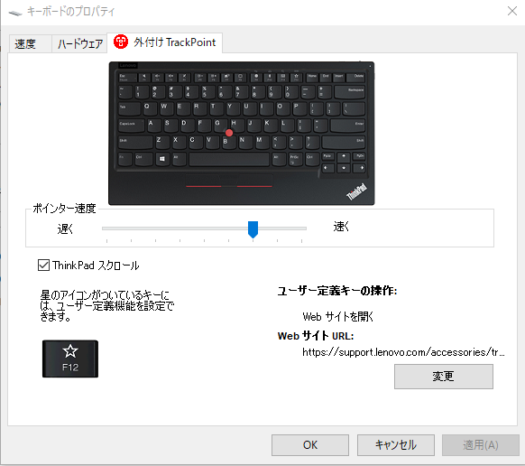

以前はデバイスマネージャーから設定した記憶があったが、ユーティリティをインストールする必要があるようだ。

### 設定手順

ThinkPad トラックポイント キーボード II ソフトウェアを下記からダウンロードする。

https://support.lenovo.com/jp/ja/downloads/ds543713-thinkpad-trackpoint-keyboard-ii-software-for-windows-7-windows-10

exeファイル実行後、適当にインストールして、キーボードのプロパティから変更する

