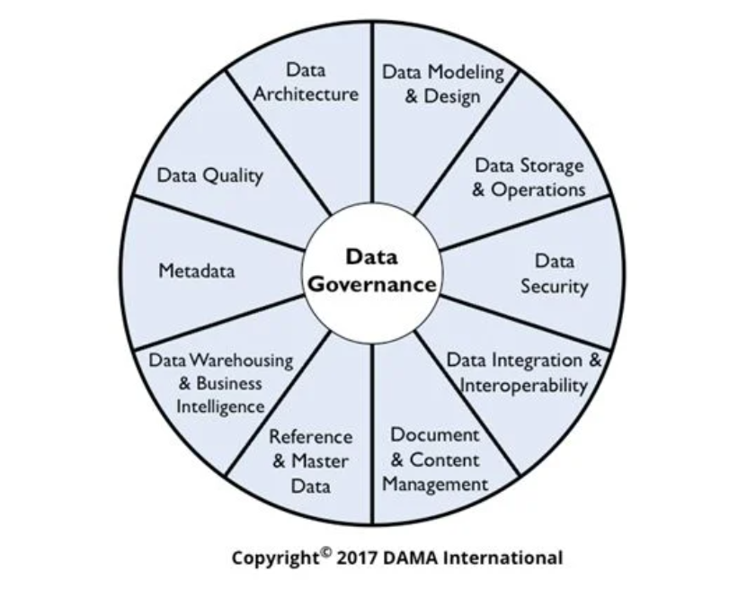

DMBOK勉強の殴り書きメモです。データガバナンスとデータマネージメント編を中心に。

- DAMAホイールとは？

  - データガバナンスを行うために必要な分野をまとめたもの

  

- データガバナンスとは？

  - 定義：データ資産の管理に対して職務権限を通し統制（コントロール）すること
    - 適切な組織人員の配置
      - 組織体制の構築
        - データスチュワード制
        - 重要な領域をインハウス化する一方定型業務はアウトソース等
    - 経営層のコミットが必要
    - データマネジメント活動の共有
    - スモールスタートが望ましい
    - 活動領域の適宜共有
  - ゴール：組織が自身のデータを資産として管理する
    - データマネジメントに関する原則、ポリシー、手続き、評価指標、ツール、責任について定義、承認、伝達、実施する
    - ポリシーの遵守、データの利用、管理活動を監視して導く
  - あくまでもデータガバナンスは手段なので目的にならないように注意する。管理のための管理等

- データガバナンスで目指すべき方向性

  - データは企業資産として管理すべき
  - データマネージメントのベストプラクティスを組織全体に対して奨励すべき
  - 企業データ戦略はビジネス戦略全体に直接呼応すべき
  - データマネジメントプロセスは継続的に改善
  
- ISO 55000/55001

  - 資産管理に関係する国際基準

  - 組織の資産(アセット)をライフサイクルを通じて、コスト、リスク、パフォーマンスのバランスを保ちながら、最大の可用性と収益性を確保するため

    > 一般社団法人 日本アセットマネジメント協会(JAAM)|ISO 55000シリーズとは？ https://www.ja-am.or.jp/iso55000s
    >
    > アセットマネジメントシステム(AMS)認証 (ISO 55001) | 公益財団法人 日本適合性認定協会 https://www.jab.or.jp/iso/iso_55001/

- データ評価のアプローチ
  - データの取得と保存のコスト
  - データが失われた場合のデータ復旧コスト
  - データの販売目的の明確化
  - データ使用による期待収益
  
- データ管理の目的
  - データを効果的に使用して企業に価値を付加出来るようにすること
  - リスク軽減
  - プロセス改善
    - 規制遵守
    - データ品質改善
    - メタデータ管理
    - 開発プロジェクトの効率性
    - ベンダー管理
  
- データスチュワード
  
  - 役割
  
    - 組織のデータ資産の品質と使用に責任を持つように任命されたビジネス上の役割
  
  - 職務の種類例
  
    - メタデータの作成と管理
    - ルールと標準の文書
    - データ品質の問題管理
    - データガバナンス運営アクティビティの実施
  
  - 色々なデータスチュワードの種類が存在する
  
  - チーフ･データスチュワード：エグゼクティブスポンサー
  
  - 執行役データスチュワード：データガバナンス評議会に所属する上級管理者
  
  - エンタープライズ・データスチュワード：業務機能全体にわたるデータドメイン（領域）
  
  - 業務データスチュワード：ステークホルダと協力してデータを定義し統制
  
  - データオーナー：業務データスチュワードでもあり、自分の担当分野内のデータに関する意思決定の承認権限
  
  - ITデータスチュワード：ITのプロフェッショナルであり、データ統合スペシャリスト、データベース管理者、ビジネスインテリジェンス・スペシャリスト、データ品質アナリスト、メタデータ管理者など各知識領域で機能
  
  - 調整役データスチュワード：業務データスチュワードとITデータスチュワードのチームの代表として､チーム間や執行役データスチュワードとの議論に臨む
  
    
  
- データガバナンスとは？
  - データ改善の継続的なプロセス
  - 様々な組織モデルがあり得る
  - データ資産の管理に対する権限と制御の行使
  - 規制やコンプライアンス要件を満たしていることを監視、確認する
  
- データガバナンスを実行していくことの責任は？
  - データ管理コミュニティの全員で実行していくこと
    - データシチュワード
    - CEO/CIO/CDO
    - 業務関係者
  
- データ資産評価
  	組織におけるデータの経済的価値を理解し測定するプロセス
  		データを利用することの経済的利益がデータの取得と保管のコストや使用に関するリスク管理のコストを上回る場合に、価値がもたらされる。

- データガバナンスの価値を届けるアプローチ例
  - データ管理のイントラWebサイトの保守
  - 定期的なニュースレターの発行
  - フォーラムやコミュニティへの参加促進
  - 関係者やオーディエンス向けにエレベーターピッチの作成
  
- データ管理のイントラWebサイトに掲載する内容
  - データガバナンス組織の連絡先
  - データ管理や既存のデータ管理の問題に対してのエグゼクティブメッセージ
  - データスチュワードチームのプロファイル
  - データ管理の問題点を報告する仕組み、メールリンク
  
- データ標準ガイドライン
  - 定期的にレビューと更新が必要
  
- データガバナンス運営委員会
  - データガバナンス活動の監視とサポートを担当する主要かつ最高の機関

- ISO 3166
  - 国際標準化機構 (ISO) が国名およびそれに準ずる区域、都道府県や州といった地域のために割り振った地理情報の符号化
  - ISO 3166 - Wikipedia https://ja.wikipedia.org/wiki/ISO_3166

- データ管理の目標
  - データ資産の取得、保存、保護、整合性の確保
  - データと情報の品質の確保
  - 利害関係者データのプライバシーと機密性の確保
  
- データガバナンス戦略

  - IT戦略だけではなく全体的な事業戦略に関連させる必要がある
    - オペレーションフレームワークと結果責任
    - 導入ロードマップ
    - 運用計画
    - データガバナンスの意義、ビジョン、使命、原則を示すもの
  - データマネジメント・プロジェクトの支援
    - 内部SDLC、サービス展開管理、ITIL、PMOプロセスへの関与、対応が必要
  - 組織との連携ポイントの策定
    - データガバナンス業務のために連携する組織との協業体制を検討
      - 調達と契約
      - 予算、資金調達
      - 規制遵守
      - SDLC/開発フレームワーク
  - データマネジメント成熟度
    - 現在のデータマネジメント遂行能力と遂行範囲を測定する
      - 変革能力
      - 協調体制の準備状況
      - 事業との整合性

