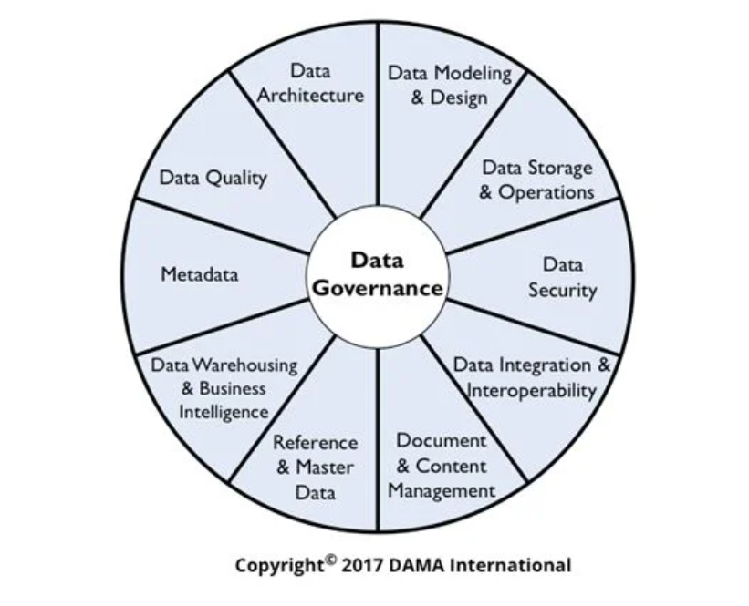

DMBOK勉強の殴り書きメモです。参照データとマスタデータについて。

## 参照データとマスタデータ

- DAMAホイールとは？

  - データガバナンスを行うために必要な分野をまとめたもの

  

- マスタデータと参照データの定義

  - 参照データ

    - 他のデータ（マスタデータ含む）を特徴づける、関連づけるデータ
      - 分類
        - 注文状況：新規、処理中、キャンセル
      - 外部情報
        - 国コード：US、JPN、DE
          - 外部情報との関連づけるために使われるデータ

  - マスタデータ

    - ビジネスに紐づくような主要業務の対象であるデータ
      - 組織情報：従業員、ベンダー、顧客情報等
      - もの・サービス：商品、製品、中間品等

  - トランザクションデータ

    - 企業の情報システムなどが扱うデータの種類の一つで、業務に伴って発生した出来事の詳細を記録したデータ
      - 日々、追加・更新が発生
      - 更新は各ユーザが行う
        - 参照データやマスタデータは基本的に管理者が行うもの

  - スタースキーマでいうところのディメンション表が参照データ、マスタデータにあたり、ファクト表がトランザクションデータと思っている。（[図の参照元](https://qiita.com/tsucasa/items/c9ada44308aff2a115cf)）

    

- マスターデータ管理の意義、目的

  - 組織のデータ要件のため
    - 完全で最新で一貫性がある信頼出来るデータで分析しなければ意味がない
  - データの品質管理
    - データ不整合や不良、欠落を避ける
  - データ統合のコスト管理
    - マスターデータがない場合のデータソース統合はコストが掛かる
  - リスクの低減、削減
    - データ共有アーキテクチャの簡素化、リスク、並びにコストが下がる

- マスターデータ管理の指針

  - 共有データ：参照データとマスターデータは組織全体で共有できるように管理
  - データ所有権：参照データとマスタデータは組織に属して特定アプリケーションや部門には属さないようにする
  - 品質：データ品質の監視とガバナンスを効かす
  - スチュワード：業務データの生成元のデータスチュワードは参照データの品質を管理して保証するために責務を負う
  - 変更管理
    - 変更時にはプロセスを経て変更する。承認フロー、及び関係者への伝達、配信等。

- MDM要件の評価に必要なもの

  - どの役割、組織、場所、物が繰り返し参照されているか
  - 人、組織、場所、物を記述するためにどのデータが使われているか
  - どのようにデータが定義され構造化されているか。これにはデータの粒度も含まれる
  - どこでデータが作成／収集され、保存され、利用可能になり、アクセスされるか
  - データが組織内のシステムを移動する際にどのように変化するか
  - 誰がどのような目的でデータを利用するのか
  - データとそのソース品質と信頼性を理解するためにどのような基準が使われるか
