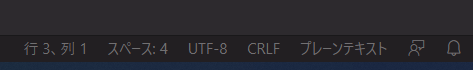
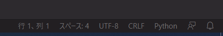

下の画像のようなプレーンテキストとか拡張子がついていないファイルに対してシンタックスを自動で設定したい。（下記の記事の通り、言語の自動検出機能が実装されていたりするので必要性は少なくなってきたけども。）

- [VS Code に言語の自動検出機能が追加されました \| DevelopersIO](https://dev.classmethod.jp/articles/vscode-automatic-language-detection/)

「ユーザ設定」 - 「設定」でDefalut Languageを検索。ここで言語モードを設定する

これで新規ファイルを作ったときに自動的に選択した言語がハイライトされる。

