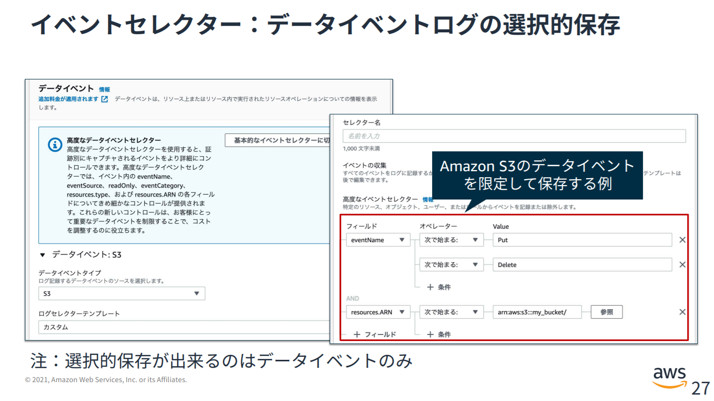

### ①AthenaでCloudTrailのAPI記録の傾向把握

eventsourceを特定して突出して多いサービスがないか確認

[AthenaでCloudTrail の証跡を分析 \| my opinion is my own](https://zatoima.github.io/aws-cloudtrail-athena-analyze-query/)

```sql
SELECT
    awsregion,
    eventsource,
    eventname,
    COUNT(*) as cnt
FROM
    cloudtrail_logs
WHERE
    date>='2021/11/24' AND
    region = 'ap-northeast-1'    
GROUP BY
    awsregion,
    eventsource,
    eventname
ORDER BY cnt DESC
limit 10;
```


次は突出したeventsource、eventnameの深堀りを行う。UserIdenity要素にリクエスターの情報があるので、理由を特定する。


### ②データイベントの配信、及びCloudTrail Insightsの配信の必要性の再検討、及び絞り込み

管理イベントの最初のコピーは無料だが、データイベントとInsightsの配信は有料なので注意をする。特にデータイベントのAPI数は多くなりやすい。

| 機能                          | 料金                                                         |
| :---------------------------- | :----------------------------------------------------------- |
| S3 に配信された管理イベント   | 管理イベントの最初のコピーは無料で配信されます。追加のコピー: 配信された 100,000 管理イベントあたり 2.00USD |
| S3 に配信されたデータイベント | 配信された 100,000 データイベントあたり 0.10USD              |
| CloudTrail Insights           | 分析された 100,000 イベントあたり 0.35USD                    |

- [料金 \- AWS CloudTrail \| AWS](https://aws.amazon.com/jp/cloudtrail/pricing/)

後はどのデータイベントを記録するかという絞り込みもイベントセレクタという機能で実施出来るので、不要なデータイベントを除外できるように設計する

[証跡のデータイベントの記録 \- AWS CloudTrail](https://docs.aws.amazon.com/ja_jp/awscloudtrail/latest/userguide/logging-data-events-with-cloudtrail.html)



### ③重複する CloudTrail 管理イベントをリージョン別に特定して削除する

下記を参照

- [CloudTrail のコストと使用量に予期しない増加があるのはなぜですか?](https://aws.amazon.com/jp/premiumsupport/knowledge-center/remove-duplicate-cloudtrail-events)

### 参考

- [20210119\_AWSBlackbelt\_CloudTrail\.pdf](https://d1.awsstatic.com/webinars/jp/pdf/services/20210119_AWSBlackbelt_CloudTrail.pdf)