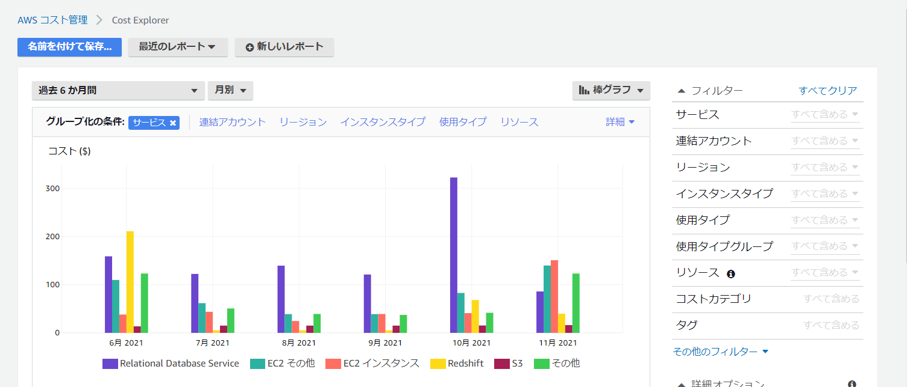
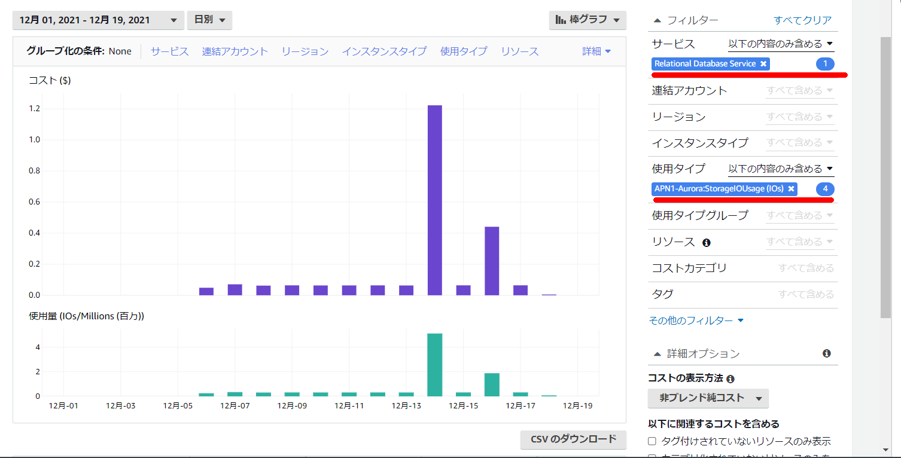
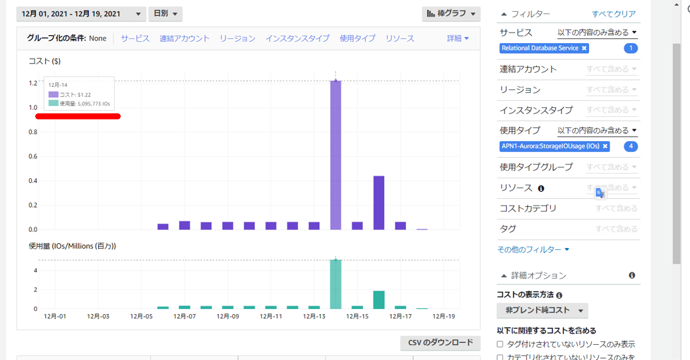

Cost Explolerのレポートを開く

> https://console.aws.amazon.com/cost-management/home#/dashboard

右側のフィルター部分で下記の通り指定する。適宜集計する期間も変更する。左上部分。

1. サービスで`RDS`を選択する
2. `Aurora:StorageIOUsage (IOs)`を使用タイプで検索して該当する使用タイプを全部選択する

カーソルをグラフにあてるとIO数とコストが確認可能。

