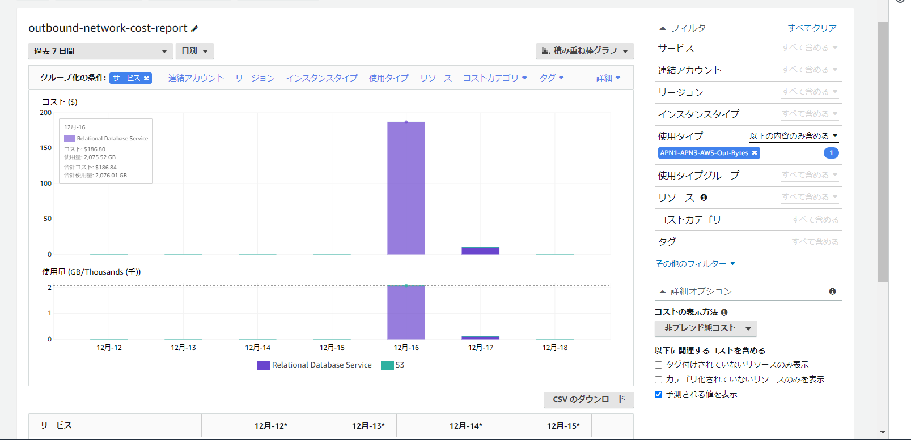

Cost Explolerのレポートで確認出来る。右側のフィルターで`使用タイプ`で`APN1-APN3-AWS-Out-Bytes`を指定する。グループ化の条件として`サービス`を指定することでどのサービスの転送量が多いのかが分かる。

Cost Explorerをもっと使いこなしたい。

参考

> [【AWS CLI】Cost Explorer編 - サーバーワークスエンジニアブログ](https://blog.serverworks.co.jp/aws-cli-cost-explorer)
>
> https://d1.awsstatic.com/webinars/jp/pdf/services/20200129_BlackBelt_CostExplorer.pdf
