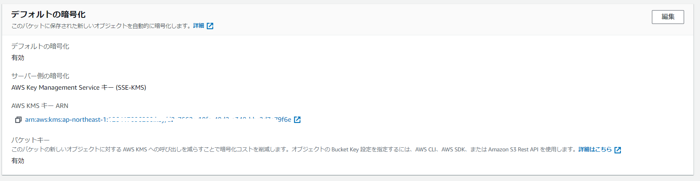

色々とややこしいのでメモ。

### 用語

**MD5**：特定の*ファイル*に対してツールによって算出された 16 進数を表す文字と数字からなる 32 文字の文字列。opensslコマンド等いくつか方法はあるが、`md5sum`コマンドだと下記の通りMD5値が出力される。

```sh
[ec2-user@bastin ~]$ dd if=/dev/zero of=~/test.txt bs=1M count=500
500+0 records in
500+0 records out
524288000 bytes (524 MB) copied, 0.233084 s, 2.2 GB/s
[ec2-user@bastin ~]$ md5sum test.txt
d8b61b2c0025919d5321461045c8226f  test.txt
```

**Etag**：HTTP のレスポンスヘッダーで、リソースの特定バージョンの識別子。URLにあるリソースに何かしらの変化があればETagも新しい値となる。

AWSにおけるETagの説明は下記の通り。<u>S3の暗号化方式（SSE-S3 or SSE-KMS)でETagsの値が変わってくることとMultipart Upload または Part Copy 操作によって作成されたオブジェクトは、暗号化の方法に関係なく、MD5 ダイジェストではない ETag を持つことに特に注意。</u>

- [Common Response Headers - Amazon Simple Storage Service](https://docs.aws.amazon.com/AmazonS3/latest/API/RESTCommonResponseHeaders.html)

> ETag
>
> The entity tag represents a specific version of the object. The ETag reflects changes only to the contents of an object, not its metadata. The ETag may or may not be an MD5 digest of the object data. Whether or not it is depends on how the object was created and how it is encrypted as described below:
>
> - Objects created through the AWS Management Console or by the PUT Object, POST Object, or Copy operation:
>   - Objects encrypted by SSE-S3 or plaintext have ETags that are an MD5 digest of their data.
>   - Objects encrypted by SSE-C or SSE-KMS have ETags that are not an MD5 digest of their object data.
> - Objects created by either the Multipart Upload or Part Copy operation have ETags that are not MD5 digests, regardless of the method of encryption.
>
> 意訳
>
> エンティティタグは、オブジェクトの特定のバージョンを表します。ETag は、オブジェクトの内容に対する変更のみを反映し、そのメタデータは反映しません。ETag はオブジェクトデータの MD5 ダイジェストであることもありますし、 そうでないこともあります。そうであるかどうかは、オブジェクトの作成方法と、以下に説明する暗号化の方法によって異なります。
>
> - AWS Management Console、またはPUT Object、POST Object、Copy操作によって作成されたオブジェクト。
>   - SSE-S3または平文で暗号化されたオブジェクトは、そのデータのMD5ダイジェストであるETagsを持っています。
>   - SSE-CまたはSSE-KMSによって暗号化されたオブジェクトは、そのオブジェクトデータのMD5ダイジェストではないETagsを持ちます。
> - Multipart Upload または Part Copy 操作によって作成されたオブジェクトは、暗号化の方法に関係なく、MD5 ダイジェストではない ETag を持ちます。
>

### パターン①：SSE-S3または平文で暗号化されたオブジェクトの場合

#### バケットの設定


#### マルチアップロードの場合

マルチアップロードされているため、EC2側で取得したハッシュとS3上でのETagが異なる。

```sh
[ec2-user@bastin ~]$ dd if=/dev/zero of=~/test.txt bs=1M count=500
500+0 records in
500+0 records out
524288000 bytes (524 MB) copied, 0.23444 s, 2.2 GB/s
[ec2-user@bastin ~]$ md5sum test.txt
d8b61b2c0025919d5321461045c8226f  test.txt
[ec2-user@bastin ~]$ aws s3 cp ~/test.txt  s3://s3-imazaj/
upload: ./test.txt to s3://s3-imazaj/test.txt                       
[ec2-user@bastin ~]$ aws s3api head-object --bucket s3-imazaj --key test.txt
{
    "AcceptRanges": "bytes",
    "LastModified": "Fri, 17 Dec 2021 13:11:36 GMT",
    "ContentLength": 524288000,
    "ETag": "\"2ab876e6e72b0fe9215ba306bea4f697-63\"",
    "VersionId": "f6twG5M7LGpjOzhGSIm9Tn1lnhnlN_ia",
    "ContentType": "text/plain",
    "ServerSideEncryption": "AES256",
    "Metadata": {}
}
```

計算したい場合は下記ツール（※非公式）を使う。s3etagで出力されたハッシュとaws s3api head-objectで取得されたETagが同じであることがわかる。

```sh
[ec2-user@bastin ~]$ gem install s3etag
Fetching: s3etag-0.0.1.gem (100%)
Successfully installed s3etag-0.0.1
Parsing documentation for s3etag-0.0.1
Installing ri documentation for s3etag-0.0.1
1 gem installed
[ec2-user@bastin ~]$ s3etag
s3etag file
    -t, --thre[ec2-user@bastin ~]$ s3etag
s3etag file
    -t, --threshold threshold
    -p, --max-parts max-parts
    -s, --min_part_size min_part_size
[ec2-user@bastin ~]$ s3etag -t 8388608 -s 8388608 test.txt
2ab876e6e72b0fe9215ba306bea4f697-63
```

計算式は下記の通り。デフォルトのS3のマルチアップロード時の8MBで分割されるので`8388608`を指定している。

> [Again on ETAG and MD5 checksum for multipart](https://forums.aws.amazon.com/thread.jspa?messageID=456442&#456442)
> 
>```sh
> ETag = MD5(Sum(p \in numberParts, MD5(PartBytes(p))) + "-" + numberParts
> ```
> 
>- 分割したファイルのMD5値を合算している
> - 合算した値の末尾に – 分割数 を追記している。

S3上のオブジェクトのMD5値を取得したい場合、下記方法もある。

```sh
[ec2-user@bastin ~]$ sudo yum -y install s3cmd
[ec2-user@bastin ~]$ s3cmd ls --list-md5 s3://s3-imazaj/
2021-12-17 13:11    524288000  2ab876e6e72b0fe9215ba306bea4f697-63  s3://s3-imazaj/test.txt
```

#### マルチアップロードではないパターン

この場合はMD5=Etagとなる。

```sh
[ec2-user@bastin ~]$ md5sum test.txt
d8b61b2c0025919d5321461045c8226f  test.txt
[ec2-user@bastin ~]$ aws s3api put-object --bucket s3-imazaj --key test.txt --body test.txt
{
    "ETag": "\"d8b61b2c0025919d5321461045c8226f\"",
    "ServerSideEncryption": "AES256",
    "VersionId": "Einc9JkCj2itDk3BDSQJPAu1HoblkzfU"
}
[ec2-user@bastin ~]$ aws s3api head-object --bucket s3-imazaj --key test.txt
{
    "AcceptRanges": "bytes",
    "LastModified": "Fri, 17 Dec 2021 13:20:58 GMT",
    "ContentLength": 524288000,
    "ETag": "\"d8b61b2c0025919d5321461045c8226f\"",
    "VersionId": "Einc9JkCj2itDk3BDSQJPAu1HoblkzfU",
    "ContentType": "binary/octet-stream",
    "ServerSideEncryption": "AES256",
    "Metadata": {}
}
[ec2-user@bastin ~]$ s3cmd ls --list-md5 s3://s3-imazaj/
2021-12-17 13:20    524288000  d8b61b2c0025919d5321461045c8226f     s3://s3-imazaj/test.txt
```

### パターン②：SSE-KMSによって暗号化されたオブジェクトの場合

S3バケットの設定



#### マルチアップロードの場合

```sh
[ec2-user@bastin ~]$ md5sum test.txt
d8b61b2c0025919d5321461045c8226f  test.txt
[ec2-user@bastin ~]$ s3cmd ls --list-md5 s3://s3-imazaj/
2021-12-17 13:20    524288000  d8b61b2c0025919d5321461045c8226f     s3://s3-imazaj/test.txt
[ec2-user@bastin ~]$ md5sum test.txt
d8b61b2c0025919d5321461045c8226f  test.txt
[ec2-user@bastin ~]$ aws s3 cp test.txt  s3://s3-imazaj/
upload: ./test.txt to s3://s3-imazaj/test.txt                       
[ec2-user@bastin ~]$ aws s3api head-object --bucket s3-imazaj --key test.txt
{
    "AcceptRanges": "bytes",
    "LastModified": "Fri, 17 Dec 2021 13:24:52 GMT",
    "ContentLength": 524288000,
    "ETag": "\"24a147ee52b41c94f398613a46a06810-63\"",
    "VersionId": "abQHe4HT0IMzx5biXy1olm6NqJKkk8Cs",
    "ContentType": "text/plain",
    "ServerSideEncryption": "aws:kms",
    "Metadata": {},
    "SSEKMSKeyId": "arn:aws:kms:ap-northeast-1:xxxxxxxxxxxxx:key/d2c7662c-19fa-40d2-a348-bbc2d7e79f6e",
    "BucketKeyEnabled": true
}
[ec2-user@bastin ~]$ s3cmd ls --list-md5 s3://s3-imazaj/
2021-12-17 13:24    524288000  24a147ee52b41c94f398613a46a06810-63  s3://s3-imazaj/test.txt
```

`s3etag`ツールを使ってもEtagとMD5値が合わなくなる

```sh
[ec2-user@bastin ~]$ s3etag -t 8388608 -s 8388608 test.txt
2ab876e6e72b0fe9215ba306bea4f697-63
```

#### ≠マルチアップロード

暗号化使っている場合はマルチアップロードでないパターンでもNGとなる。

```sh
[ec2-user@bastin ~]$ aws s3api put-object --bucket s3-imazaj --key test.txt --body test.txt
{
    "ETag": "\"dd6006c0c101d532e17cb992b04658b0\"",
    "ServerSideEncryption": "aws:kms",
    "VersionId": "8k7ceRD0TRNWLTmiQlaqersys_0nZgln",
    "SSEKMSKeyId": "arn:aws:kms:ap-northeast-1:xxxxxxxxxxxxx:key/d2c7662c-19fa-40d2-a348-bbc2d7e79f6e",
    "BucketKeyEnabled": true
}
[ec2-user@bastin ~]$ aws s3api head-object --bucket s3-imazaj --key test.txt
{
    "AcceptRanges": "bytes",
    "LastModified": "Fri, 17 Dec 2021 13:26:25 GMT",
    "ContentLength": 524288000,
    "ETag": "\"dd6006c0c101d532e17cb992b04658b0\"",
    "VersionId": "8k7ceRD0TRNWLTmiQlaqersys_0nZgln",
    "ContentType": "binary/octet-stream",
    "ServerSideEncryption": "aws:kms",
    "Metadata": {},
    "SSEKMSKeyId": "arn:aws:kms:ap-northeast-1:xxxxxxxxxxxxx:key/d2c7662c-19fa-40d2-a348-bbc2d7e79f6e",
    "BucketKeyEnabled": true
}
```

### 参考

- [S3へコピーしたデータが、本当にコピー元と同一かどうか検証してみた時のお話 - Qiita](https://qiita.com/speaktech/items/0710a3de2628ef730500)
- [S3マルチパートアップロードのETagの値 | レコチョクのエンジニアブログ](https://techblog.recochoku.jp/3659)
