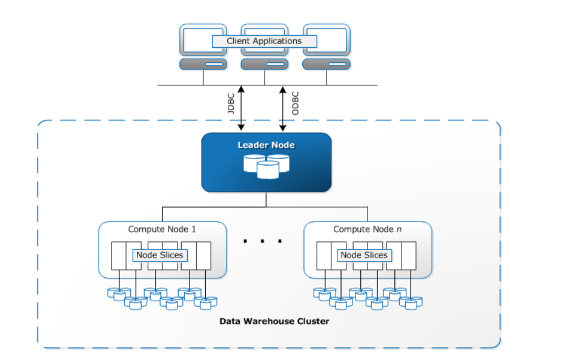

Redshift Spectrumの同時実行性能がどのように決まるのかをメモ。

### 1.スライス数

この要素自体はSpectrumに限らず通常のRedshiftでも重要な概念となる。

スライス数は１つ目の要素としてインスタンスタイプ（インスタンスサイズ）によって決まる。各スライスは、ノードのメモリとディスク容量の一部を割り当てられ、ノードに割り当てられたワークロードの一部分を処理する。リーダーノードは、スライスへのデータの分散を管理し、クエリまたは他のデータベース操作のワークロードをスライスに分配して、各スライスはそれぞれがワークロードを担当する。下記のように各ノードには複数のスライスが存在する。

参照元：[データウェアハウスシステムのアーキテクチャ \- Amazon Redshift](https://docs.aws.amazon.com/ja_jp/redshift/latest/dg/c_high_level_system_architecture.html)

このスライス数はノードごとのデフォルトスライスとしてノードサイズによって事前に決まっている。

> [Amazon Redshift クラスター \- Amazon Redshift - ノードタイプの詳細](https://docs.aws.amazon.com/ja_jp/redshift/latest/mgmt/working-with-clusters.html#rs-node-type-info)

RA3の場合、ra3.xlplusは「2」、ra3.4xllargeは「4」、ra3.16xlageは「16」となる。

ノードサイズのサイズ変更の仕方によってスライス数が変更されないこともあるのでオペレーション時には注意した方が良いというハマリポイントがある。

> [Amazon Redshift クラスター \- Amazon Redshift - ノードタイプの詳細]([Amazon Redshift クラスター \- Amazon Redshift](https://docs.aws.amazon.com/ja_jp/redshift/latest/mgmt/working-with-clusters.html#rs-node-type-info))
>
> - *ノードあたりのスライスの数*は、従来のサイズ変更でクラスターを作成またはサイズ変更するときに、コンピューティングノードがパーティション分割されるデフォルトのスライス数です。
> - 伸縮自在なリサイズを使用してクラスターのサイズを変更すると、ノードあたりのスライス数が変わる可能性があります。 ただし、クラスターのすべてのコンピューティングノードのスライスの総数は、伸縮自在なサイズ変更後も変わりません。
> - スナップショットからの復元操作を使用してクラスターを作成する場合、ノードタイプを変更すると、元のクラスターから生成されるクラスターのスライスの数が変わることがあります。

### 2.同時実行数

1クエリ 1 スライスにつき最大 10 の同時実行数となっている。

- いくつのクエリが同時に実行されているかによって、同時実行数が変わる
- 割りあてられた同時実行数によって、S3 をスキャンするスレッド数が制限される

※「最大」となっているのもおそらく注意点であるし、かつ確認する限りマニュアルにもSpectrum層-S3の同時実行数の記載がないところにも注意。ユーザ側には意識させないところだとは思われるが、明確には仕様が示されていない。

> 参照先：[Amazon Redshift Spectrum 12 のベストプラクティス \| Amazon Web Services ブログ](https://aws.amazon.com/jp/blogs/news/10-best-practices-for-amazon-redshift-spectrum/)

### Spectrumのパフォーマンスについて

「1.スライス数」と「2.同時実行数」の話をまとめるとこのようになると考えられる。

### Spectrumの同時実行の確認方法について

`SVL_S3QUERY_SUMMARY`表を確認。スライスで処理するファイル数や並列リクエストなどの統計もあるのでここで確認する

> [SVL\_S3QUERY\_SUMMARY \- Amazon Redshift](https://docs.aws.amazon.com/ja_jp/redshift/latest/dg/r_SVL_S3QUERY_SUMMARY.html)

| 列名                    | 説明                                                         |
| ----------------------- | ------------------------------------------------------------ |
| files                   | この Redshift Spectrum  クエリで処理されたファイル数。ファイル数が少ないと、並列処理の利点は制限されます。 |
| files_max               | 1 つのスライスで処理されるファイルの最大数。                 |
| files_avg               | 1 つのスライスで処理されるファイルの平均数。                 |
| splits                  | このセグメントで処理された分割の数。このスライスで処理された分割の数。例えば分割可能なデータファイルの容量が大きい場合  (約 512 MB を超えるデータファイルなど)、Redshift Spectrum はファイルを複数の S3 リクエストに分割し、並列処理を試みます。 |
| splits_max              | このスライスで処理された分割の最大数。                       |
| splits_avg              | このスライスで処理された分割の平均数。                       |
| total_split_size        | 処理されたすべての分割の合計サイズ。                         |
| max_split_size          | 処理された分割の最大サイズ (単位: バイト)。                  |
| avg_split_size          | 処理された分割の平均サイズ (単位: バイト)。                  |
| total_retries           | 個別の処理ファイルでの再試行の総数。                         |
| max_retries             | 処理ファイルでの再試行の最大数。                             |
| max_request_duration    | 個別ファイルリクエストの最長時間  (マイクロ秒)。実行時間の長いクエリはボトルネックの可能性があります。 |
| avg_request_duration    | ファイルリクエストの平均時間 (マイクロ秒)。                  |
| max_request_parallelism | Redshift Spectrum クエリでの 1  つのスライスの並列リクエストの最大数。 |
| avg_request_parallelism | Redshift Spectrum クエリでの 1  つのスライスの並列リクエストの平均数。 |

### Spectrumの同時実行性能のパフォーマンスを最大化するためには？

ここにある通りS3側にある分割されたファイル数と同時実行数が最適なバランスになっているかを確認する必要がある。

> ・[Amazon Redshift Spectrum 12 のベストプラクティス \| Amazon Web Services ブログ](https://aws.amazon.com/jp/blogs/news/10-best-practices-for-amazon-redshift-spectrum/)
>
> ファイル総数 <= クエリごとの同時実行性能 (例えば 10) * クラスターのスライス数、といった簡単な計算ができます。。ただしクラスターのノード数を増やしても、必ずしもパフォーマンスが向上するとは限りません。最適なクラスターのノード数は、以下のようにして決めてください。まず Redshift Spectrum の外部テーブルに、いくつのファイルが含まれているかを確認してください。続いてクラスターのサイズを大きくしていって（クラスターに含まれるスライス数を増やすということです）、ノード数が増えてもパフォーマンスがこれ以上伸びなくなるというポイントを探してください。そのときのノードタイプにおける、最適な Redshift のクラスターサイズは、それ以上のパフォーマンス向上が起こらなくなるところです。

力技であればRedshiftのクラスタを複数台並べてクエリを掛けることで更に並列度自体は挙げられる。ストレージとコンピュートが分離されているSpectrumの利点の一つだと思う。クラスタを複数を立ててそれぞれのクラスタから同じS3のファイルにクエリすることも出来る。

### 補足：Redshift SpectrumのConcurrency Scaling

Redshift Spectrum自体もConcurrency Scalingは対象の模様。以前はSpectrumのConcurrency Scalingは対象外だった模様。マニュアルは少々分かりづらい記載になっているが、Forumの方では記載があった。（※実際には試していない）

- [同時実行スケーリングを使用する \- Amazon Redshift](https://docs.aws.amazon.com/ja_jp/redshift/latest/dg/concurrency-scaling.html)
  - 制限のあるネットワークまたは仮想プライベートクラウド (VPC) 構成で保護されている、外部リソースにアクセスするクエリはサポートされません。
- [AWS Developer Forums: Amazon Redshift Announcements \.\.\.](https://forums.aws.amazon.com/thread.jspa?start=100&threadID=132076&tstart=0)
  - **Redshift Spectrum**: UNLOAD and queries that use Spectrum to reference external tables are now eligible for Concurrency Scaling

### 参考

- [Amazon Redshift Spectrum 12 のベストプラクティス \| Amazon Web Services ブログ](https://aws.amazon.com/jp/blogs/news/10-best-practices-for-amazon-redshift-spectrum/)
- [Amazon Redshift で伸縮自在なサイズ変更を使用する](https://aws.amazon.com/jp/premiumsupport/knowledge-center/redshift-elastic-resize)
