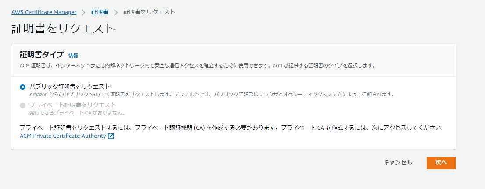
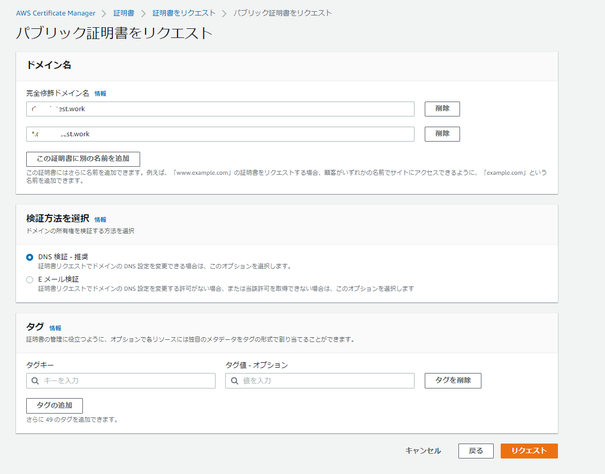
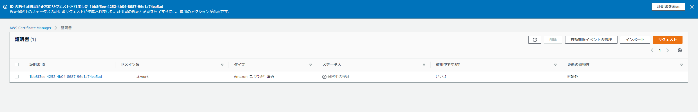
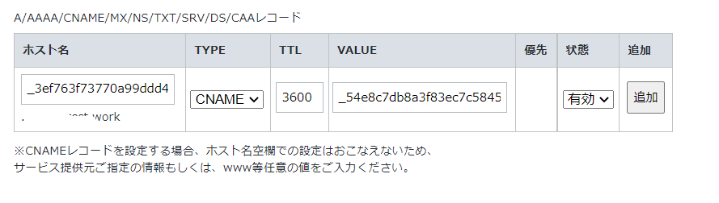
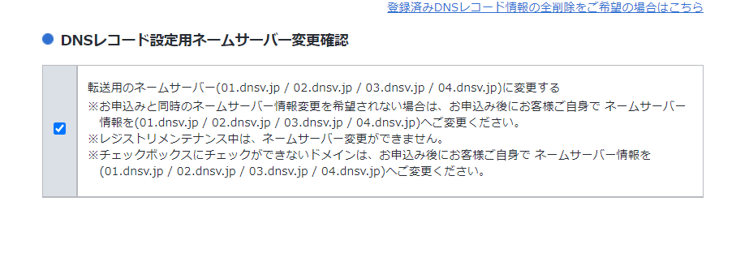
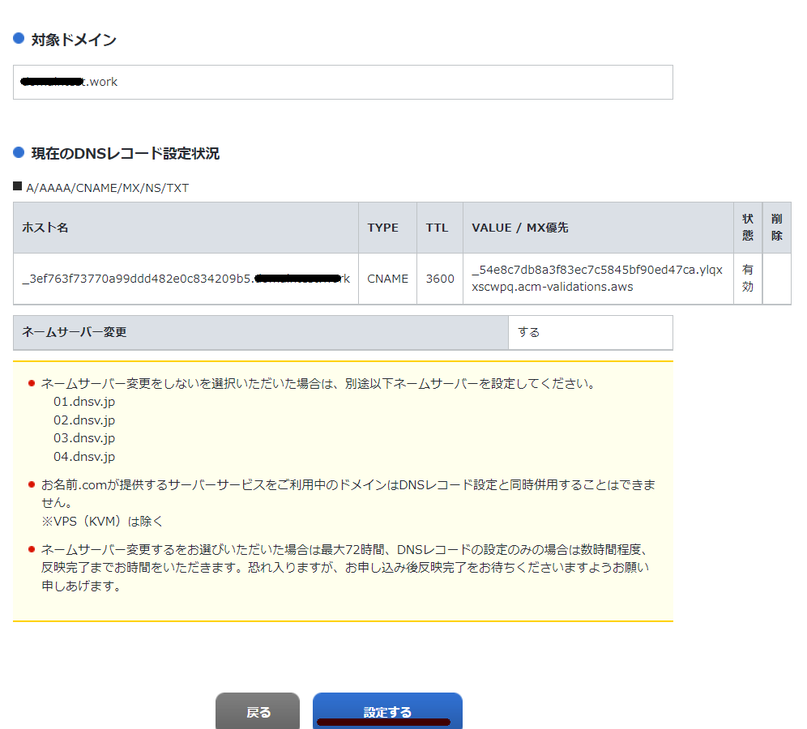
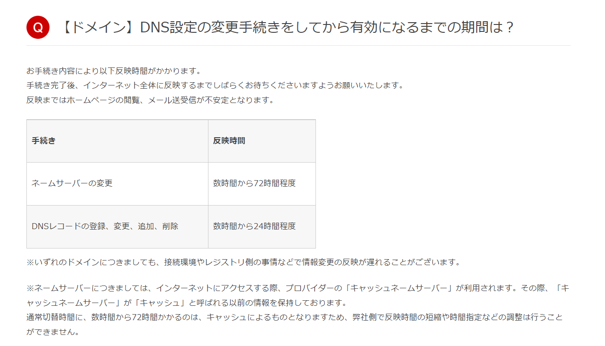
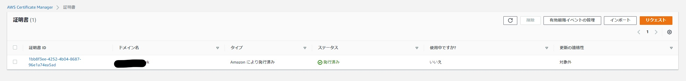

表題の通り、お名前.comで取得したドメインを使用してACMでSSL証明書を発行する際のメモ。

### ACMからパブリック証明書をリクエスト

ドメイン名と検証方法を入力

証明書の発行中。しばらく待機する

証明書の詳細画面に移動して、「CSVにエクスポート」を選択して手元にダウンロードしておく。後続の手順で参照。

お名前.comに移動して「DNSレコードを設定する」に移動

対象ドメインを選択して次へ

DNSレコード設定を利用する

ACMの画面から下記のようなCSVをダウンロードしているはずなのでここから下記を入力する

| ホスト名    | TYPE  | VALUE        |
| ----------- | ----- | ------------ |
| Domain Name | CNAME | Record Value |

入力して追加する

ページ下部の設定はデフォルトのままチェックを付ける

設定するをクリック

完了となる

数時間から24時間程度と書かれているのでDNSの伝搬に時間が掛かるので気長に待つ。

https://help.onamae.com/answer/8081

数十分でステータスが発行済に変更になった

### 参考

検証を保留中の ACM 証明書の解決 https://aws.amazon.com/jp/premiumsupport/knowledge-center/acm-certificate-pending-validation/
