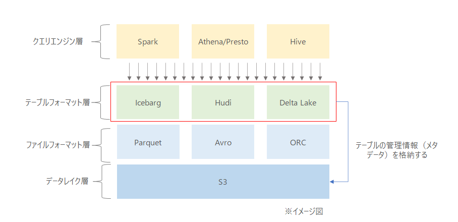
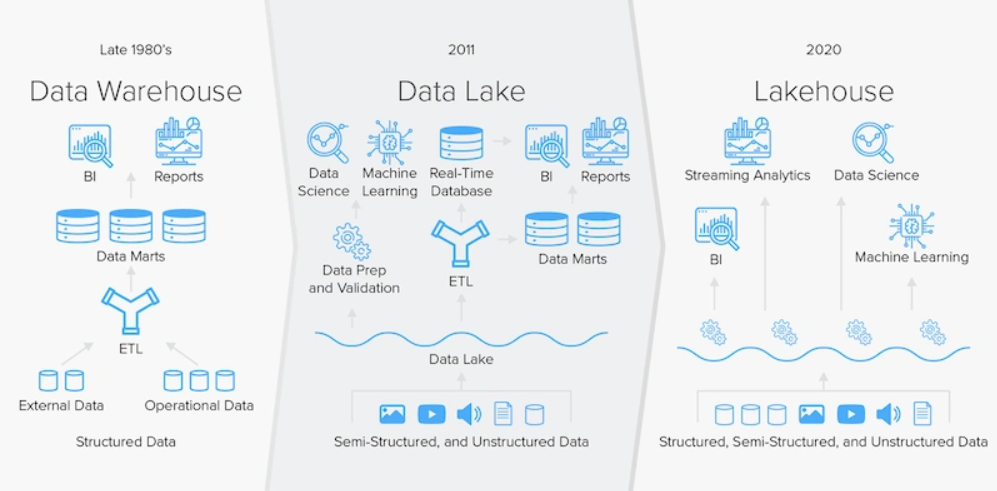

ようやくデータレイクという言葉が自分の耳に馴染んできたところであるが、もう次のトレンドが出ているらしい。Parquet、ORC、Avroあたりが列志向フォーマットでデータレイクサービスでよく使われる"ファイルフォーマット"であるが、"テーブルフォーマット"としてApache Hudi、Delta Lake、Apache Icebergがあるらしい。AWSでは、Lake Formationで使用できるGoverned Tablesがこれにあたる。そのあたりをざっくりとメモ。

| テーブルフォーマット |   開発元   |     備考     |
| :------------------: | :--------: | :----------: |
|     Apache  Hudi     |    Uber    | Apacheに寄贈 |
|     Delta  Lake      | Databricks |              |
|   Apache  Iceberg    |  Netflix   | Apacheに寄贈 |

Athenaで使用出来るIcebergしか触ったことはないが、実態としては、parquetファイルとメタデータファイルで構成されるものとなる。

### イメージ図

赤枠のところが追加されたと理解している。テーブルを形成するためにどのように構造化されているかの間の抽象化レイヤー。ここが追加されることによって`ACIDの更新、削除`、`データバージョニング`が出来る模様。

※IcebargがORCに対応しているとかそういうのを表した図ではない。



例えば、AthenaからIcebargのテーブルを作った場合、次のようなファイルフォーマットとメタデータが生成される模様。

```sh
% aws s3 ls s3://xxxxx/iceberg_table/ --recursive
2021-12-06 21:30:30          0 iceberg_table/
2021-12-07 13:42:38        453 iceberg_table/data/3494c159//iceberg_table/category=macbook/id_bucket=4/82f67f06-a0e1-4522-ba48-3cbe6d3a8be6.parquet
2021-12-07 13:45:35        438 iceberg_table/data/4b0be337//iceberg_table/category=macbook/id_bucket=4/dde0a679-84f8-46f4-891e-33355a25f396.parquet
2021-12-07 13:40:55       1417 iceberg_table/metadata/00000-60ff8e64-b2c6-4cc1-89b1-dc740816cf2d.metadata.json
2021-12-07 13:42:39       2336 iceberg_table/metadata/00001-b6262f06-8805-40c6-9b28-7b1d361f3705.metadata.json
2021-12-07 13:45:36       3289 iceberg_table/metadata/00002-79008873-1a1b-44db-830a-cdeae6c87dde.metadata.json
2021-12-07 13:42:38       7033 iceberg_table/metadata/958b8acb-2800-473b-b55e-486333344762-m0.avro
2021-12-07 13:45:35       7033 iceberg_table/metadata/b8518cfe-ffeb-4b58-880b-81ffe1156b85-m0.avro
2021-12-07 13:42:39       4270 iceberg_table/metadata/snap-1296825016097872104-1-958b8acb-2800-473b-b55e-486333344762.avro
2021-12-07 13:45:35       4340 iceberg_table/metadata/snap-6943776344382491461-1-b8518cfe-ffeb-4b58-880b-81ffe1156b85.avro
```

### 利点

データをテーブルとしてアクセスするために、ファイルのパスだけでなくデータのスキーマ、データの統計情報などもメタデータとして管理されている。下記のようなメリットがあるようだ。

- データレイクのファイルをACIDで更新、削除ができる
- タイムトラベル（データバージョニング）
- スキーマの変更が容易
- パフォーマンス

icebergの公式ページでは次の通り説明されている。

> https://iceberg.apache.org/
>
> - Schema evolution supports add, drop, update, or rename, and has no side-effects
>   - スキーマの進化は、追加、削除、更新、名前の変更に対応し、副作用はありません。
>
> - Hidden partitioning prevents user mistakes that cause silently incorrect results or extremely slow queries
>   - ヒドゥン・パーティショニングにより、ユーザーによるミスを防ぎ、無言の不正確な結果や極端に遅いクエリを防ぐことができます。
>
> - Partition layout evolution can update the layout of a table as data volume or query patterns change
>   - パーティションレイアウトの進化は、データ量やクエリーパターンの変化に応じて、テーブルのレイアウトを更新することができます。
>
> - Time travel enables reproducible queries that use exactly the same table snapshot, or lets users easily examine changes
>   - タイムトラベルにより、全く同じテーブルスナップショットを使用した再現性の高いクエリや、ユーザーが簡単に変更点を確認することができます。
> - Version rollback allows users to quickly correct problems by resetting tables to a good state
>   - バージョンロールバックにより、テーブルを良好な状態にリセットすることで、問題を迅速に修正することが可能

### 補足

Data Lakeの発展系としてこのLakehouseがどうなっていくのか見守りたい。AWSでもこのあたりが実装されてきたので今後どのように使われていくのかをしっかりとウォッチする。

参照先：[https://www.integrate.io/jp/blog/meet-the-data-lakehouse-ja/#lakehouse](https://www.integrate.io/jp/blog/meet-the-data-lakehouse-ja/#lakehouse)



### 参考

- [Amazon Athena Apache IcebergテーブルフォーマットによるACID Transactionを試してみました！ \| DevelopersIO](https://dev.classmethod.jp/articles/20211207-amazon-athena-iceberg-preview)
- [更新できるデータレイクを作る 〜Apache Hudiを用いたユーザデータ基盤の刷新〜 \- Gunosy Tech Blog](https://tech.gunosy.io/entry/apache_hudi?utm_source=pocket_mylist)
- [AWS Lake Formation が、Governed Tables、ストレージの最適化、および行レベルのセキュリティをサポート](https://aws.amazon.com/jp/about-aws/whats-new/2021/11/aws-lake-formation-governed-tables-storage-security)
- [AWS Lake Formation による効果的なデータレイクの構築 パート 1: governed tableを作成する \| Amazon Web Services ブログ](https://aws.amazon.com/jp/blogs/news/blogs-big-data-part-1-effective-data-lakes-using-aws-lake-formation-part-1-getting-started-with-governed-tables/)
