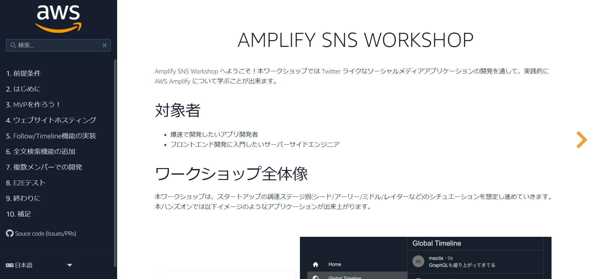
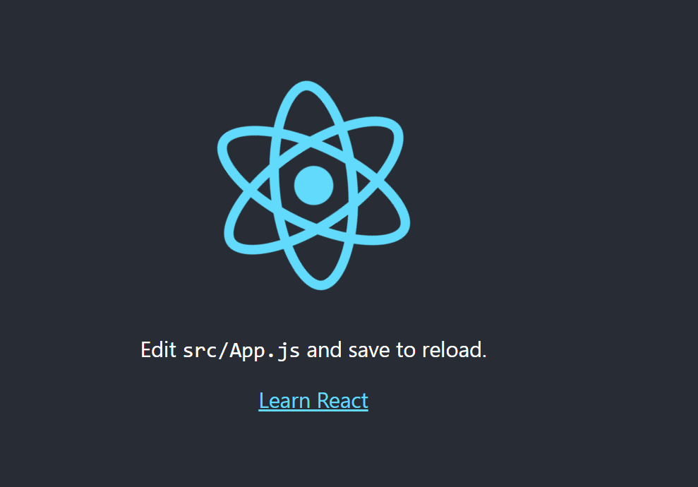
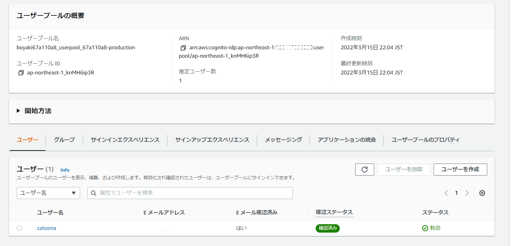

### はじめに

本記事はCognitoの実機確認を行いたかったため、こちらのCognito実行までを実行している作業メモです。手順自体は下記を見た方が絶対にわかりやすいです。

> https://amplify-sns.workshop.aws/ja/



### 確認事前準備

#### バージョン確認

- Node.js、npm

Amplify CLIではNode.jsで10.x、npmでは6.x以降のバージョンが推奨らしい

```sh
[ec2-user@bastin ~]$ node -v; npm -v
v17.7.1
8.5.2
```

- Java

```sh
[ec2-user@bastin ~]$ java -version
openjdk version "1.8.0_312"
OpenJDK Runtime Environment (build 1.8.0_312-b07)
OpenJDK 64-Bit Server VM (build 25.312-b07, mixed mode)
```

- Amplify CLIのインストール

```sh
[ec2-user@bastin ~]$ npm install -g @aws-amplify/cli@4.45.0
～省略～
[ec2-user@bastin ~]$ amplify version
Initializing new Amplify CLI version...
Done initializing new version.
Scanning for plugins...
Plugin scan successful
4.45.0
```

### Amplify CLIの設定

```sh
amplify configure
```

```sh
[ec2-user@bastin ~]$ amplify configure
Follow these steps to set up access to your AWS account:

Sign in to your AWS administrator account:
https://console.aws.amazon.com/
Press Enter to continue

Specify the AWS Region
? region:  ap-northeast-1
Specify the username of the new IAM user:
? user name:  amplify-wJAim
Complete the user creation using the AWS console
https://console.aws.amazon.com/iam/home?region=ap-northeast-1#/users$new?step=final&accessKey&userNames=amplify-wJAim&permissionType=policies&policies=arn:aws:iam::aws:policy%2FAdministratorAccess
Press Enter to continue

Enter the access key of the newly created user:
? accessKeyId:  ********************
? secretAccessKey:  ****************************************
This would update/create the AWS Profile in your local machine
? Profile Name:  default

Successfully set up the new user.
[ec2-user@bastin ~]$ 
```

### 作業ディレクトリの作成

```sh
mkdir amplify-sns-workshop
cd amplify-sns-workshop
npx create-react-app boyaki
cd boyaki
```

### Amplifyの初期化

```sh
amplify init
```

```sh
[ec2-user@bastin boyaki]$ amplify init
Note: It is recommended to run this command from the root of your app directory
? Enter a name for the project boyaki
? Enter a name for the environment production
? Choose your default editor: Vim (via Terminal, Mac OS only)
? Choose the type of app that you're building javascript
Please tell us about your project
? What javascript framework are you using react
? Source Directory Path:  src
? Distribution Directory Path: build
? Build Command:  npm run-script build
? Start Command: npm run-script start
Using default provider  awscloudformation

? Select the authentication method you want to use: AWS profile

For more information on AWS Profiles, see:
https://docs.aws.amazon.com/cli/latest/userguide/cli-configure-profiles.html

? Please choose the profile you want to use default
Adding backend environment production to AWS Amplify Console app: d23637fuj8pa65
⠧ Initializing project in the cloud...
～省略～
```

### 環境のテスト

development server起動後に、`http://localhost:3000` や `http://<PublicIP>:3000`にアクセスする

```sh
[ec2-user@bastin boyaki]$ npm start

> boyaki@0.1.0 start
> react-scripts start

(node:24767) [DEP_WEBPACK_DEV_SERVER_ON_AFTER_SETUP_MIDDLEWARE] DeprecationWarning: 'onAfterSetupMiddleware' option is deprecated. Please use the 'setupMiddlewares' option.
(Use `node --trace-deprecation ...` to show where the warning was created)
(node:24767) [DEP_WEBPACK_DEV_SERVER_ON_BEFORE_SETUP_MIDDLEWARE] DeprecationWarning: 'onBeforeSetupMiddleware' option is deprecated. Please use the 'setupMiddlewares' option.

Starting the development server...


Compiled successfully!

You can now view boyaki in the browser.

  Local:            http://localhost:3000
  On Your Network:  http://10.0.1.31:3000

Note that the development build is not optimized.
To create a production build, use npm run build.

assets by path static/ 1.49 MiB
  asset static/js/bundle.js 1.48 MiB [emitted] (name: main) 1 related asset
  asset static/js/node_modules_web-vitals_dist_web-vitals_js.chunk.js 6.92 KiB [emitted] 1 related asset
  asset static/media/logo.6ce24c58023cc2f8fd88fe9d219db6c6.svg 2.57 KiB [emitted] (auxiliary name: main)
asset index.html 1.67 KiB [emitted]
asset asset-manifest.json 546 bytes [emitted]
runtime modules 31.3 KiB 15 modules
modules by path ./node_modules/ 1.35 MiB 99 modules
modules by path ./src/ 18.1 KiB
  modules by path ./src/*.css 8.82 KiB
    ./src/index.css 2.72 KiB [built] [code generated]
    ./node_modules/css-loader/dist/cjs.js??ruleSet[1].rules[1].oneOf[5].use[1]!./node_modules/postcss-loader/dist/cjs.js??ruleSet[1].rules[1].oneOf[5].use[2]!./node_modules/source-map-loader/dist/cjs.js!./src/index.css 1.37 KiB [built] [code generated]
    ./src/App.css 2.72 KiB [built] [code generated]
    ./node_modules/css-loader/dist/cjs.js??ruleSet[1].rules[1].oneOf[5].use[1]!./node_modules/postcss-loader/dist/cjs.js??ruleSet[1].rules[1].oneOf[5].use[2]!./node_modules/source-map-loader/dist/cjs.js!./src/App.css 2 KiB [built] [code generated]
  modules by path ./src/*.js 5.7 KiB
    ./src/index.js 1.8 KiB [built] [code generated]
    ./src/App.js 2.51 KiB [built] [code generated]
    ./src/reportWebVitals.js 1.39 KiB [built] [code generated]
  ./src/logo.svg 3.61 KiB [built] [code generated]
webpack 5.70.0 compiled successfully in 7242 ms

```



### 認証機能の追加

全てデフォルトで良い。

```sh
cd /home/ec2-user/amplify-sns-workshop/boyaki
amplify add auth
```

```sh
[ec2-user@bastin boyaki]$ amplify add auth
Using service: Cognito, provided by: awscloudformation
 
 The current configured provider is Amazon Cognito. 
 
 Do you want to use the default authentication and security configuration? Default configuration
 Warning: you will not be able to edit these selections. 
 How do you want users to be able to sign in? Username
 Do you want to configure advanced settings? No, I am done.
Successfully added auth resource boyaki9b531430 locally

Some next steps:
"amplify push" will build all your local backend resources and provision it in the cloud
"amplify publish" will build all your local backend and frontend resources (if you have hosting category added) and provision it in the cloud
```

#### ステータスの確認

```sh
[ec2-user@bastin boyaki]$ amplify status

Current Environment: production

| Category | Resource name  | Operation | Provider plugin   |
| -------- | -------------- | --------- | ----------------- |
| Auth     | boyaki9b531430 | Create    | awscloudformation |

```

#### 変更の反映

数分掛かる。正常に完了するとCognitoが設定されている状態となる

```sh
amplify push
```

```sh
[ec2-user@bastin boyaki]$ amplify push
✔ Successfully pulled backend environment production from the cloud.

Current Environment: production

| Category | Resource name  | Operation | Provider plugin   |
| -------- | -------------- | --------- | ----------------- |
| Auth     | boyaki9b531430 | Create    | awscloudformation |
? Are you sure you want to continue? Yes
⠼ Updating resources in the cloud. This may take a few minutes...

UPDATE_IN_PROGRESS amplify-boyaki-production-211642 AWS::CloudFormation::Stack Tue Mar 15 2022 21:25:11 GMT+0900 (Coordinated Universal Time) User Initiated
⠧ Updating resources in the cloud. This may take a few minutes...

～中略～
✔ All resources are updated in the cloud
```

### 認証機能のフロントエンドへの実装

```sh
npm install --save aws-amplify@3.3.14 @aws-amplify/ui-react@0.2.34
```

> 実行時に、`npm ERR! peer react@"^16.7.0" from @aws-amplify/ui-react@0.2.34`が出る場合は、Reactのバージョンを16系に変更する必要があり、`package.json`ファイルを以下の内容に書き換える必要がある模様。下記は手順。実行後に再度上記の`npm install --save ～`を実行
>
> ```sh
> {
>   "name": "boyaki",
>   "version": "0.1.0",
>   "private": true,
>   "dependencies": {
>     "@testing-library/jest-dom": "^5.14.1",
>     "@testing-library/react": "^11.2.7",
>     "@testing-library/user-event": "^12.8.3",
>     "react": "16.10.0",
>     "react-dom": "16.10.0",
>     "react-scripts": "4.0.3",
>     "web-vitals": "^1.1.2"
>   },
>   "scripts": {
>     "start": "react-scripts start",
>     "build": "react-scripts build",
>     "test": "react-scripts test",
>     "eject": "react-scripts eject"
>   },
>   "eslintConfig": {
>     "extends": [
>       "react-app",
>       "react-app/jest"
>     ]
>   },
>   "browserslist": {
>     "production": [
>       ">0.2%",
>       "not dead",
>       "not op_mini all"
>     ],
>     "development": [
>       "last 1 chrome version",
>       "last 1 firefox version",
>       "last 1 safari version"
>     ]
>   }
> }
> ```
>
> npmのインストール
>
> ```sh
> npm install
> ```

### `./src/App.js`ファイルの中身の変更

下記に置き換える

```sh
vi ./src/App.js
```

```sh
import React from 'react';
import Amplify from 'aws-amplify';
import { AmplifyAuthenticator, AmplifySignUp, AmplifySignOut } from '@aws-amplify/ui-react';
import { AuthState, onAuthUIStateChange } from '@aws-amplify/ui-components';
import awsconfig from './aws-exports';

Amplify.configure(awsconfig);

const App = () => {
    const [authState, setAuthState] = React.useState();
    const [user, setUser] = React.useState();

    React.useEffect(() => {
        return onAuthUIStateChange((nextAuthState, authData) => {
            setAuthState(nextAuthState);
            setUser(authData)
        });
    }, []);

  return authState === AuthState.SignedIn && user ? (
      <div className="App">
          <div>Hello, {user.username}</div>
          <AmplifySignOut />
      </div>
    ) : (
      <AmplifyAuthenticator>
        <AmplifySignUp
          slot="sign-up"
          formFields={[
            { type: "username" },
            { type: "password" },
            { type: "email" }
          ]}
        />
      </AmplifyAuthenticator>
  );
}

export default App;
```

ここまで来てnpm startでdevelopment serverを起動したところ下記のエラーが発生

```sh
ERROR in ./src/App.js 43:35-48
export 'AmplifySignUp' (imported as 'AmplifySignUp') was not found in '@aws-amplify/ui-react' (possible exports: Alert, AmplifyProvider, Authenticator
～中略～
```

下記を見てreactのバージョンをダウングレードしたところ正常にいった。

- ['AmplifySignOut' is not exported from '@aws\-amplify/ui\-react'\.を解消する \- Qiita](https://qiita.com/AkiSuika/items/265a08d0d58274af69c5)

```sh
npm list --depth=0
npm remove @aws-amplify/ui-react
npm install @aws-amplify/ui-react@1.2.25
npm list --depth=0
```

```sh
[ec2-user@bastin boyaki]$ npm list --depth=0
boyaki@0.1.0 /home/ec2-user/amplify-sns-workshop/boyaki
├── @aws-amplify/ui-react@2.10.0
├── @testing-library/jest-dom@5.16.2
├── @testing-library/react@12.1.4
├── @testing-library/user-event@13.5.0
├── aws-amplify@4.3.16
├── react-dom@17.0.2
├── react-scripts@5.0.0
├── react@17.0.2
└── web-vitals@2.1.4

[ec2-user@bastin boyaki]$ 
[ec2-user@bastin boyaki]$ npm remove @aws-amplify/ui-react

removed 93 packages, and audited 2351 packages in 12s

178 packages are looking for funding
  run `npm fund` for details

17 moderate severity vulnerabilities

To address issues that do not require attention, run:
  npm audit fix

To address all issues (including breaking changes), run:
  npm audit fix --force

Run `npm audit` for details.
[ec2-user@bastin boyaki]$ npm install @aws-amplify/ui-react@1.2.25

added 19 packages, and audited 2370 packages in 10s

178 packages are looking for funding
  run `npm fund` for details

17 moderate severity vulnerabilities

To address issues that do not require attention, run:
  npm audit fix

To address all issues (including breaking changes), run:
  npm audit fix --force

Run `npm audit` for details.
[ec2-user@bastin boyaki]$ 
[ec2-user@bastin boyaki]$ npm list --depth=0
boyaki@0.1.0 /home/ec2-user/amplify-sns-workshop/boyaki
├── @aws-amplify/ui-react@1.2.25
├── @testing-library/jest-dom@5.16.2
├── @testing-library/react@12.1.4
├── @testing-library/user-event@13.5.0
├── aws-amplify@4.3.16
├── react-dom@17.0.2
├── react-scripts@5.0.0
├── react@17.0.2
└── web-vitals@2.1.4
```


Cognito側でもユーザプールが作成されていることを確認出来る。



### 環境の削除

```sh
$ amplify delete
? Are you sure you want to continue? This CANNOT be undone. (This will delete all the environments of the project from the clou
d and wipe out all the local files created by Amplify CLI) Yes
⠋ Deleting resources from the cloud. This may take a few minutes...
Deleting env:production
✔ Project deleted in the cloud
Project deleted locally.
```


