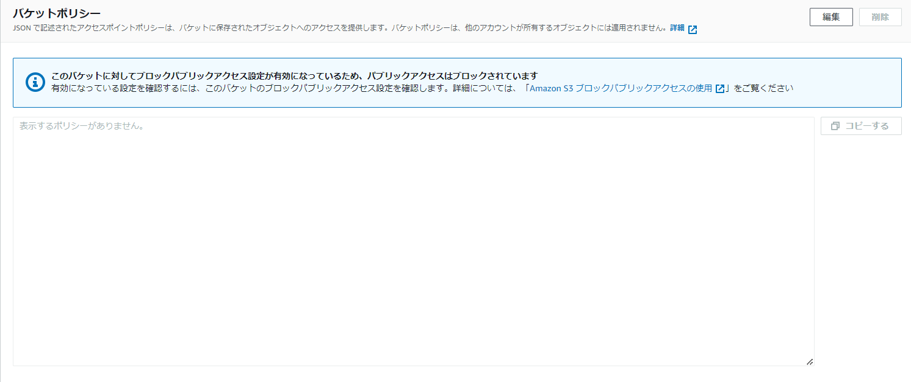
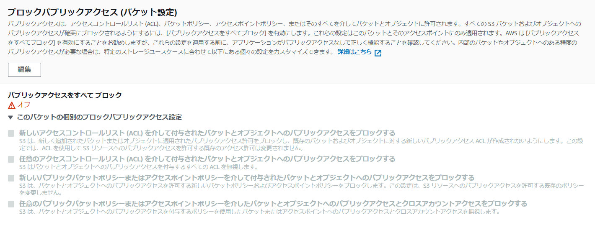
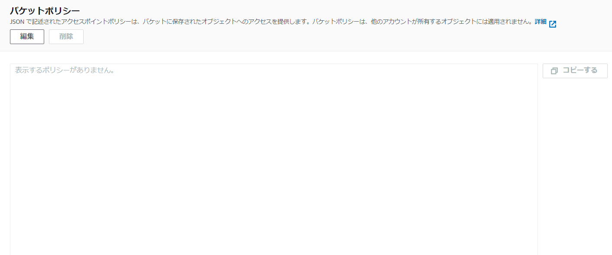
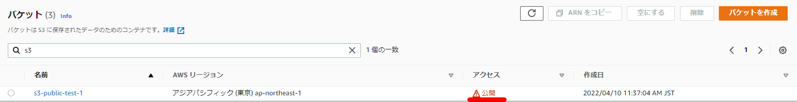

### はじめに

S3のパブリックアクセスについて下記4つのステータスを確認したので整理してみる。

1. 非公開のバケットとオブジェクト
2. オブジェクトは公開することができます
3. 公開
4. このアカウントの認証ユーザのみ

### 1.非公開のバケットとオブジェクト

下記状態の場合、`非公開のバケットとオブジェクト`と表示される

- ブロックパブリックアクセスをオン
- バケットポリシーで明示的なアクセスを許可していない





### 2.オブジェクトは公開することができます

下記状態の場合、`オブジェクトは公開することができます`と表示される。当初、この表示の場合、パブリックアクセスが可能と思っていたが、明示的にバケットポリシーの変更が必要な模様。日本語的にもパブリックアクセス可能なように思えたが、実際にはアクセスできない。

- ブロックパブリックアクセスをオフ
- バケットポリシーで明示的なアクセスを許可していない






### 3.公開

下記状態の場合、`公開`と表示される。

- ブロックパブリックアクセスをオフ
- バケットポリシーで明示的なアクセスを許可を行う

例：

```json
{
    "Version": "2012-10-17",
    "Statement": [
        {
            "Sid": "PublicReadGetObject",
            "Effect": "Allow",
            "Principal": "*",
            "Action": [
                "s3:GetObject"
            ],
            "Resource": [
                "arn:aws:s3:::s3-public-test-1/*"
            ]
        }
    ]
}
```





### 4.このアカウントの認証ユーザのみ

下記状態の場合、`このアカウントの認証ユーザのみ`と表示される。

- ブロックパブリックアクセスをオン
- バケットポリシーで明示的なアクセスを許可を行う


