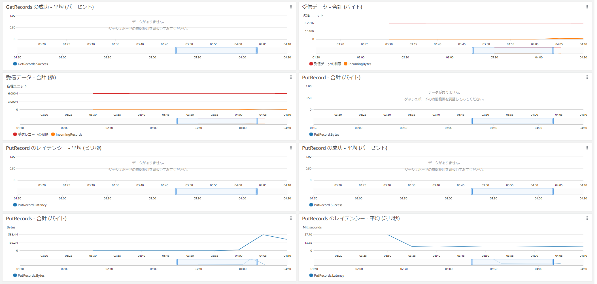
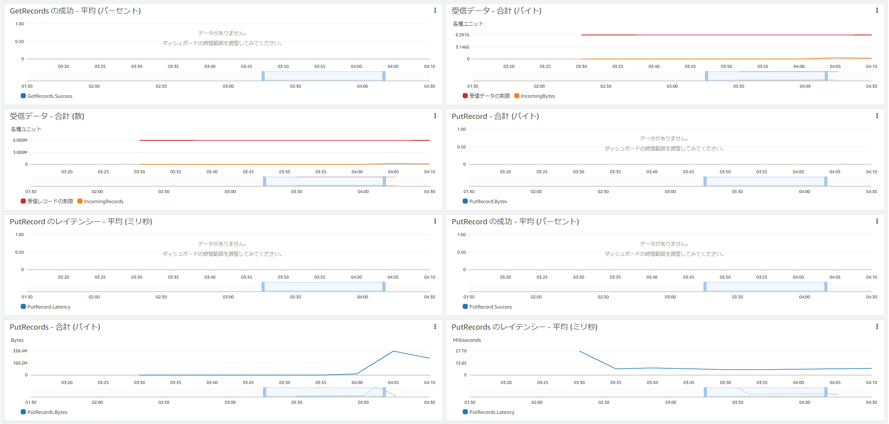

### 特徴

##### pgaudit

- PostgreSQL の拡張機能

- PostgreSQL ログに混在して出力（Auroraの場合はCloudWatchにも出力）

- セッション監査/オブジェクト監査/DML・DDLを指定して対象の監査を絞ることが出来る

- 取得される情報サンプル

  ```sql
  2020-11-13 08:06:24 UTC:10.0.1.123(50322):audit_user1@auditdb:[24298]:LOG:  AUDIT: SESSION,1,2,DDL,CREATE TABLE AS,,,"CREATE TABLE t1 AS
  	SELECT num                         a 
  	      ,'1'                         b 
  	      ,to_char(num,'FM00000')      c 
  	      ,current_timestamp      d 
  	FROM   generate_series(1,10000000) num
  	;",<none>
  2020-11-13 08:07:36 UTC:10.0.1.123(50322):audit_user1@auditdb:[24298]:LOG:  AUDIT: SESSION,2,1,READ,SELECT,TABLE,public.t1,select count(*) from t1;,<none>
  2020-11-13 08:07:36 UTC::@:[32064]:LOG:  AUDIT: SESSION,1,1,READ,SELECT,TABLE,public.t1,select count(*) from t1;,<none>
  ```

- 使用上の注意としてはパフォーマンス影響がある。下記はGithubから

  > - Depending on settings, it is possible for pgAudit to generate an enormous volume of logging. Be careful to determine exactly what needs to be audit logged in your environment to avoid logging too much.
  >
  >   For example, when working in an OLAP environment it would probably not be wise to audit log inserts into a large fact table. The size of the log file will likely be many times the actual data size of the inserts because the log file is expressed as text. Since logs are generally stored with the OS this may lead to disk space being exhausted very quickly. In cases where it is not possible to limit audit logging to certain tables, be sure to assess the performance impact while testing and allocate plenty of space on the log volume. This may also be true for OLTP environments. Even if the insert volume is not as high, the performance impact of audit logging may still noticeably affect latency.
  >
  >   訳
  >
  > - 設定によっては、pgAuditが膨大な量のログを生成する可能性があります。ロギングが多すぎないように、環境に監査ログを記録する必要があるものを正確に判断するように注意してください。
  >
  > - たとえば、OLAP環境で作業している場合、大きなファクトテーブルへのログ挿入を監査することはおそらく賢明ではありません。ログファイルはテキストとして表現されるため、ログファイルのサイズは挿入物の実際のデータサイズの何倍にもなる可能性があります。ログは通常OSに保存されるため、ディスク容量がすぐに使い果たされる可能性があります。監査ログを特定のテーブルに制限できない場合は、テスト中にパフォーマンスへの影響を評価し、ログボリュームに十分なスペースを割り当てるようにしてください。これは、OLTP環境にも当てはまる可能性があります。挿入量がそれほど多くない場合でも、監査ログのパフォーマンスへの影響がレイテンシーに著しく影響する可能性があります。

- 参考リンク

> https://github.com/pgaudit/pgaudit

##### Database Activity Streams

- ほぼリアルタイムのデータを保存可能

- 職務分離が可能

  - DBAとセキュリティ担当がいたとして監査はセキュリティ担当だけが確認とかが出来る

- 同期モードと非同期モードが存在する。どちらも一長一短あって悩ましいところ。

  - > **非同期モード** - データベースセッションでアクティビティストリーミングイベントが生成されると、セッションは直ちに通常のアクティビティに戻ります。アクティビティストリーミングイベントは、バックグラウンドで永続的なレコードになります。バックグラウンドタスクでエラーが発生した場合は、RDS イベントが送信されます。このイベントは、アクティビティストリーミングのイベントレコードが失われた可能性がある時間枠のスタートと終了を示します。
    >
    > 非同期モードでは、アクティビティストリーミングの精度よりもデータベースのパフォーマンスが優先されます。

  - > **同期モード** - データベースセッションでアクティビティストリーミングイベントが生成されると、そのイベントが永続化されるまで、セッションによってその他のアクティビティはブロックされます。何らかの理由でイベントを永続化できない場合、データベースセッションは通常のアクティビティに戻ります。ただし、アクティビティストリーミングレコードがしばらくの間失われる可能性があることを示す RDS イベントが送信されます。システムが正常な状態に戻ったら、2 番目の RDS イベントが送信されます。
    >
    > 同期モードでは、データベースパフォーマンスよりもアクティビティストリーミングの精度が優先されます。

- Kinesis ストリーミング分の追加料金が必要

- 取得出来る情報はマニュアルを確認

  - https://docs.aws.amazon.com/ja_jp/AmazonRDS/latest/AuroraUserGuide/DBActivityStreams.Monitoring.html

- Kinesis経由で3rd Partyの監視ツールやS3に出力することが出来る。S3に出力される場合、json形式なので可視化やSQLで分析するようなことが必要になってくるはず。

  - Aurora - DAS - Kinesis Stream - Kinesis Firehose - Lamdbaで復号化 - S3出力 という流れにする必要がある
    - https://dev.classmethod.jp/articles/aurora-postgresql-audit-with-data-activity-stream/

- AWSだけでやる場合、分析するためのAthenaやQuickSightの考慮が別途必要。

- 取得される情報サンプル

  ```json
  {
    "type":"DatabaseActivityMonitoringRecords",
    "version":"1.1",
    "databaseActivityEvents": 
      {
        "type":"DatabaseActivityMonitoringRecord",
        "clusterId":"cluster-4HNY5V4RRNPKKYB7ICFKE5JBQQ",
        "instanceId":"db-FZJTMYKCXQBUUZ6VLU7NW3ITCM",
        "databaseActivityEventList":[
          {
            "startTime": "2019-05-24 00:36:54.403455+00",
            "logTime": "2019-05-24 00:36:54.494235+00",
            "statementId": 2,
            "substatementId": 1,
            "objectType": null,
            "command": "CREATE TABLE",
            "objectName": null,
            "databaseName": "postgres",
            "dbUserName": "rdsadmin",
            "remoteHost": "172.31.3.195",
            "remotePort": "34534",
            "sessionId": "5ce73c6f.7e64",
            "rowCount": null,
            "commandText": "create table my_table (id serial primary key, name varchar(32));",
            "paramList": [],
            "pid": 32356,
            "clientApplication": "psql",
            "exitCode": null,
            "class": "DDL",
            "serverVersion": "2.3.1",
            "serverType": "PostgreSQL",
            "serviceName": "Amazon Aurora PostgreSQL-Compatible edition",
            "serverHost": "172.31.3.192",
            "netProtocol": "TCP",
            "dbProtocol": "Postgres 3.0",
            "type": "record",
            "errorMessage": null
          }
        ]
      },
     "key":"decryption-key"
  } 
  ```

- 参考リンク

> https://docs.aws.amazon.com/ja_jp/AmazonRDS/latest/AuroraUserGuide/DBActivityStreams.html

### 結論

要件次第だが、特になければ次の通りが良いと思った

- pgauditを使う場合
  - DASの追加費用が高く感じる、同期モード・非同期モードの仕様が受け入れられない、AWSだけでやる場合の追加設定の考慮から、オンプレPostgreSQLと同様の監査方式を採用したい、オンプレPostgreSQLで実績が多いpgauditを使いたい場合、重要テーブルだけ監査を取りたいとかであればpgaudit

- DAS（Database Activity Streams）
  - リアルタイム性を追求したい、職務分離をしたい、及びpgauditで全テーブル情報を取得してパフォーマンスIssueが発生してDASの非同期モードで負荷を少なく取得したい、様々なメトリクスを取得したい等があった場合

### Appendix：簡易性能検証

パフォーマンスの差異も気になるので、pgbenchを使って検証してみた。N=1の結果なのであまり参考にならないかもしれない。実際のワークロードでどうなるかを見てください、というお約束。

32クライアントからpgbenchを実行して300秒実行し続けた結果を確認。

```
#ベンチマークテスト
create database pgbench;
pgbench -i -s 1000 -U postgres -h aurorapgsqlv1.cluster-xxxxxxx.ap-northeast-1.rds.amazonaws.com -d pgbench
pgbench -r -c 32 -T 300 -U postgres -h aurorapgsqlv1.cluster-xxxxxxx.ap-northeast-1.rds.amazonaws.com pgbench 
```

### 結果サマリ

負荷が低かったのかDAS（同期モード） 有効化を除く、ほぼ劣化しなかったという結果に。オンプレPostgreSQLでpgauditを有効化にした際にはもうちょっと劣化した記憶があるけど、今回のケースではほぼ劣化してなかった

|                             | DB監査設定無し | DAS（同期モード） 有効化 | DAS（非同期モード） 有効化 | pgaudit   |
| --------------------------- | -------------- | ------------------------ | -------------------------- | --------- |
| トランザクション数          | 548204         | 400485                   | 533808                     | 553199    |
| 平均レイテンシ              | 17.477 ms      | 23.922 ms                | 17.948 ms                  | 17.319 ms |
| tps                         | 1831.0         | 1337.7                   | 1783.0                     | 1847.7    |
| DB監査を1とした場合の劣化率 | 100%           | 137%                     | 103%                       | 99%       |

### DB監査設定無し

```
[ec2-user@bastin ~]$ pgbench -i -s 1000 -U postgres -h aurorapgsqlv1.cluster-xxxxxxx.ap-northeast-1.rds.amazonaws.com -d pgbench
dropping old tables...

creating tables...
generating data (client-side)...
100000000 of 100000000 tuples (100%) done (elapsed 113.86 s, remaining 0.00 s)
vacuuming...
creating primary keys...
done in 204.96 s (drop tables 0.66 s, create tables 0.05 s, client-side generate 134.28 s, vacuum 36.71 s, primary keys 33.27 s).
[ec2-user@bastin ~]$ 
[ec2-user@bastin ~]$ pgbench -r -c 32 -T 300 -U postgres -h aurorapgsqlv1.cluster-xxxxxxx.ap-northeast-1.rds.amazonaws.com pgbench 
pgbench (14.2, server 13.6)
starting vacuum...end.
transaction type: <builtin: TPC-B (sort of)>
scaling factor: 1000
query mode: simple
number of clients: 32
number of threads: 1
duration: 300 s
number of transactions actually processed: 548204
latency average = 17.477 ms
initial connection time = 613.275 ms
tps = 1830.980993 (without initial connection time)
statement latencies in milliseconds:
         0.000  \set aid random(1, 100000 * :scale)
         0.000  \set bid random(1, 1 * :scale)
         0.000  \set tid random(1, 10 * :scale)
         0.000  \set delta random(-5000, 5000)
         1.895  BEGIN;
         2.015  UPDATE pgbench_accounts SET abalance = abalance + :delta WHERE aid = :aid;
         1.939  SELECT abalance FROM pgbench_accounts WHERE aid = :aid;
         1.983  UPDATE pgbench_tellers SET tbalance = tbalance + :delta WHERE tid = :tid;
         2.045  UPDATE pgbench_branches SET bbalance = bbalance + :delta WHERE bid = :bid;
         1.916  INSERT INTO pgbench_history (tid, bid, aid, delta, mtime) VALUES (:tid, :bid, :aid, :delta, CURRENT_TIMESTAMP);
         5.610  END;
[ec2-user@bastin ~]$ 
```

PI


Kinesis



### DAS（同期モード） 有効化

```
[ec2-user@bastin ~]$ pgbench -i -s 1000 -U postgres -h aurorapgsqlv1.cluster-xxxxxxx.ap-northeast-1.rds.amazonaws.com -d pgbench
dropping old tables...

creating tables...
generating data (client-side)...
100000000 of 100000000 tuples (100%) done (elapsed 106.98 s, remaining 0.00 s)
vacuuming...
creating primary keys...
done in 209.44 s (drop tables 0.65 s, create tables 0.06 s, client-side generate 136.14 s, vacuum 34.68 s, primary keys 37.90 s).
[ec2-user@bastin ~]$ 
[ec2-user@bastin ~]$ pgbench -r -c 32 -T 300 -U postgres -h aurorapgsqlv1.cluster-xxxxxxx.ap-northeast-1.rds.amazonaws.com pgbench 
pgbench (14.2, server 13.6)
starting vacuum...end.
transaction type: <builtin: TPC-B (sort of)>
scaling factor: 1000
query mode: simple
number of clients: 32
number of threads: 1
duration: 300 s
number of transactions actually processed: 400485
latency average = 23.922 ms
initial connection time = 636.947 ms
tps = 1337.700718 (without initial connection time)
statement latencies in milliseconds:
         0.000  \set aid random(1, 100000 * :scale)
         0.000  \set bid random(1, 1 * :scale)
         0.000  \set tid random(1, 10 * :scale)
         0.000  \set delta random(-5000, 5000)
         2.751  BEGIN;
         2.942  UPDATE pgbench_accounts SET abalance = abalance + :delta WHERE aid = :aid;
         2.897  SELECT abalance FROM pgbench_accounts WHERE aid = :aid;
         2.909  UPDATE pgbench_tellers SET tbalance = tbalance + :delta WHERE tid = :tid;
         2.991  UPDATE pgbench_branches SET bbalance = bbalance + :delta WHERE bid = :bid;
         2.808  INSERT INTO pgbench_history (tid, bid, aid, delta, mtime) VALUES (:tid, :bid, :aid, :delta, CURRENT_TIMESTAMP);
         6.548  END;
[ec2-user@bastin ~]$ 
```

PI

明確に他のケースでは出ていないような待機イベントが発生している


Kinesis


### DAS（非同期モード） 有効化

```
[ec2-user@bastin ~]$ pgbench -i -s 1000 -U postgres -h aurorapgsqlv1.cluster-xxxxxxx.ap-northeast-1.rds.amazonaws.com -d pgbench
dropping old tables...
creating tables...
generating data (client-side)...
100000000 of 100000000 tuples (100%) done (elapsed 107.02 s, remaining 0.00 s)
vacuuming...
creating primary keys...
done in 201.66 s (drop tables 0.65 s, create tables 0.04 s, client-side generate 128.15 s, vacuum 36.05 s, primary keys 36.76 s).
[ec2-user@bastin ~]$ pgbench -r -c 32 -T 300 -U postgres -h aurorapgsqlv1.cluster-xxxxxxx.ap-northeast-1.rds.amazonaws.com pgbench 
pgbench (14.2, server 13.6)
starting vacuum...end.
transaction type: <builtin: TPC-B (sort of)>
scaling factor: 1000
query mode: simple
number of clients: 32
number of threads: 1
duration: 300 s
number of transactions actually processed: 533808
latency average = 17.948 ms
initial connection time = 622.183 ms
tps = 1782.959790 (without initial connection time)
statement latencies in milliseconds:
         0.000  \set aid random(1, 100000 * :scale)
         0.000  \set bid random(1, 1 * :scale)
         0.000  \set tid random(1, 10 * :scale)
         0.000  \set delta random(-5000, 5000)
         1.933  BEGIN;
         2.082  UPDATE pgbench_accounts SET abalance = abalance + :delta WHERE aid = :aid;
         1.995  SELECT abalance FROM pgbench_accounts WHERE aid = :aid;
         2.057  UPDATE pgbench_tellers SET tbalance = tbalance + :delta WHERE tid = :tid;
         2.102  UPDATE pgbench_branches SET bbalance = bbalance + :delta WHERE bid = :bid;
         1.966  INSERT INTO pgbench_history (tid, bid, aid, delta, mtime) VALUES (:tid, :bid, :aid, :delta, CURRENT_TIMESTAMP);
         5.746  END;
[ec2-user@bastin ~]$ 

```

PI


Kinesis



### pgaudit

```
[ec2-user@bastin ~]$ pgbench -i -s 1000 -U postgres -h aurorapgsqlv1.cluster-xxxxxxx.ap-northeast-1.rds.amazonaws.com -d pgbench
dropping old tables...

creating tables...
generating data (client-side)...
100000000 of 100000000 tuples (100%) done (elapsed 134.45 s, remaining 0.00 s)
vacuuming...
creating primary keys...
done in 233.72 s (drop tables 0.25 s, create tables 0.06 s, client-side generate 155.32 s, vacuum 35.62 s, primary keys 42.47 s).
[ec2-user@bastin ~]$ 
[ec2-user@bastin ~]$ 
[ec2-user@bastin ~]$ pgbench -r -c 32 -T 300 -U postgres -h aurorapgsqlv1.cluster-xxxxxxx.ap-northeast-1.rds.amazonaws.com pgbench 
pgbench (14.2, server 13.6)
starting vacuum...end.
transaction type: <builtin: TPC-B (sort of)>
scaling factor: 1000
query mode: simple
number of clients: 32
number of threads: 1
duration: 300 s
number of transactions actually processed: 553199
latency average = 17.319 ms
initial connection time = 620.244 ms
tps = 1847.681325 (without initial connection time)
statement latencies in milliseconds:
         0.000  \set aid random(1, 100000 * :scale)
         0.000  \set bid random(1, 1 * :scale)
         0.000  \set tid random(1, 10 * :scale)
         0.000  \set delta random(-5000, 5000)
         1.832  BEGIN;
         1.997  UPDATE pgbench_accounts SET abalance = abalance + :delta WHERE aid = :aid;
         1.897  SELECT abalance FROM pgbench_accounts WHERE aid = :aid;
         1.950  UPDATE pgbench_tellers SET tbalance = tbalance + :delta WHERE tid = :tid;
         2.010  UPDATE pgbench_branches SET bbalance = bbalance + :delta WHERE bid = :bid;
         1.873  INSERT INTO pgbench_history (tid, bid, aid, delta, mtime) VALUES (:tid, :bid, :aid, :delta, CURRENT_TIMESTAMP);
```


### 参考

> Part 1: Audit Aurora PostgreSQL databases using Database Activity Streams and pgAudit | AWS Database Blog https://aws.amazon.com/jp/blogs/database/part-1-audit-aurora-postgresql-databases-using-database-activity-streams-and-pgaudit/
>
> Part 2: Audit Aurora PostgreSQL databases using Database Activity Streams and pgAudit | AWS Database Blog https://aws.amazon.com/jp/blogs/database/part-2-audit-aurora-postgresql-databases-using-database-activity-streams-and-pgaudit/
