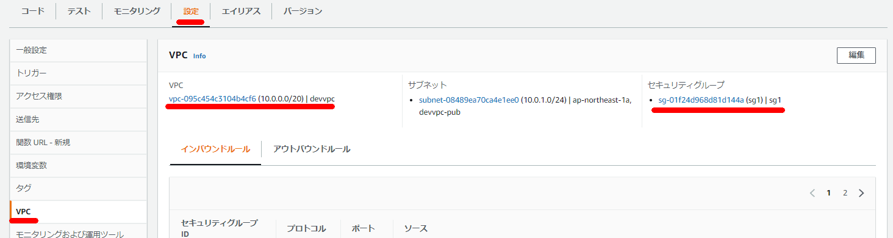

Lambda上で `psycopg2` をそのまま利用するにはひと手間必要なので`awslambda-psycopg2`を使ってAurora PostgreSQLに接続する。

### ライブラリをダウンロード

```sh
git clone https://github.com/jkehler/awslambda-psycopg2.git
```

```sh
[ec2-user@bastin lambda]$ git clone https://github.com/jkehler/awslambda-psycopg2.git
Cloning into 'awslambda-psycopg2'...
remote: Enumerating objects: 210, done.
remote: Counting objects: 100% (26/26), done.
remote: Compressing objects: 100% (21/21), done.
remote: Total 210 (delta 5), reused 22 (delta 5), pack-reused 184
Receiving objects: 100% (210/210), 3.57 MiB | 8.89 MiB/s, done.
Resolving deltas: 100% (81/81), done.
[ec2-user@bastin lambda]$ ls -l
total 0
drwxrwxr-x 8 ec2-user ec2-user 153 May  6 15:41 awslambda-psycopg2
```

### デプロイ用のパッケージの作成

```sh
mkdir -p upload-lambda/package
touch upload-lambda/lambda_function.py
mv awslambda-psycopg2/psycopg2-3.8 upload-lambda/package/psycopg2
```

### テスト用のスクリプトを準備

動作させるだけのスクリプトをとりあえず準備。

```sh
cat << EOF > upload-lambda/lambda_function.py
import psycopg2
def lambda_handler(event, context):
    return 'ok'
EOF
```

### psycopg2-binaryをzipファイルに含める

```sh
cd ./upload-lambda/package/
zip -r ../my-deployment-package.zip .
```

### lambda_function.pyをzipファイルに含める

```sh
cd ..
zip -r ./my-deployment-package.zip lambda_function.py
```

下記の通りのフォルダ構成となっていることを確認

> ```sh
> tree upload-lambda
> upload-lambda
> ├── lambda_function.py
> ├── my-deployment-package.zip
> └── package
>     └── psycopg2
> ```


### Lambda側のVPCの設定

VPCを使用する設定にして、Aurora側に接続できるようなセキュリティグループ設定を行う。



### 簡易確認

ここまでやってDeploy→Testで正常に動作することを確認する。

### 接続用スクリプトの準備

```python
import psycopg2
import psycopg2.extras
import time
import datetime
import logging
import sys
import os

def lambda_handler(event, context):

    print('event: {}'.format(event))
    print('context: {}'.format(context))

    logger = logging.getLogger()
    logger.setLevel(logging.INFO)

    conn = psycopg2.connect("host=auroraserverlessv2.cluster-xxxxxx.ap-northeast-1.rds.amazonaws.com port=5432 dbname=postgres user=postgres password=postgres")

    cur = conn.cursor()
    logger.info("SUCCESS: Connection to RDS Aurora instance succeeded")

    sql = "test用のSQL"
    logger.info(sql)

    with conn.cursor() as cur:
        cur.execute(sql, (bucket, key))
        conn.commit()

    conn.commit()
    cur.close()
    conn.close()
```

デプロイして正常にいくかどうかを確認する
